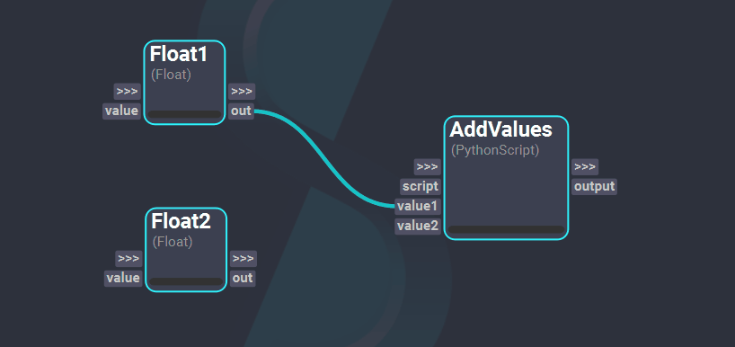
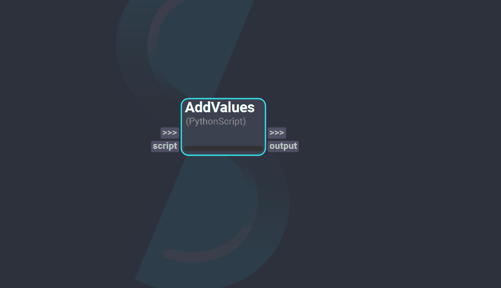
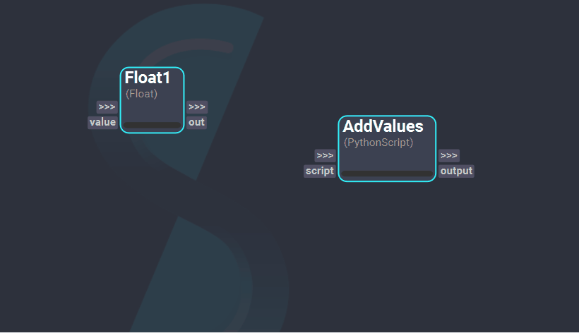
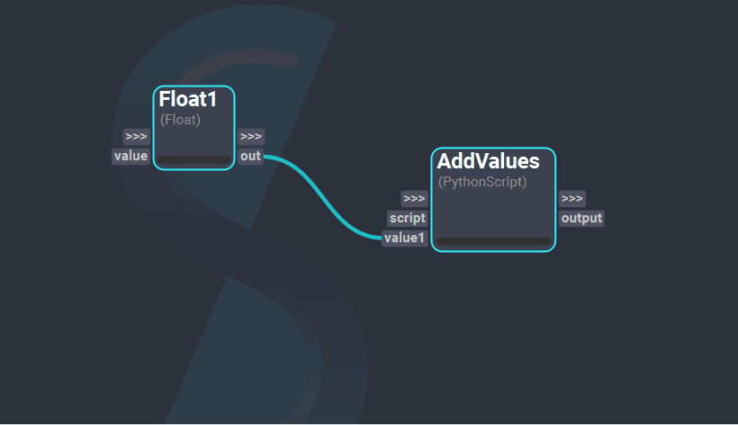

# Workflow Authoring

This page is dedicated to explain the most basic steps for creating a Shift workflow. 
When launching Shift, an new empty board is opened where nodes and connections can be added to start building the workflow. 

## Creating a Node

To create a new [node](../terminology.md/#operator), press the `Tab` key or `Double Left-Click` to open the "*Create Node*" dialog. This dialog enables searching for nodes by name and/or filtering by [catalog](../terminology.md/#catalog). The nodes will be listed alphabetically underneath, where they can be added to the Shift board by double-clicking on them.

   

Alternatively, nodes can be added to the board using the [Nodes List widget](../ui_overview.md/#operator) present in the Shift interface.

## Creating Connections

To establish a connection between plugs from different nodes, `Left-Click` and `Drag` from one plug to the desired plug. By creating a connection, the workflow can propagate the data produced in the output plugs of a node and transfer it to the connected input plug of another node.

  

## Creating New Plugs

Certain nodes in Shift allow the creation of new plugs. To create a new plug, `Right-Click` on the node to open its context menu and select the "*Create New Plug*" option if available. This will open the "*Add Plug*" dialog, which contains all the information fields required to create a custom plug. These are:

- **Name**: The name of the plug. This must be unique among the plugs of the same direction in the same node. For example, if an input plug named *value* already exists in the node, no other input plug can have that name. Allowed plug names follow the same restrictions as variable names in Python.
- **Type**: The type of the plug. This will determine which data type values are compatible with the plug. More details about plug types are provided [here](#TODO).
- **Value**: The initial value of the plug on creation. 
- **Default**: The default value of the plug. This is the value the plug will be set to when an invalid value is given or the node errors. If no default value is defined in the dialog, the default value will become the inital value of the plug.
- **Direction**: The direction of the plug. These can be:
    * *In*: The plug will be created at the left side of the node, which corresponds to the node's inputs. This plug will receive and/or set data to the node. 
    * *Out*: The plug will be created at the right side of the node, which corresponds to the node's outputs. This plug will have the data processed by the node.
    * *Through*: Two plugs with the same name will be created, one to the left side of the node as an input and another one to the right side of the node as an ouput. 

### Creating New Plugs through a Connection
Adding a new plug to a node can also be done while creating a connection. To achieve this, **drag and drop** a plug over the node where the new connection is to be added. This action will automatically prompt and populate the "*Add Plug*" dialog with the name, type, values, and direction information of the plug from which the connection was started from. Once the new plug is created, a connection between this plug and the one that was dragged will be established.

## Removing a Plug

To remove a plug, `Right-Click` on the plug and select the "*Remove Plug*" option. This action will delete the plug and destroy all existing connections associated with it.

