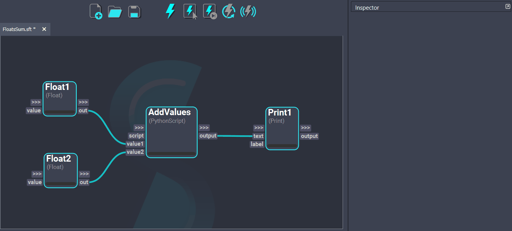
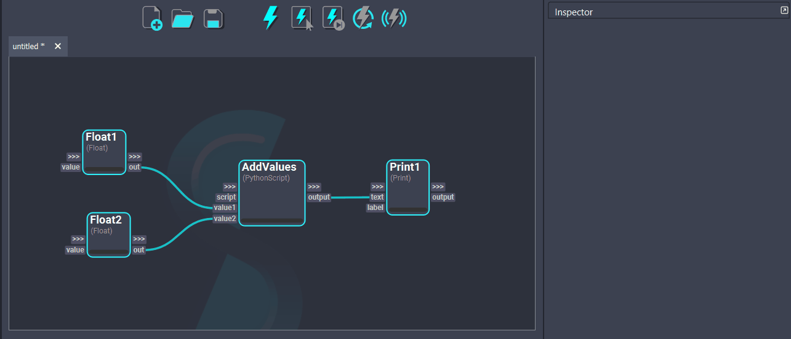

# Debug Workflows

While working on a workflow, debugging may be necessary to ensure the graph execution produces the expected results. This page outlines Shift's features designed for workflow debugging.

## Erred Nodes & Traceback
When a node does not execute successfully it will turn red and the workflow execution will be interrupted. In such case, the node will store the traceback generated by the error. To inspect the traceback, `Right Click` on the node and select the *Traceback* option. This will pop up a dialog with the error traceback content. 

Once the root of the error is fixed, the node will turn blue and its traceback will be cleared when it gets recomputed. 

### Logger
The error traceback information can be consulted in the [Logger widget](../ui_overview/#logger) too. The logger also reports warnings raised by nodes, and other Shift messages such as plug connection errors or other general logs related to the workflow or the application itself. 
To learn more about the Logger's messages and configuration, please refer to this [page](../../reference/logger.md). 

## Control Workflow Execution

Shift provides many ways of executing workflows in a modular way. For instance, the graph can be executed step by step with the [*Execute Next*](../execute/#execute-next) feature, or execute specific nodes via the [*Execute Selected*](../execute/#execute-selected) feature. These options allow a more precise control over the workflow's execution and enables to inspect the nodes' results during the process.

### Breakpoints
Additionally, Shift allows to add breakpoints to the nodes. When a node is flagged with a breakpoint, the execution of the graph will stop once it reaches that node. To add a breakpoint, `Right Click` on the node and select the *Breakpoint* option. To remove it, follow the same steps. 

### Stop Execution on Error
By default, if a node errors the execution of the workflow will be interrupted. While this prevents the workflow from propagating unwanted data, this behavior can also be disabled if desired. 
To allow the execution of a workflow to continue even if there are errors, go to the top menu a do `Execute -> Stop on Error`. To revert this change, follow the same steps. 