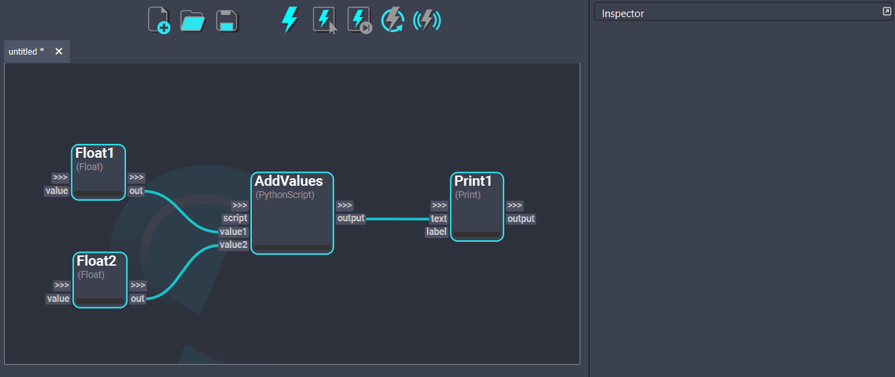
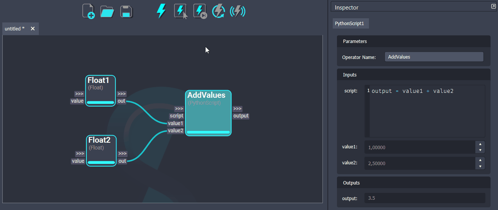

# Workflow Execution

A node in a workflow gets executed when its been computed successfully and outputs a result. Once a node has been executed, it will be **clean** and will not be recomputed unless it gets **dirty**. A node will be dirty whenever a plug value is modified or the workflow gets saved. Shift will use dirty propagation to identify the nodes affected by the modifications done to a node and flag them to be recomputed.

There are different ways a workflow can be executed, which depend on which nodes will get computed. 

## {:width="25" height="25"} Execute All

The "Execute All" action will compute all the nodes present in the workflow. 

## {:width="25" height="25"} Execute Selected

The "Execute Selected" action will compute all the selected nodes in the workflow. To do so, Shift will identify the workflow sub-graph required to evaluate the desired nodes and execute it.

## {:width="25" height="25"} Execute Next

The "Execute Next" action will compute the next dirty node present in the workflow. This allows to execute one node at a time and becomes useful to closely follow and inspect the processing of the workflow.

## {:width="25" height="25"} Stop Execution

The "Stop Execution" action will set all the nodes in the workflow to dirty. All **connected** inputs and output values will be cleared to their default values. This forces Shift to recompute all nodes the next time the workflow has to be executed. 

## {:width="25" height="25"} Live Execution

The "Live Execution" action allows to trigger the execution of the whole workflow whenever a change to any node is done. While the "Live Execution" is turned on, the other execution buttons are disabled. To re-enable all the execution buttons, turn Live Execution off.

