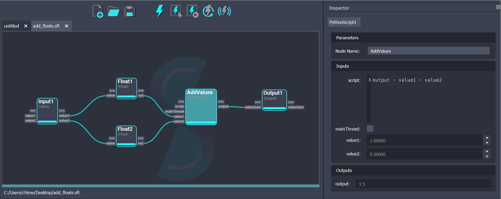
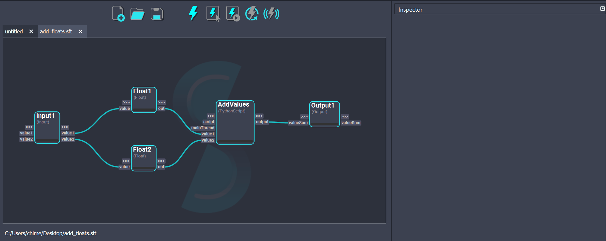

# Workflow Execution

The execution of a node in a Shift workflow consists of the evaluation of its internal logic given the node's input data. If the execution completes successfully, the output plugs will be updated with the result and the node will be flagged as **clean**. All clean nodes will be displayed with a full blue progress bar and will not be recomputed unless they become **dirty**. The dirty status is set whenever a plug value is modified or the workflow gets saved or manually reset via the Shift UI. Shift will use dirty propagation to identify the nodes affected by the modifications done to a node and flag them to be recomputed.

## Execution Actions

There are different ways a workflow can be executed, which depend on which nodes will get computed. 

### {style="width:5%"} Execute All

The "Execute All" action will compute all the dirty nodes present in the workflow.

<figure>
      
      <figcaption><b>Figure 1</b>: Executing all the workflow.</figcaption>
</figure>

### {style="width:5%"} Execute Selected

The "Execute Selected" action will compute all the selected nodes in the workflow. To do so, Shift will identify the workflow sub-graph required to evaluate the desired nodes and execute it.

<figure>
      
      <figcaption><b>Figure 2</b>: Executing the workflow up to the selected node.</figcaption>
</figure>

### {style="width:5%"} Execute Next

The "Execute Next" action will compute the next dirty node present in the workflow. This allows to execute one node at a time and becomes useful to closely follow and inspect the processing of the workflow.

<figure>
      
      <figcaption><b>Figure 3</b>: Executing the workflow one step at a time.</figcaption>
</figure>

### {style="width:5%"} Clear Execution

The "Clear Execution" action will set all the nodes in the workflow to dirty. All **connected** inputs and output values will be cleared to their default values. This forces Shift to recompute all nodes the next time the workflow has to be executed.
If a workflow is executing when this button is clicked, the execution will be interrupted.

<figure>
      
      <figcaption><b>Figure 4</b>: Clear the executed status from all nodes.</figcaption>
</figure>

### {style="width:5%"} Live Execution

The "Live Execution" action allows to trigger the execution of the whole workflow whenever a change to any node is done. While the "Live Execution" is turned on, the other execution buttons are disabled. To re-enable all the execution buttons, turn Live Execution off.

<figure>
      
      <figcaption><b>Figure 5</b>: Executing workflow in live execution mode.</figcaption>
</figure>

## Threaded Execution

By default Shift will run the execution of the workflow on a dedicated thread. This allows the user to freely inspect the board that is currently executing. Additionally, for long executing workflows, the user is free to author and inspect any board other than the executing one.

### Stopping a Running Execution

An interruption of the currently executing workflow can be requested by clicking on the *Clear Execution* button. While a board is executing, this button will force the execution to stop without clearing the execution progress.

<figure>
      
      <figcaption><b>Figure 6</b>: Stopping the execution of a workflow.</figcaption>
</figure>

The interruption will take effect once the execution of the operator that was running when the button was clicked ends. This behaviour ensures that Shift can safely kill the execution thread.

### Managing Threaded Execution Behaviour

The threaded execution feature can be activated or deactivated from the *Single Thread* toggle in *Execute* menu in the top bar. Please be aware that disabling this feature will cause the workflow to run in the same Python thread as the Shift UI, resulting in Shift freezing until the execution is complete.

<figure>
      
      <figcaption><b>Figure 7</b>: Disabling the threaded execution feature.</figcaption>
</figure>

>[!NOTE]
>The default execution mode can also be set at initialization of Shift using the `SHIFT_SINGLE_THREADED` environment variable.

### Actions Limited While Executing

The user can perform most interactions within the Shift UI while a workflow is executing. This includes inspecting the nodes, authoring other boards and using plugins. However, the following actions are limited:

- The user can not launch executions of other workflows. Only one workflow at a time can be executed.
- The user can not author the executing workflow. This includes not being able to: edit plug values, create plugs, create nodes or create connections.
- The user can not save the executing workflow. In order to save the workflow file the execution must finish or be interrupted.
- The user can not save workflows that are loaded and being executed inside *Workflow* nodes in another board.
- The user can not paste nodes copied from an executing workflow. The user must wait for the execution to finish before pasting.

### Executing Specific Nodes on the Main Thread

Certain Python functions are required to be called from the Python process main thread. This is the case for some DCCs like Maya or Nuke. Ignoring this requirement can cause unexpected behaviours or crashes. When a node executes in the main thread, the Shift UI will momentarily freeze until the execution of the node finishes. Please check out the [Forcing Operators to Run on the Main Thread](../../reference/developer_guide/developing_custom_catalogs#forcing-operators-to-run-on-the-main-thread) section of the *Developer Guide* for more information on the advanced options available to force the execution of nodes in the main thread.
