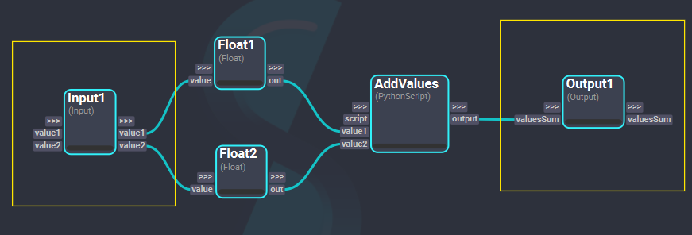
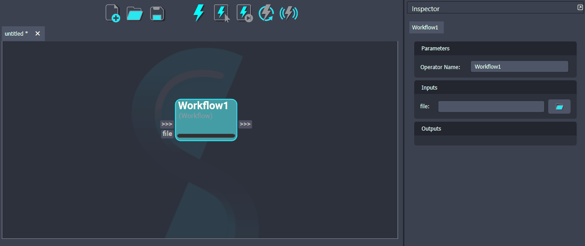

# Nesting Workflows

In Shift, any workflow can be embedded into a node and executed within another workflow.

## Setting Workflow I/Os

To create a reusable workflow, the input and output of the workflow must be specified. This is done through `Input` and `Output` nodes. The plugs created in these nodes must be `through` plugs and define which inputs are expected by the workflow and which are the outputs that will be returned.

The plugs from these nodes will act as data pathways, linking information set externally in the workflow to the current workflow and viceversa.

## Workflow Node

The `Workflow` node allows to embed the execution of a workflow inside another workflow. This node has a *file* plug, where the workflow to nest is to be indicated. When the file plug content is set to reference a valid workflow file (with a *.sft* extension), the node will automatically update by creating the input and output plugs corresponding to the sourced workflow inputs and outputs. Then, when the `Workflow` node gets executed, it will execute the referenced workflow.

To learn more about the `Workflow` node functionalities, please refer to the [`Workflow`](../../nodes/workflow.md) documentation.

### Workflows on External Processes

When using the `Workflow` node, the execution of the workflow happens on the same Python process Shift is running in. However, it is also possible to execute a workflow in an external process running in a different Python interpreter. To do so, please refer to the [`Workflow Process`](../../nodes/workflow_process.md) documentation.
