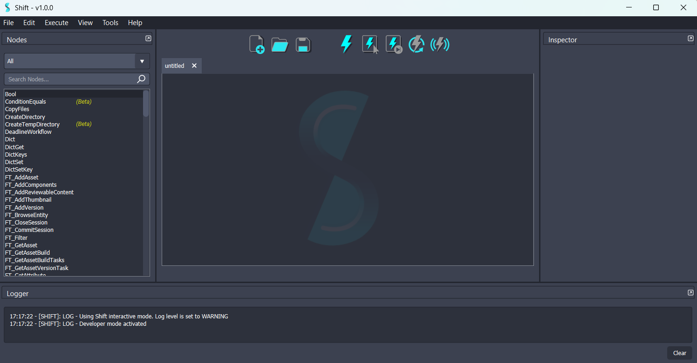
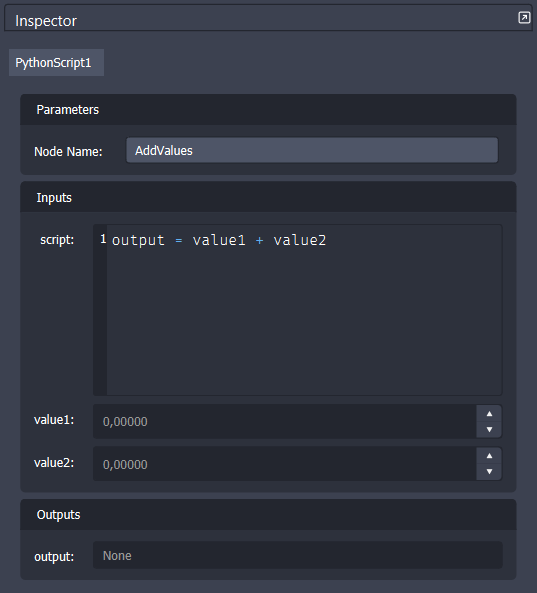
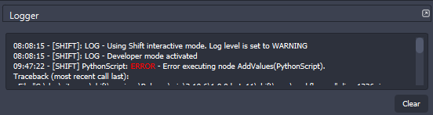

# UI Overview

This page covers all the information about Shift's interface and interactions with it.

## The Shift Window

<figure>
      
      <figcaption><b>Figure 1</b>: Shift UI at startup.</figcaption>
</figure>

## Menu Bar
At the very top of the application we find Shift's menu bar. This menu has all the actions that can be done in Shift. Most of them have short-cut associated.

|Action|Menu|Description|Short-Cut|
|:--|:--|:----|:--
|*New Workflow*|*File*|Opens a new empty board.|`Ctrl+N`|
|*Open Workflow*|*File*|Opens a file browser to open an existing workflow.|`Ctrl+O`|
|*Open Recent*|*File*|Lists the most recent workflows to open.||
|*Save Workflow*|*File*|Saves the current workflow.|`Ctrl+S`|
|*Save Workflow As*|*File*|Saves the current workflow with a new name.|`Ctrl+Shift+S`|
|*Catalog Manager*|*File*|Opens the [Catalog Manager](../../reference/catalogs#the-catalog-manager).|`P`|
||||
|*Undo*|*Edit*|Undoes the last action performed on the board.|`Ctrl+Z`|
|*Redo*|*Edit*|Redoes the last undo performed on the board.|`Ctrl+Y`|
|*Add New Node*|*Edit*|Prompts the "[Create Node](authoring#creating-a-node)" dialog.|`Ctrl+A`|
|*Duplicate*|*Edit*|Duplicates the selected items.|`Ctrl+D`|
|*Copy*|*Edit*|Copies the selected items to the clipboard.|`Ctrl+C`|
|*Paste*|*Edit*|Pastes the items copied on the clipboard.|`Ctrl+V`|
|*Cut*|*Edit*|Copies and removes the selected items to the clipboard.|`Ctrl+X`|
|*Remove*|*Edit*|Removes an item from the board.|`Del`|
|*Add Note*|*Edit*|Adds a new note to the board.|`N`|
|*Add Plug*|*Edit*|If a node is selected, prompts the "[Add Plug](authoring#creating-new-plugs)" dialog.|`Ctrl+P`|
||||
|*Execute All*|*Execute*|Executes all the nodes in the workflow.|`Ctrl+Return`|
|*Execute Selected*|*Execute*|Executes the selected nodes in the workflow.|`Shift+Return`|
|*Execute Next*|*Execute*|Executes the next node in the workflow.|`>`|
|*Clear Execution*|*Execute*|Clears the executed status from all the nodes in the workflow.|`<`|
|*Stop On Error*|*Execute*|Defines if the workflow execution should stop when encountering an error or not.||
||||
|*Frame All*|*View*|Frames all the nodes present in the board.|`A`|
|*Frame Selected*|*View*|Frames the selected nodes.|`F`|
|*Frame Errors*|*View*|Frames all nodes that have errored.|`E`|
|*Focus Execution*|*View*|Defines if the board should focus on the current executing node or not.||
|*Log Level*|*View*|Defines the Logger's message log level.||
||||
|*About Shift*|*Help*|Opens an informative window about Shift.||

Additional menus from the ones listed are plugin menus, which allow to extend Shift's functionalities and utility widgets. Please, refer to this [page](../../reference/plugins.md) for more information.
## Toolbar

The toolbar consists in a list of buttons with the most used and relevant actions for Shift.

<figure>
      
      <figcaption><b>Figure 2</b>: Shift's tool bar.</figcaption>   
</figure>

These are, from left to right:

1. "*New Workflow*" - Used to start creating a new workflow from scratch
2. "*Open Workflow*" - Used to open an existing workflow file
3. "*Save*" - Used to save the current workflow file
4. "*Execute*" - Used to execute all nodes in the current workflow
5. "*Execute Selected*" - Used to execute the workflow up to the currently selected operator
6. "*Execute Next Operator*" - Used to execute the next operator in the graph
7. "*Clear Execution*" - Used to refresh the workflow execution status
8. "*Toggle Live Execution*" - Used to toggle the live execution of the workflow

## Board

The Shift board is the main workspace for creating the workflow graph. On the board it is possible to create and interact with nodes, link them, and navigate the graph.

The following controls are available for the board:

|Action|Short-Cut|
|:--|:--|
|*Pan*|`Alt + Left-Click` or `Middle-Click`|
|*Zoom*|`Alt + Right-Click` or `Mouse Wheel`|
|*Focus on Selected*|`F`|
|*Select*|`Left-Click`|
|*Add to Selection*|`Shift + Left-Click`|
|*Create Node*|`Double Left-Click` or `Tab`|
|*Delete Selected*|`Del`|
|*Rectangular Selection*|`Left-Click and Drag`|

Several Shift boards can be opened to work on different tasks at the same time; each will be displayed as a separate tab.

## Dockable Widgets
All other widgets in the Shift Window are utility widgets used to interact with the workflow and the application. These widgets are dockable widgets, which means that they can be resized and rearranged throughout the Shift window to satisfy personal layout tastes.
New dockable widgets can also be added through [plugins](../../reference/plugins.md); these additional widgets can be added and removed from the UI when needed.

Shift standalone comes with three native and indispensable widgets:

### The Inspector

The inspector is used to display and modify the properties of the selected nodes in the workflow. It is divided into four sections (from top to bottom):

- The node's unique name.
- The parameters group: It contains the operator's name, which can be modify to change the name of the node.
- The node's inputs: List of node inputs and its corresponding values. Input values can be modified here as long as they are not connected to another plug; if this is the case, the corresponding widget will be disabled and greyed out.
- The node's outputs: List of node outputs and its corresponding values.

<figure>
      
      <figcaption><b>Figure 3</b>: Inspector widget showing a PythonScript node with its script, inputs and outputs.</figcaption>
</figure>

> [!NOTE]
> By right-clicking on the plug widgets in the inspector, more actions can be performed, such as copying the plug value to the clipboard or opening a dialog to show more details.

### The Logger

The logger displays all the log messages generated while working on Shift. This covers everything from nodes errors and warnings, setup information, missing configurations or extraordinary exceptions raised by Shift. Log messages can be removed by clicking `Clear` on the bottom right corner of the widget. 

<figure>
      
      <figcaption><b>Figure 4</b>: Shift's logger showing an error.</figcaption>
</figure>

More information about the logger and custom configuration can be found [here](../../reference/logger.md).

### The Nodes List
The nodes list displays all the available nodes ordered alphabetically. This list can be filtered by name or by catalog to facilitate looking for the desired operator. By **double-clicking** on the operator's name, the corresponding node will be created in the Shift board.