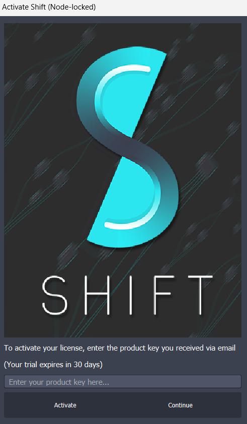

# Licensing

Shift requires a successful license activation for commercial use. For non-commercial and testing purposes a trial period of 30 days can be requested.
In this page the different licensing components of Shift will be explained in combination with the requirements and steps for activating the product.

Currently, Shift supports only one *Licensing Mode*:

- **Node-Locked Licensing:** License mode that locks Shift to one particular computer with a particular hardware footprint. After the activation on a computer, using the license key on a different computer would disable the ability to activate the software.

Shift also distinguishes between two *Licensing Types*:

- **Interactive:** License type that allows the user to use Shift from the graphical interface in standalone or within another compatible software. This licensing type is intended for users that will develop workflows and interact with Shift's node-based features and interface to create their automatization processes. 
- **Batch:** License type that allows the user to run Shift from a batch script or terminal without the ability to use the graphical interface for manipulating workflows. This licensing type is intended for users that want to run Shift from a terminal or integrate a Shift workflow execution in their custom Python script.

To be able to activate Shift it is required to purchase a `PRODUCT KEY`. Product keys can be purchased through Inbibo's official [website](https://inbibo.co.uk/shift#prices). Shift product keys have the following characteristics:

- A `PRODUCT KEY` is associated to one single license type: Interactive or Batch. If the user wants to use Shift both in Interactive and Batch mode, two separate product keys have to be purchased.
- A product key consists of **28** alphanumeric characters separated by "-" which is provided to the user when purchasing Shift through the website: `XXXX-XXXX-XXXX-XXXX-XXXX-XXXX-XXXX`.

## Node-Locked Licensing

Node-Locked Licensing in Shift requires the activation of a `PRODUCT KEY` on one single machine. As commented before, this activation process requires the user to activate the product for batch and interactive modes separately.

### Interactive

Whenever activating Shift for the first time, a dialog will be prompted requesting to enter a valid `PRODUCT KEY` or to launch Shift in trial mode for non-commercial purposes.

To activate Shift in Node-Locked Interactive mode:

  1. Launch Shift by clicking on the shift.bat file in Shift's installation folder.
  2. A dialog will show up where to enter a valid `PRODUCT KEY` in order to enable the full license; or to continue with the 30 day trial period.

<figure>
      
      <figcaption><b>Figure 1</b>: Activation Dialog.</figcaption>
</figure>

  3. On the text box, enter the `PRODUCT KEY` associated to your Interactive Node-Locked License.
  4. Click on *Activate* on the bottom left corner.

If the product key is invalid or connecting with the licensing servers failed, an error will be raised indicating that Shift couldn't be activated. Otherwise, Shift will be open, meaning that the license was activated successfully.

> [!NOTE]
> - This activation mode requires access to the internet for activating licenses.
> - For deactivating licenses to switch to a different machine, please contact support.

### Batch

To activate a Shift Batch license it is required to execute the provided Python script and enter the acquired product key. 

To activate Shift in Node-Locked Batch mode: 

  1. Open a new terminal.
  2. Go to `shift\tools` in the Shift installation folder.
  2. Run the python script `batchActivate.py`.
  3. Enter the `PRODUCT KEY`.
  4. Shift is activated and ready to be used.

### Trial

Shift allows the user to use the product for **30 days** in Node-Locked Interactive mode. This means that the trial can be used using the graphical interface for one single machine at a time. 

The trial period does not require any input from the user. Simply click *Continue* in the Shift activation dialog to start using the application. The trial period is registered automatically the first time that Shift is launched with internet access.

Trial licenses are intended for testing and non-commercial purposes. To use Shift for commercial purposes a `PRODUCT KEY` must be purchased through Inbibo's official [website](https://inbibo.co.uk/shift#prices) and activated. See the Shift [End User License Agreement](https://inbibo.co.uk/shift-eula) for details.

> [!NOTE]
> This activation mode requires access to the internet.

