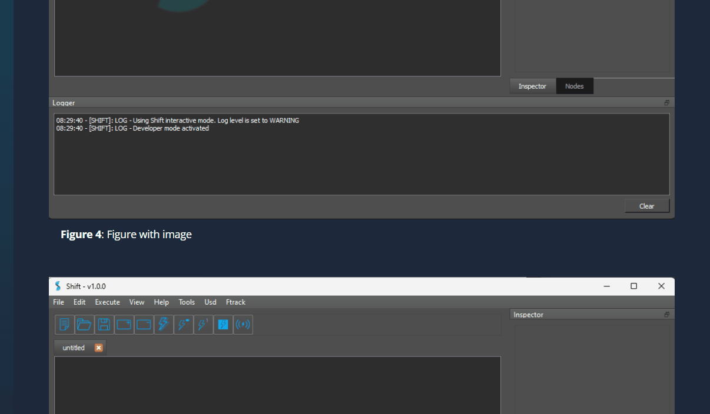

# Introduction

## Static

<figure style="width:80%; margin-left:10%" markdown>
      
      <figcaption><b>Figure 1</b>: Markdown figure with width and margin.</figcaption>
</figure>

<figure markdown>
      
      <figcaption><b>Figure 2</b>: Markdown figure with no style. </figcaption>
</figure>

      <figure markdown>
            
            <figcaption><b>Figure 3</b>: Markdown figure centered with no style. </figcaption>
      </figure>

<figure>
      
      <figcaption><b>Figure 4</b>: Figure with image</figcaption>
</figure>

<b>Figure 5</b>: Plain Image

## Gifs

<figure style="width:80%; margin-left:10%" markdown>
      
      <figcaption><b>Figure 1</b>: Markdown figure with width and margin.</figcaption>
</figure>

<figure markdown>
      
      <figcaption><b>Figure 2</b>: Markdown figure with no style. </figcaption>
</figure>

      <figure markdown>
            
            <figcaption><b>Figure 3</b>: Markdown figure centered with no style. </figcaption>
      </figure>

<figure>
      
      <figcaption><b>Figure 4</b>: Figure with image</figcaption>
</figure>

<b>Figure 5</b>: Plain Image

## Embedded images

My text {style="width:4%"} .

## {style="width:10%"}  My header.

My text {style="width:4%"} .

## {style="width:10%"}  My header.

## Code blocks

<pre style="margin: 15px 0">
    <code style="white-space: pre; padding: 10px; box-sizing: border-box;">
myCode
  </code>
</pre>

<pre style="margin: 15px 0">
<code style="white-space: pre; padding: 10px; box-sizing: border-box;">
myCode
</code>
</pre>

<pre style="margin: 15px 0">
    <code style="white-space: pre; padding: 10px; box-sizing: border-box;">from shift.core import files
workflow, catalog_manifest = files.openBatchWorkflow("&ltpath_to_your_workflow_file&gt")</code>
</pre>