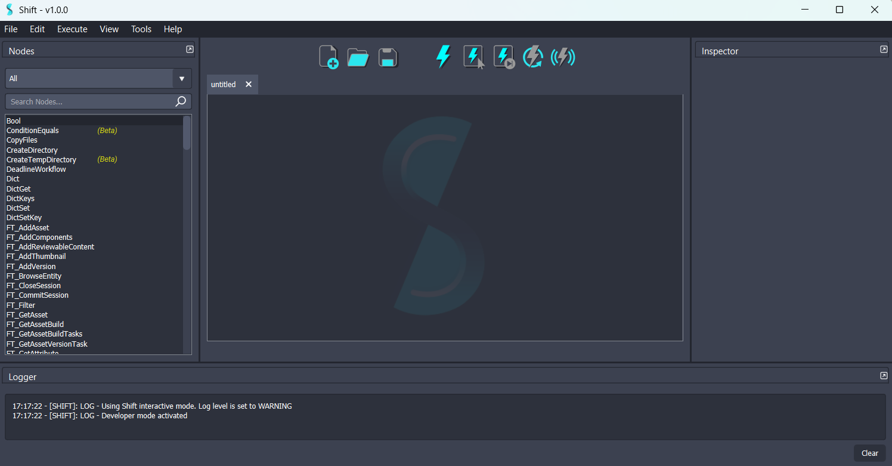

# Introduction

<figure style="width:80%; margin-left:10%" markdown>
      
      <figcaption><b>Figure 1</b>: Markdown figure with width and margin.</figcaption>
</figure>

<figure markdown>
      
      <figcaption><b>Figure 2</b>: Markdown figure with no style. </figcaption>
</figure>

      <figure markdown>
            
            <figcaption><b>Figure 3</b>: Markdown figure centered with no style. </figcaption>
      </figure>

<figure>
      
      <figcaption><b>Figure 4</b>: Figure with image</figcaption>
</figure>

<b>Figure 5</b>: Plain Image

