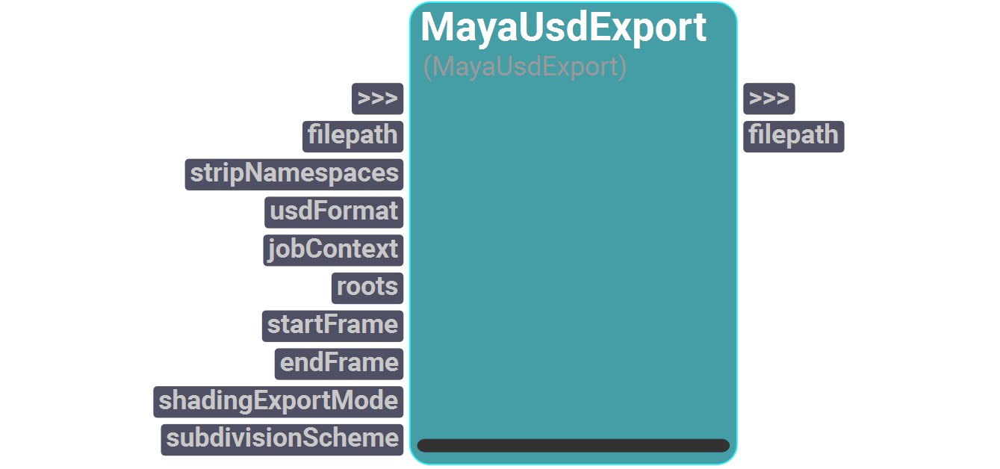
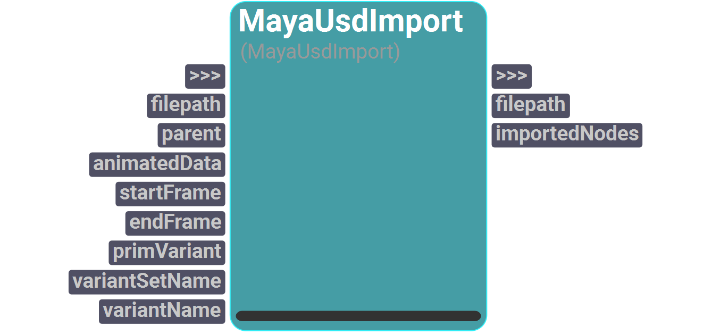
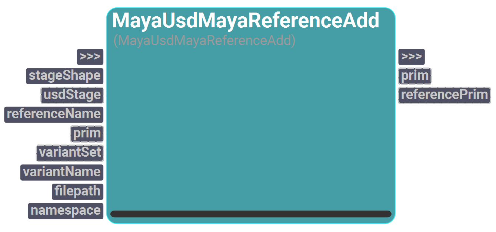
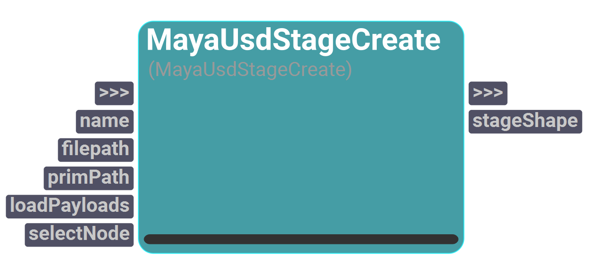
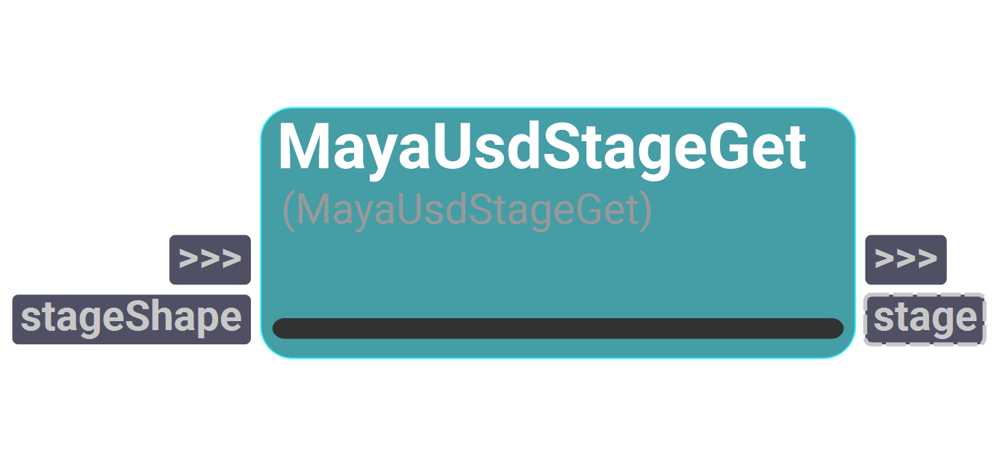

# sMayaUSD
This catalog includes operators that work with MayaUSD.

---
## MayaUsdExport

<figure style="width: 30%">
	
	<figcaption></figcaption>
</figure>

Exports the objects from the Maya scene to USD.
If roots are given, those nodes will be exported.
If a valid frame range is provided, then the animation is exported too.
Works for Maya.

#### Inputs
| Name | Type | Default | Options
| --- | --- | --- | --- |
| filepath | FileOut |  | 
| stripNamespaces | Bool | False | 
| usdFormat | Enum | usdc | usda, usdc
| jobContext | Enum | None | None, Arnold
| roots | List | [] | 
| startFrame | Float | 0.0 | 
| endFrame | Float | 0.0 | 
| shadingExportMode | Enum | None | None, pxrRis, useRegistry
| subdivisionScheme | Enum | None (Polygonal Mesh) | None (Polygonal Mesh), Catmull-Clark, Bilinear, Loop

#### Outputs
| Name | Type | Default |
| --- | --- | --- |
| filepath | FileOut | 

---
## MayaUsdImport

<figure style="width: 30%">
	
	<figcaption></figcaption>
</figure>

Imports the objects from USD to Maya geometry.
If animatedData is set to True, it will import the animation too. Otherwise, the animation won't be imported.
If parent object is given, the imported geometry will be moved inside the parent.
In order to import the geometry from a specific variant only,
a valid variantPrim, variantSet and variantName need to be provided.
Works for Maya.

#### Inputs
| Name | Type | Default
| --- | --- | --- |
| filepath | FileIn | 
| parent | String | ""
| animatedData | Bool | False
| startFrame | Float | 0.0
| endFrame | Float | 0.0
| primVariant | String | ""
| variantSetName | String | ""
| variantName | String | ""

#### Outputs
| Name | Type | Default |
| --- | --- | --- |
| filepath | FileOut | 
| importedNodes | List | []

---
## MayaUsdMayaReferenceAdd

<figure style="width: 30%">
	
	<figcaption></figcaption>
</figure>

Adds a MayaReference prim.
This node works in both the Maya stage shape context or the USD stage context. However, only one of those can be chosen for the
operation.
If variantSet and variantName are given, the prim will be added only to the specified variant.
Otherwise, the prim will be added out of the variant context.
Works for Maya.

#### Inputs
| Name | Type | Default
| --- | --- | --- |
| stageShape | String | ""
| usdStage | Instance | None
| referenceName | String | ""
| prim | Instance | None
| variantSet | Instance | None
| variantName | String | ""
| filepath | FileIn | 
| namespace | String | ""

#### Outputs
| Name | Type | Default |
| --- | --- | --- |
| prim | Instance | None
| referencePrim | Instance | None

---
## MayaUsdStageCreate

<figure style="width: 30%">
	
	<figcaption></figcaption>
</figure>

Creates a MayaUsdProxyShape node which holds a USD stage which can be interacted with from the DCC.
Works for Maya.

#### Inputs
| Name | Type | Default
| --- | --- | --- |
| name | String | ""
| filepath | FileIn | 
| primPath | String | ""
| loadPayloads | Bool | True
| selectNode | Bool | False

#### Outputs
| Name | Type | Default |
| --- | --- | --- |
| stageShape | String | ""

---
## MayaUsdStageGet

<figure style="width: 30%">
	
	<figcaption></figcaption>
</figure>

Gets the underlying UsdStage instance that a MayaUsdProxyShape node is wrapping.
Works for Maya.

#### Inputs
| Name | Type | Default
| --- | --- | --- |
| stageShape | String | ""

#### Outputs
| Name | Type | Default |
| --- | --- | --- |
| stage | Instance | None

