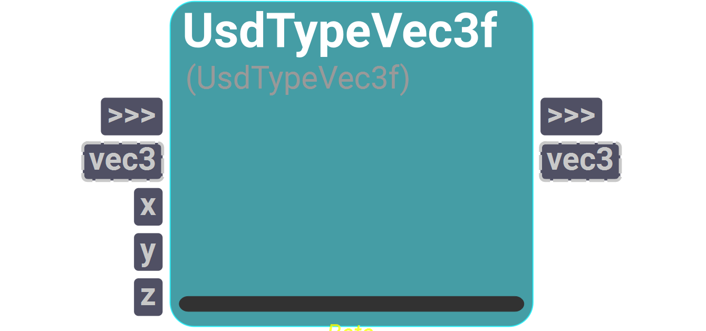

# sUSDTypes
A catalog to work with USD type objects. This catalog is in beta, more nodes will be added in the future.

---
## UsdTypeVec3f
<i>Beta operator</i>

<figure style="width: 30%">
	
	<figcaption></figcaption>
</figure>

Returns a Gf.Vec3f object from the given component inputs.
If no vector is given as input, the Gf.Vec3f object will be built using 
the given x, y and z components.
If a vector is given and also the components, the Gf.Vec3f will be updated 
with the given x, y and z components.

#### Inputs
| Name | Type | Default
| --- | --- | --- |
| vec3 | Instance | None
| x | Float | 0.0
| y | Float | 0.0
| z | Float | 0.0

#### Outputs
| Name | Type | Default |
| --- | --- | --- |
| vec3 | Instance | None

