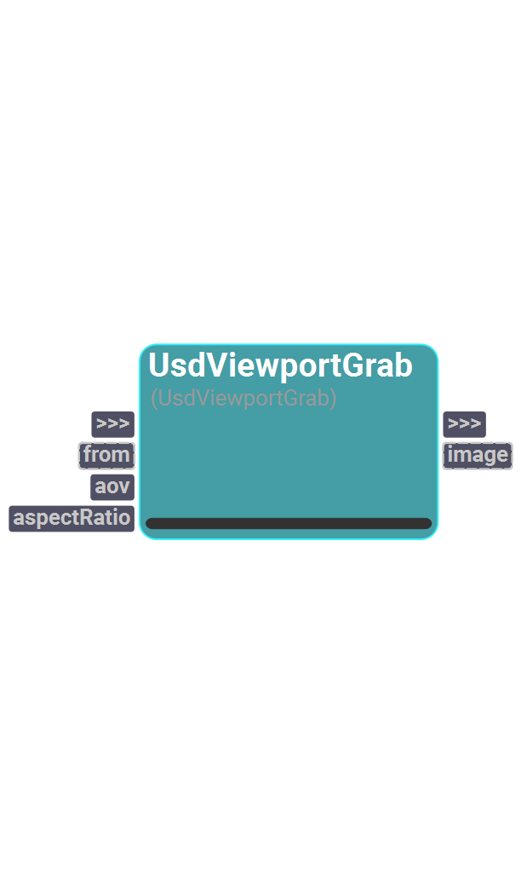

# sUSDViewer
A catalog to interact with the Usd Viewer plugin for Shift.

---
## UsdViewportGrab

<figure style="width: 30%">
	
	<figcaption></figcaption>
</figure>

Node used to grab a snapshot of the current Usd Viewer plugin viewport.
    It allows the selection of the AOV to grab and an aspect ratio to fit the grabbed image to.
    The node must be linked to a Usd Viewer plugin instance.
    
    

#### Inputs
| Name | Type | Default | Options
| --- | --- | --- | --- |
| from | Instance | None | 
| aov | Enum | color | color, depth
| aspectRatio | Enum | 16:9 | source, 16:9, 4:3, 1:1

#### Outputs
| Name | Type | Default |
| --- | --- | --- |
| image | Instance | None

