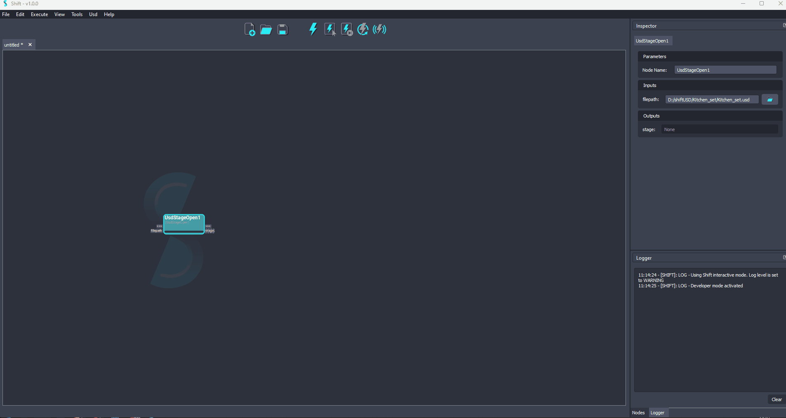

# USD

Shift has developed a specialized catalog and utility plugins for using the USD API in Shift. 

## Dependencies
| **Dependency**                                           | **Version**    |
| -------------------------------------------------------- | -------------- |
| [Python](https://www.python.org/download/releases/3.0/)  | 3.7 to 3.10    |
| [USD](https://pypi.org/project/usd-core/)                | 22.11 or higher  |
| [PyOpenGl](https://pypi.org/project/PyOpenGL/)           | 3.1.5 or higher  |
| [Numpy](https://numpy.org/news/#releases)                | 1.21.6 or higher |

## Catalogs

Shift comes with a total of three catalogs to manipulate USD data:

- [**sUsd**](susd.md): A catalog for managing USD information, featuring operators for stages, prims, attributes, layers, variants, and more. This is the most comprehensive catalog for working with USD within Shift.
- [**sUsdTypes**](susdtypes.md): A catalog for managing USD type objects, specially from the *Gf* library from USD. This catalog is currently in beta, and more operators will be added in the future.
- [**sMayaUsd**](smayausd.md): A catalog that integrates operators that are compatible with MayaUSD. They are only available in Maya.       

## Plugins

Shift comes equipped with two primary plugins for interacting with USD (Universal Scene Description) files. The plugins can be found in the *Usd* section in the top menu bar.

- USD Viewer: This plugin provides a viewport for visualizing USD stages, allowing users to inspect and manipulate 3D scene data in real-time.

- USD Outliner: This plugin works alongside the USD Viewer to display the hierarchical structure of USD stages, offering a tree-based interface for navigating and selecting prims (scene elements). The outliner is tightly integrated with the workflow, enabling advanced interaction with USD nodes.

These two plugins together allow users to efficiently visualize, explore, and interact with USD-based workflows, making Shift a powerful tool for managing complex 3D scenes and assets.

### USD Viewer

The USD Viewer plugin allows users to visualize and interact with USD stages sourced from specific nodes (UsdStageOpen & UsdStageNew) in the active board workflow. It integrates seamlessly with Shift's interface and works in conjunction with the USD Outliner plugin for hierarchical navigation. Users can double-click on USD prims in the viewer to create a new UsdPrimGet operator connected to the selected prim. When the USD Outliner is open, prim selections between the viewer and outliner are synchronized. For more details on how to manipulate USD stages and prims, refer to the section on [USD Catalogs](#catalogs).

<figure>
      
      <figcaption>USD Viewer Plugin</figcaption>
</figure>

### USD Outliner

The USD Outliner plugin displays the hierarchy of USD stages sourced from specific nodes (UsdStageOpen & UsdStageNew) in the active board workflow. It provides a tree view of the USD scene, allowing users to explore, select, and interact with USD prims. Selecting a prim in the outliner works in conjunction with the USD Viewer plugin for hierarchical navigation. Double-clicking a prim creates a UsdPrimGet operator linked to the selected prim for further manipulation. For more information on working with USD stages, refer to the section on [USD Catalogs](#catalogs).

<figure>
      
      <figcaption>USD Outliner Plugin</figcaption>
</figure>

<!-- 
### Examples
This section is reserved to an example video of how to use USD resources.
 -->
