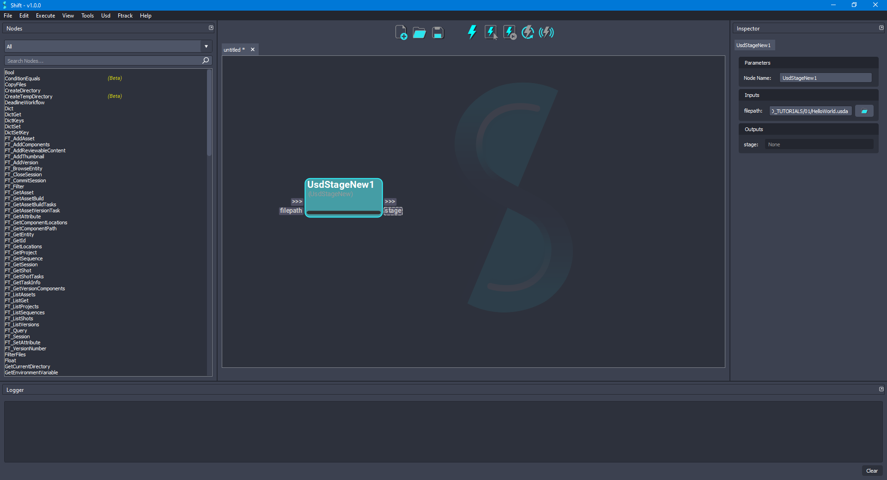

## Creating Your First USD Stage

This tutorial is focused on creating, using the operators from Shift_USD catalog, a simple USD stage containing a transform and a sphere.

In order to follow easily the steps, it is recommended to read the documentation about the [Shift's interface](../../../getting_started/basics/ui_overview.md) and [workflow execution](../../../getting_started/basics/execute.md).

### Tutorial

1. Open Shift application. A new window's instance of Shift should appear like the following one:

<figure>
    
    <figcaption><b>Figure 1</b>: Shift UI.</figcaption>
</figure>

2. Now, add a new **<tt>UsdStageNew</tt>** node to the board. Using the **Inspector** widget, set as value for the **filepath** input plug a filepath pointing to a `.usda` file. For doing this, the UI offers a browse button next to the plug input field that opens a browse dialog to facilitate locating the file or it can be added typing manually the path. For this example, the filepath can be: `D:/USD_TUTORIALS/01/HelloWorld.usda`. The board should look like the following one:

<figure>
    
    <figcaption><b>Figure 2</b>: Added the 'UsdStageNew' node to the board.</figcaption>
</figure>

3. Add a new **<tt>UsdPrimAdd</tt>** node to the board. Now, connect the **stage** output plug from the `UsdStageNew` node to the **stage** input plug of this new node. Also, set `/hello` as value for the **primpath** input plug and choose `Xform` as value for the **primType** input plug. Rename the node as `HelloXformAdd` to identify it easily. The board should look like the following one:

<figure>
    
    <figcaption><b>Figure 3</b>: Added the 'HelloXformAdd' node to the board for creating the Xform.</figcaption>
</figure>

5. Now, add another **<tt>UsdPrimAdd</tt>** node to the board to create the geometry for the sphere. Connect the **stage** output plug from the `HelloXformAdd` node to the **stage** input plug of this new node.  Set `/hello/world` as value for the **primpath** input plug and choose `Sphere` as value for the **primType** input plug. Rename the node as `WorldSphereAdd` to identify it easily. The board should look like the following one:

<figure>
    
    <figcaption><b>Figure 4</b>: Added the 'WorldSphereAdd' node to the board for creating the sphere.</figcaption>
</figure>

6. Finally, add a new **<tt>UsdStageSave</tt>** node. Connect the **stage** output plug from the `WorldSphereAdd` node to the **stage** input plug of this new node. A new filepath value can be set to save the file to another specified file. For this example, leave the value empty to reuse the file created by the `UsdStageNew` node. The board should look like the following one:

<figure>
    
    <figcaption><b>Figure 5</b>: Added the 'UsdStageSave' node to the board for saving the stage.</figcaption>
</figure>

7. Once the nodes are connected and properly set, the generated workflow can be executed to generate the Usd file. The workflow will be executed and the nodes will show a blue progress bar as they are done. The board should look like the following one:

<figure>
    
    <figcaption><b>Figure 6</b>: Workflow executed.</figcaption>
</figure>

### Visualizing the Stage

Use the <tt>usdview</tt> tool shipped with USD to visualise and inspect the stage:

<figure>
    
    <figcaption><b>Figure 7</b>: Visualisation of the generated stage.</figcaption>
</figure>
