## Inspecting and Authoring Properties

This tutorial focuses on inspecting the properties containing geometric data of the prims created in the tutorial [Creating a Simple USD Stage](usd_tutorial_01.md), using the operators from the Shift_USD catalog.

The base file for the example is the resulting USD from the previous tutorial named `HelloWorld.usda`. Also, it can be downloaded from the [OpenUSD](https://github.com/PixarAnimationStudios/OpenUSD) Github project repository, from `extras/usd/tutorials/authoringProperties/` folder.

### Tutorial

1. Open Shift application. A new window's instance of Shift should appear like the following one:

<figure>
    
    <figcaption><b>Figure 1</b>: Shift UI.</figcaption>
</figure>

>[!NOTE]
> Before creating the USD workflow, ensure that the USD nodes appear in the Node List widget. The catalogs combobox should show `sUSD` and `sUSDTypes` if USD is correctly loaded in Shift. If this is not the case, please check again the [Shift_USD installation page](../usd#installation).

2. Add a new *UsdStageOpen* node to the board. Using the **Inspector** widget, set as the value for the **filepath** input plug a filepath pointing to the `HelloWorld.usda` file downloaded for the example. The board should look like the following:

<figure>
    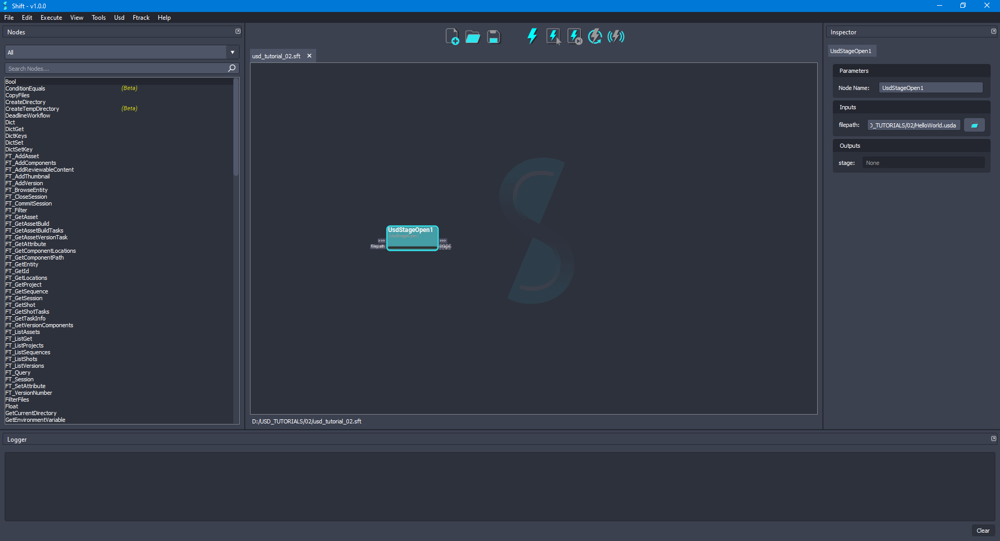
    <figcaption><b>Figure 2</b>: Added the 'UsdStageOpen' node to the board for opening a given USD file.</figcaption>
</figure>

3. Add a new *UsdPrimGet* node to the board. Connect the **stage** output plug from the *UsdStageOpen* node to the **stage** input plug of the new node and set `/hello` as the value for the **primpath** input plug. Rename the node as *HelloXformGet* to identify it easily. The board should look like the following:

<figure>
    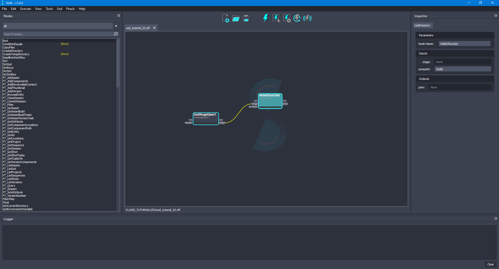
    <figcaption><b>Figure 3</b>: Added the 'HelloXformGet' node to the board connected to the 'UsdStageOpen' node for getting the '/hello' prim.</figcaption>
</figure>

4. Add another *UsdPrimGet* node to the board. Connect the **stage** output plug from the *UsdStageOpen* node to the **stage** input plug of the new node and set `/hello/world` as the value for the **primpath** input plug. Rename the node as *WorldSphereGet* to identify it easily. The board should look like the following:

<figure>
    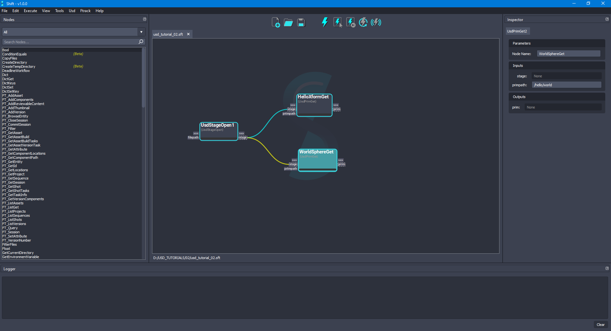
    <figcaption><b>Figure 4</b>: Added the 'WorldSphereGet' node to the board connected to the 'UsdStageOpen' node for getting the '/hello/world' prim.</figcaption>
</figure>

5. Add a new *UsdPrimPropertyNamesGet* node to the board. Connect the **prim** output plug from the *HelloXformGet* node to the **prim** input plug of the new node. Rename the node as *HelloPropertyNamesGet* to identify it easily. The board should look like the following:

<figure>
    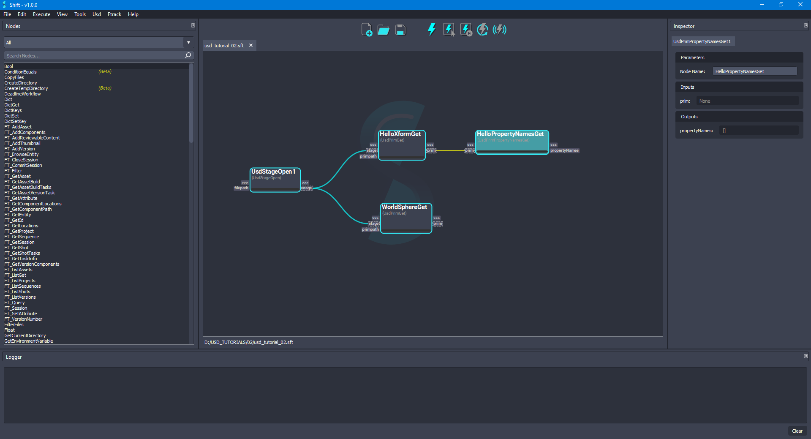
    <figcaption><b>Figure 5</b>: Added the 'HelloPropertyNamesGet' node to the board connected to the 'HelloXformGet' node.</figcaption>
</figure>

6. As done in the previous step, add another *UsdPrimPropertyNamesGet* node to the board. Connect the **prim** output plug from the *WorldSphereGet* node to the **prim** input plug of this new node. Rename the node as *WorldPropertyNamesGet* to identify it easily. The board should look like the following:

<figure>
    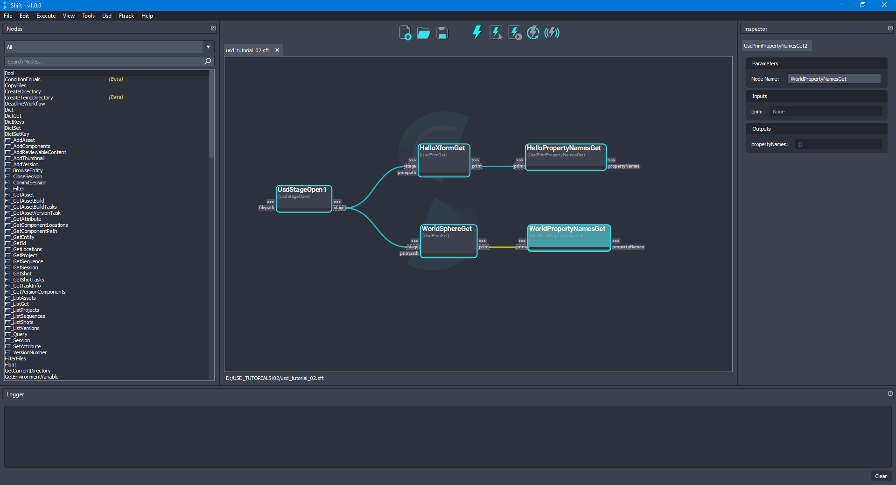
    <figcaption><b>Figure 6</b>: Added the 'WorldPropertyNamesGet' node to the board connected to the 'WorldSphereGet' node.</figcaption>
</figure>

7. Now, with the *HelloPropertyNamesGet* node selected, run the execution only for the selected nodes. The execution will run only on the necessary nodes to compute the *HelloPropertyNamesGet* node, meaning that from the 2 branches created, only the top one will be executed. With the *HelloPropertyNamesGet* node selected, `Right-Click` over the **propertyNames** output plug field and click on the *Show* option from the context menu. A new dialog should appear showing the value of the plug, which should be: `['proxyPrim', 'purpose', 'visibility', 'xformOpOrder']`. The board should look like the following:

<figure>
    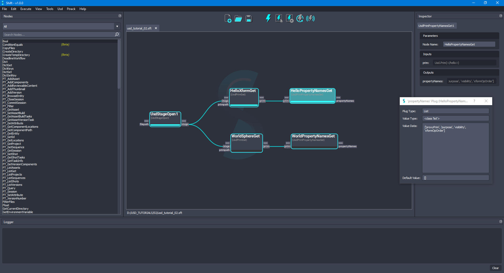
    <figcaption><b>Figure 7</b>: Executed the selected node named 'HelloPropertyNamesGet'.</figcaption>
</figure>

8. Following the previous steps, do the same selecting now the *WorldPropertyNamesGet* node. Execute again only the selected node. The execution will run over the nodes on the bottom branch, that was still not executed. When showing the result values from the **propertyNames** output plug, the values of the list are: `['doubleSided', 'extent', 'orientation', 'primvars:displayColor', 'primvars:displayOpacity', 'proxyPrim', 'purpose', 'radius', 'visibility', 'xformOpOrder']`. The board should look like the following:

<figure>
    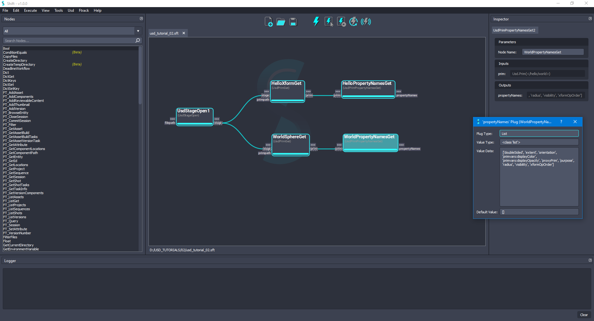
    <figcaption><b>Figure 8</b>: Executed the selected node named 'WorldPropertyNamesGet'.</figcaption>
</figure>

9. Add a new *UsdAttributeGet* node to the board. Connect the **prim** output plug from the *WorldSphereGet* node to the **prim** input plug of the new node and set `extent` as the value for the **name** input plug. Rename the node as *ExtentGet* to identify it easily. The board should look like the following:

<figure>
    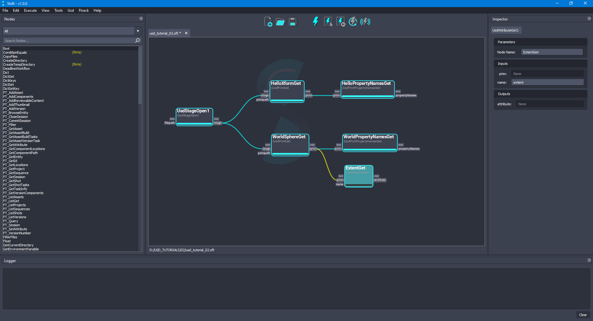
    <figcaption><b>Figure 9</b>: Added the 'ExtentGet' node to the board connected to the 'WorldSphereGet' node.</figcaption>
</figure>

10. In order to get the value of an attribute, add a new *UsdAttributeValueGet* node to the board. Connect the **attribute** output plug from the *ExtentGet* node to the **prim** input plug of the new node. Leave the **useTime** input plug value set to `False` and the **time** input plug value set to `0`. Rename the node as *ExtentValueGet* to identify it easily. The board should look like the following:

<figure>
    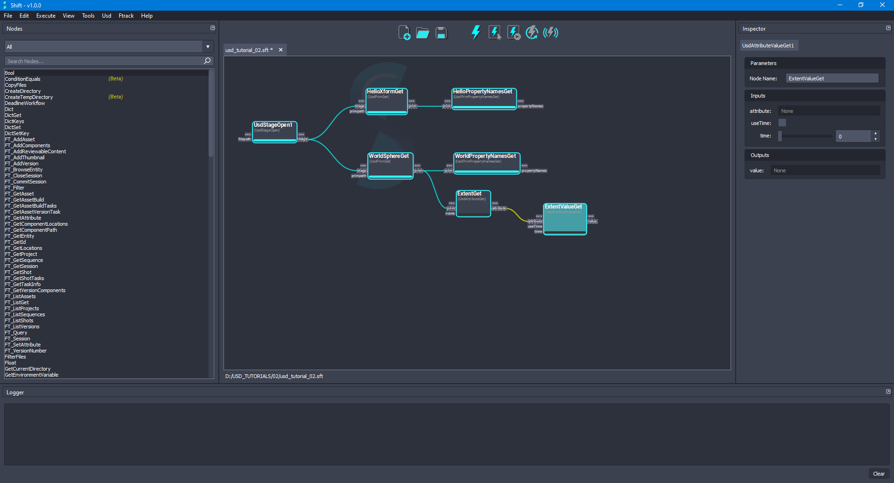
    <figcaption><b>Figure 10</b>: Added the 'ExtentValueGet' node to the board connected to the 'ExtentGet' node.</figcaption>
</figure>

11. Select the *ExtentValueGet* node and execute the workflow again only for the selected node. Inspecting the value of the **value** output plug as done in the previous cases, the result list is: `[(-1, -1, -1), (1, 1, 1)]`. The board should look like the following:

<figure>
    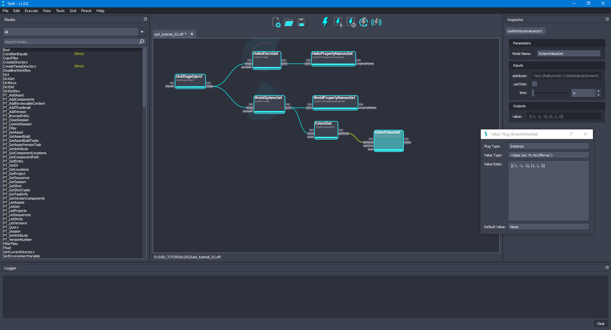
    <figcaption><b>Figure 11</b>: Executed the 'ExtentValueGet' node.</figcaption>
</figure>

12. Add another *UsdAttributeGet* node to the board. Connect the **prim** output plug from the *WorldSphereGet* node to the **prim** input plug of this new node and set `radius` as the value for the **name** input plug. Rename the node as *RadiusGet* to identify it easily. The board should look like the following:

<figure>
    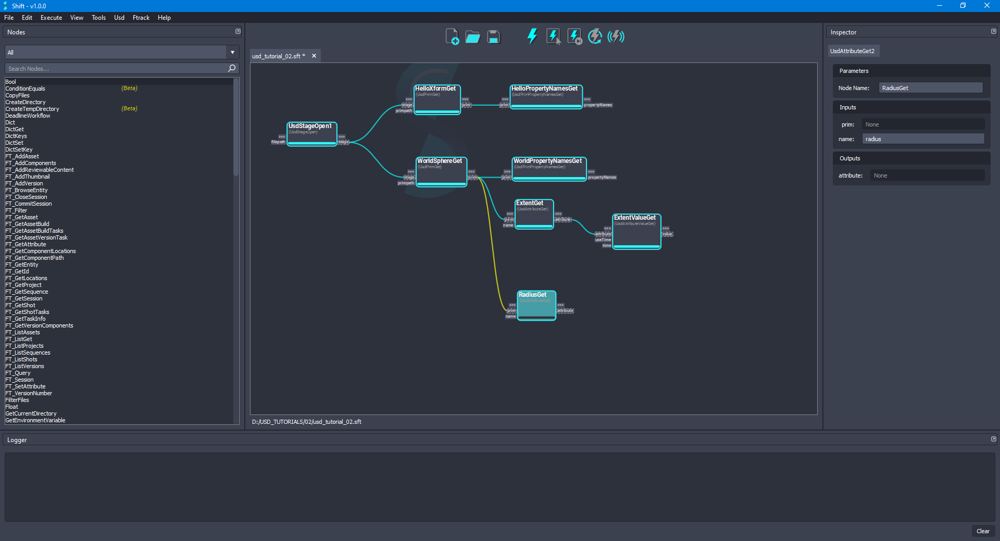
    <figcaption><b>Figure 12</b>: Added the 'RadiusGet' node to the board connected to the 'WorldSphereGet' node.</figcaption>
</figure>

13. Add a new *UsdAttributeValueSet* node to the board and rename it as *RadiusValueSet*. Connect the **attribute** output plug from the *RadiusGet* node to the **attribute** input plug of the new node. Leave the **useTime** input plug value set to `False` and **time** input plug value set to `0`. The board should look like the following:

<figure>
    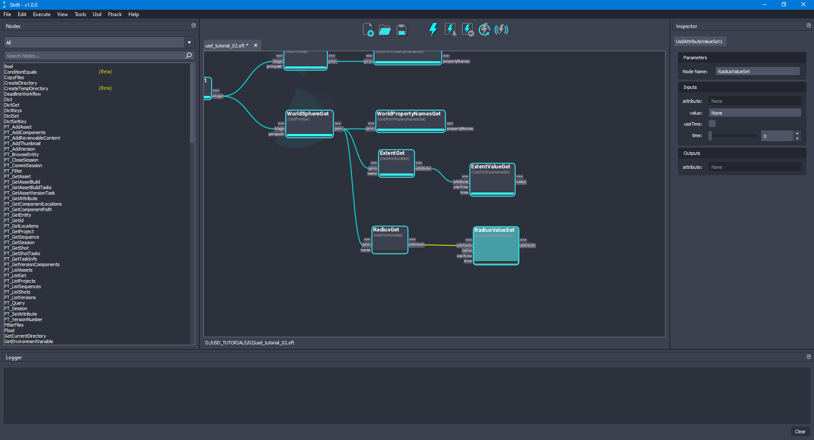
    <figcaption><b>Figure 13</b>: Added the 'RadiusValueSet' node to the board connected to the 'RadiusGet' node.</figcaption>
</figure>

14. Add a new *Float* node is necessary, add it to the board and rename it as *RadiusValue*. Set `2,0` as the value of the input **value** plug. Connect the **out** output plug from *RadiusValue* node to the **value** input plug of the *RadiusValueSet* node. The board should look like the following:

<figure>
    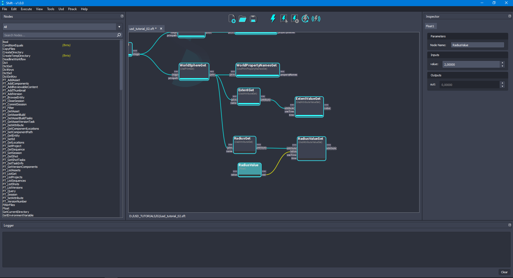
    <figcaption><b>Figure 14</b>: Added the 'RadiusValue' node to the board connected to the 'RadiusValueSet' node.</figcaption>
</figure>

15. To update the sphere's extent to reflect its new size, the same process is needed to update the value of the extent attribute. First, add a new *PythonScript* node and rename it as *MultiplyExtent*. Drag and drop a connection from the **value** output plug of the *ExtentValueGet* node over the *MultiplyExtent* node. In the **Add Plug** dialog should appear, keep the preselected values for the plug configuration as they are preselected and click over the **OK** button to create the new input plug. Create an additional output plug doing `Right-Click` over the node and selecting the **Create New Plug** option. In the **Add Plug** dialog, set the name as `outValue`, the type as `instance` and the direction as `out`. Finally, type `outValue = value * 2` in the **script** input plug of the *MultiplyExtent* node. The board should look like the following:

<figure>
    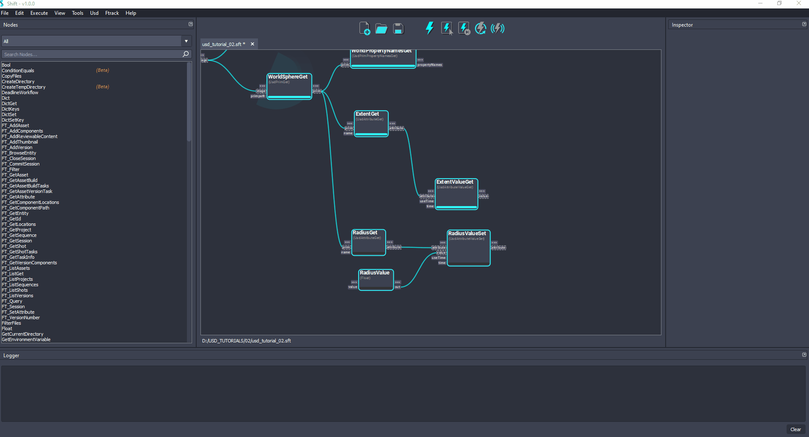
    <figcaption><b>Figure 15</b>: Added the 'MultiplyExtent' node to the board connected to the 'ExtentValueGet' node.</figcaption>
</figure>

16. Add another *UsdAttributeValueSet* node to the board and rename it as *ExtentValueSet*. Connect the **attribute** output plug from the *ExtentGet* node to the **attribute** input plug of the new node. Also, connect the **outValue** output plug from the *MultiplyExtent* node to the **value** input plug. Leave the **useTime** input plug value set to `False` and the **time** input plug value set to `0`. The board should look like the following:

<figure>
    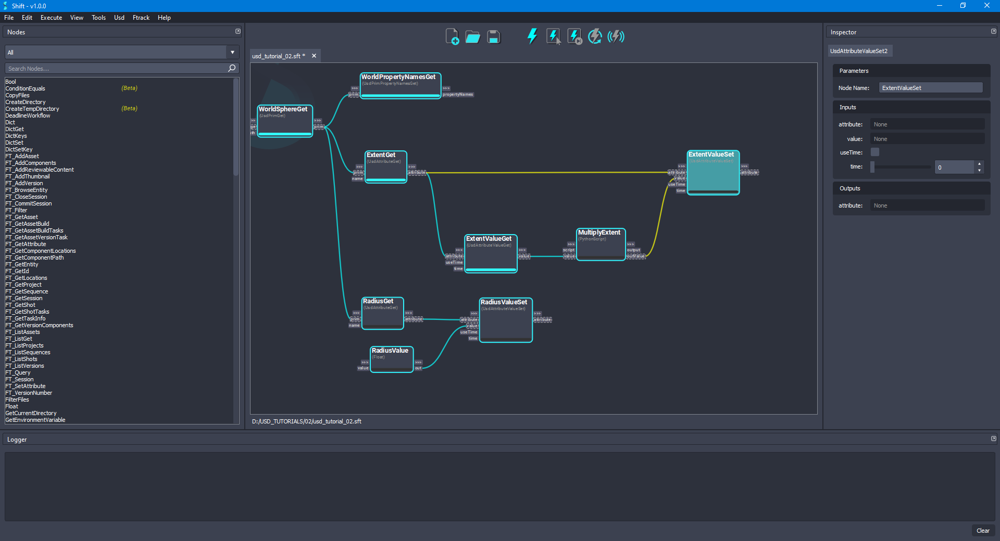
    <figcaption><b>Figure 16</b>: Added the 'ExtentValueSet' node to the board connected to the 'ExtentGet' node.</figcaption>
</figure>

17. For authoring the *displayColor* attribute of the sphere, add a new *UsdPrimDisplayColorSet* node to the board. Connect the **prim** output plug from the *WorldSphereGet* node to the **prim** input plug of the new node. Set the **color** input plug value to `[0,0,1]`, the **indices** input plug value as `[]`, and the **interpolation** input plug value as `constant`. Rename the node as *WorldDisplayColorSet* to identify it easily. The board should look like the following:

<figure>
    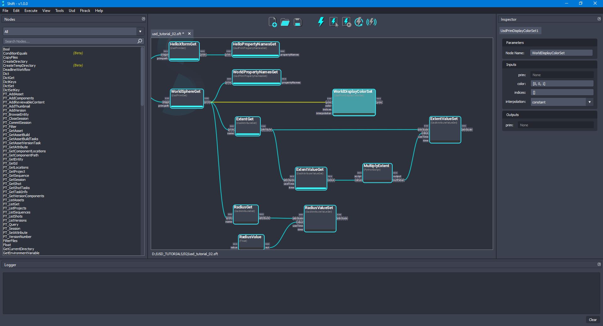
    <figcaption><b>Figure 17</b>: Added the 'WorldDisplayColorSet' node to the board connected to the 'WorldSphereGet' node.</figcaption>
</figure>

18. To define the workflow execution order it is necessary to connect some [trigger](../../../reference/nodes.md#node-interface) plugs. Connect the **out-trigger** output plugs from nodes *HelloPropertyNamesGet*, *WorldPropertyNamesGet*, *RadiusValueSet* and *ExtentValueSet* to the **in-trigger** input plug of the *WorldDisplayColorSet* node. Doing this, the *WorldDisplayColorSet* node will be executed once the other nodes are done. The board should look like the following:

<figure>
    
    <figcaption><b>Figure 18</b>: Added the trigger connections to 'WorldDisplayColorSet' node.</figcaption>
</figure>

19. For retrieving the stage from a prim, add a new *UsdPrimStageGet* node and rename it as *WorldStageGet*. Connect the **prim** output plug from *WorldDisplayColorSet* node to the **prim** input plug of the new node. Doing this, the stage is retrieved from the sphere's prim. The board should look like the following:

<figure>
    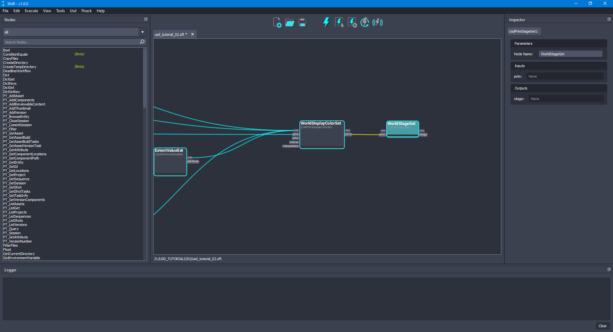
    <figcaption><b>Figure 19</b>: Added the 'WorldStageGet' node to the board connected to the 'WorldDisplayColorSet' node.</figcaption>
</figure>

20. For saving the stage, add a new *UsdStageSave* node. Connect the **stage** output plug from the *WorldStageGet* node to the **stage** input plug of the new node. Leave the **filepath** input plug value empty to override the opened initial USD file for the current example. The board should look like the following:

<figure>
    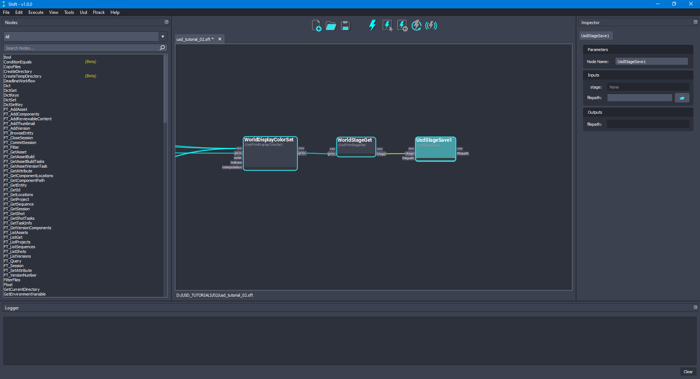
    <figcaption><b>Figure 20</b>: Added the 'UsdStageSave' node to the board connected to the 'WorldStageGet' node.</figcaption>
</figure>

21. Execute the entire workflow. Open again the `HelloWorld.usda` file, it will contain the authored properties updated and the new *displayColor* attribute set.

### Visualizing the Stage

Shift is shipped with native plugins to visualize and inspect the stage. They can be accessed from the *Usd* top menu:
* **USD Outliner**: Shows the user the stage hierarchy sourced from specific Usd nodes in the active board workflow.

* **USD Viewer**: Shows the stage in the Usd viewer sourced from specific Usd nodes in the active board workflow.

<figure>
    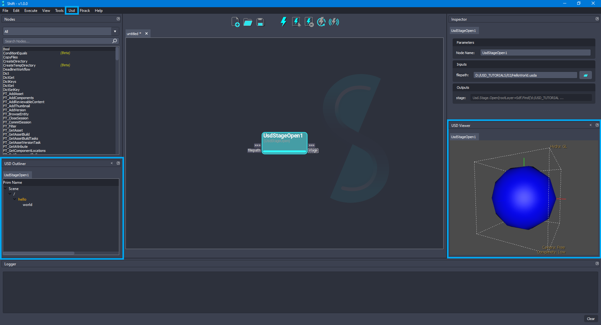
    <figcaption><b>Figure 21</b>: Shift USD Outliner and USD Viewer plugins.</figcaption>
</figure>

Also, the *usdview* tool shipped with USD is used to visualise and inspect the stage:

<figure>
    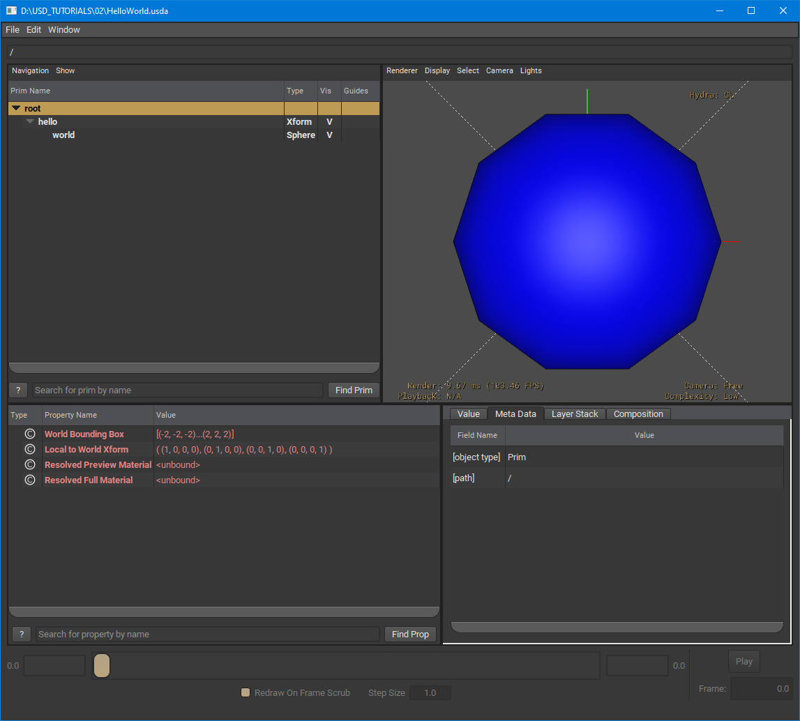
    <figcaption><b>Figure 22</b>: Visualisation of the generated stage.</figcaption>
</figure>

### Workflow Resources

The workflow corresponding to this tutorial can be found in the following path in the Shift installation folder: `<path_to_the_shift_installation_folder>/shift/examples/USD/tutorials/tutorial_02_authoring_properties/tutorial_02.sft`.
