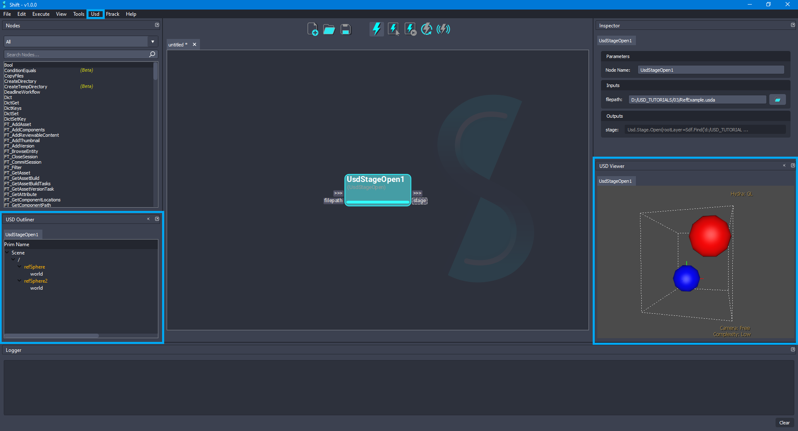

---

[< Inspecting and Authoring Properties](usd_tutorial_02.md)

[Converting Between Layer Formats >](usd_tutorial_04.md)

---

## Referencing Layers

This tutorial is focused on creating a new stage that references the stage created in the previous tutorials, using the operators from the Shift_USD catalog. The example will reuse the `HelloWorld.usda` file generated during the last tutorial [Inspecting and Authoring Properties](usd_tutorial_02.md).

The base file for the example, `HelloWorld.usda`, can be downloaded from the [OpenUSD](https://github.com/PixarAnimationStudios/OpenUSD) Github project repository, from `extras/usd/tutorials/referencingLayers/` folder.

### Tutorial

1. Open Shift application. A new window instance of Shift should appear like the following one:

<figure>
    
    <figcaption><b>Figure 1</b>: Shift UI.</figcaption>
</figure>

>[!NOTE]
> Before creating the USD workflow, ensure that the USD nodes appear in the Node List widget. The catalogs combobox should show `sUSD` and `sUSDTypes` if USD is correctly loaded in Shift. If this is not the case, please check again the [Shift_USD installation page](../usd#installation).

2. Add a new *UsdStageOpen* node to the board and rename it to *StageOpen*. Using the **Inspector** widget, set as the value for the **filepath** plug a filepath pointing to the `HelloWorld.usda` file downloaded for the example. The board should look like the following:

<figure>
    
    <figcaption><b>Figure 2</b>: Added the 'StageOpen' node to the board for opening a given USD file.</figcaption>
</figure>

3. Add a new *UsdPrimGet* node to the board and rename it to *HelloGet*. Connect the **stage** output plug from the *StageOpen* node to the **stage** input plug of the new node. Set `/hello` as the value to the **primpath** input plug. The board should look like the following:

<figure>
    
    <figcaption><b>Figure 3</b>: Added the 'HelloGet' node to the board connected to the 'StageOpen' node.</figcaption>
</figure>

4. Add a new *UsdStageDefaultPrimSet* node to the board and rename it to *DefaultPrimSet*. Connect the **stage** output plug from the *StageOpen* node to the **stage** input plug of the new node, also, connect the **prim** output plug from the *HelloGet* node to the **prim** input plug of the new node. The board should look like the following:

<figure>
    
    <figcaption><b>Figure 4</b>: Added the 'DefaultPrimSet' node to the board connected to the 'HelloGet' and 'StageOpen' nodes.</figcaption>
</figure>

5. For adding a translation to the `Hello` prim, add a new *UsdXformSet* node to the board and rename it to *HelloXformSet*. Connect the **prim** output plug from the *HelloGet* node to the **prim** input plug of the new node and connect the **out-trigger** from the *DefaultPrimSet* node to the **in-trigger** of the new node. Set `[4, 5, 6]` as the value for the **translate** input plug, leave the **useTime** input plug value set as `False`, the **time** input plug value set as `0`, and the **rotate**, **scale** and **pivot** input plugs values set as `None`. The board should look like the following:

<figure>
    
    <figcaption><b>Figure 5</b>: Added the 'HelloXformSet' node to the board connected to the 'DefaultPrimSet' and 'HelloGet' nodes.</figcaption>
</figure>

6. Add a new *UsdPrimStageGet* node to the board and rename it to *HelloStageGet*. Connect the **prim** output plug from the *HelloXformSet* node to the **prim** input plug of the new node. The board should look like the following:

<figure>
    
    <figcaption><b>Figure 6</b>: Added the 'HelloStageGet' node to the board connected to the 'HelloXformSet' node.</figcaption>
</figure>

7. Add a new *UsdStageSave* node to the board and rename it to *HelloWorldStageSave*. Connect the **stage** output plug from the *HelloStageGet* node to the **stage** input plug of the new node. Leave the **filepath** input plug empty to override the original file. The board should look like the following:

<figure>
    
    <figcaption><b>Figure 7</b>: Added the 'HelloWorldStageSave' node to the board connected to the 'HelloStageGet' node.</figcaption>
</figure>

8. Add a new *UsdStageNew* node to the board and rename it to *RefExampleStageNew*. Connect the **out-trigger** output plug from the *HelloWorldStageSave* node to the **in-trigger** input plug of the new node. Set as the value for the **filepath** input plug a filepath pointing to a file named `RefExample.usda`. That file will be used for adding references to the previous modified stage. The board should look like the following:

<figure>
    
    <figcaption><b>Figure 8</b>: Added the 'RefExampleStageNew' node to the board connected to the 'HelloWorldStageSave' node.</figcaption>
</figure>

9. For overriding a prim in a stage, add a new *UsdPrimOverride* node to the board and rename it to *RefSphereOverride*. Connect the **stage** output plug from the *RefExampleStageNew* node to the **stage** input plug of the new node. Set `/refSphere` as the value for the **primpath** input plug. The board should look like the following:

<figure>
    
    <figcaption><b>Figure 9</b>: Added the 'RefSphereOverride' node to the board connected to the 'RefExampleStageNew' node.</figcaption>
</figure>

10. Add a new *UsdPrimReferenceAdd* node to the board and rename it to *RefSphereReferenceAdd*. Connect the **prim** output plug from the *RefSphereOverride* node to the **prim** input plug of the new node. Set `Reference` as the value for the **mode** input plug and `None` as the value for the **reference** input plug. For the **filepath** input plug, set as value the path to the updated `HelloWorld.usda` file used at the beginning of the tutorial, `D:/USD_TUTORIALS/03/HelloWorld.usda`. Leave the value empty for the **primpath** input plug, `None` as the value for the **variantSet** input plug and empty value for the **variantName** input plug. The board should look like the following:

<figure>
    
    <figcaption><b>Figure 10</b>: Added the 'RefSphereReferenceAdd' node to the board connected to the 'RefSphereOverride' node.</figcaption>
</figure>

11. Add another *UsdPrimStageGet* node to the board and rename it to *RefSphereStageGet*. Connect the **prim** output plug from the *RefSphereReferenceAdd* node to the **prim** input plug of the new node. The board should look like the following:

<figure>
    
    <figcaption><b>Figure 11</b>: Added the 'RefSphereStageGet' node to the board connected to the 'RefSphereReferenceAdd' node.</figcaption>
</figure>

12. Add another *UsdStageSave* node to the board and rename it to *RefSphereStageSave*. Connect the **stage** output plug from the *RefSphereStageGet* node to the **stage** input plug of the new node. Leave the **filepath** input plug empty to override the original file. The board should look like the following:

<figure>
    
    <figcaption><b>Figure 12</b>: Added the 'RefSphereStageSave' node to the board connected to the 'RefSphereStageGet' node.</figcaption>
</figure>

13. In order to reset the transform of the `/refSphere` prim, add a new *UsdXformOpOrderClear* node to the board and rename it to *RefSphereOpOrderClear*. Connect the **prim** output plug from the *RefSphereReferenceAdd* node to the **prim** input plug of the new node, also, connect the **out-trigger** output plug from the *RefSphereStageSave* node to the **in-trigger** plug of the new node. The board should look like the following:

<figure>
    
    <figcaption><b>Figure 13</b>: Added the 'RefSphereOpOrderClear' node to the board connected to the 'RefSphereReferenceAdd' and 'RefSphereStageSave' nodes.</figcaption>
</figure>

14. Add a new *UsdPrimOverride* node to the board and rename it to *RefSphere2Override*. Connect the **stage** output plug from the *RefSphereStageGet* node to the **stage** input plug of the new node, also, connect the **out-trigger** output plug from the *RefSphereOpOrderClear* node to the **in-trigger** input plug of the new node. Set `/refSphere2` as the value for the **primpath** input plug. The board should look like the following:

<figure>
    
    <figcaption><b>Figure 14</b>: Added the 'RefSphere2Override' node to the board connected to the 'RefSphereStageGet' and 'RefSphereOpOrderClear' nodes.</figcaption>
</figure>

15. Add another *UsdPrimReferenceAdd* node to the board and rename it to *RefSphere2ReferenceAdd*. Connect the **prim** output plug from the *RefSphere2Override* node to the **prim** input plug of the new node. As done in the previous step 10, set `Reference` as the value for the **mode** input plug and `None` as the value for the **reference** input plug. For the **filepath** input plug, set as value the path to the updated `HelloWorld.usda` file used at the beginning of the tutorial, `D:/USD_TUTORIALS/03/HelloWorld.usda`. Leave the value empty for the **primpath** input plug, `None` as the value for the **variantSet** input plug and empty value for the **variantName** input plug. The board should look like the following:

<figure>
    
    <figcaption><b>Figure 15</b>: Added the 'RefSphere2ReferenceAdd' node to the board connected to the 'RefSphere2Override' node.</figcaption>
</figure>

16. Add a new *UsdPrimStageGet* node to the board and rename it to *RefSphere2StageGet*. Connect the **prim** output plug from the *RefSphere2ReferenceAdd* node to the **prim** input plug of the new node. The board should look like the following:

<figure>
    
    <figcaption><b>Figure 16</b>: Added the 'RefSphere2StageGet' node to the board connected to the 'RefSphere2ReferenceAdd' node.</figcaption>
</figure>

17. Add another *UsdStageSave* node to the board and rename it to *RefSphere2StageSave*. Connect the **stage** output plug from the *RefSphere2StageGet* node to the **stage** input plug of the new node. Leave empty the value for the **filepath** input plug, doing this, the original file will be overriden. The board should look like the following:

<figure>
    
    <figcaption><b>Figure 17</b>: Added the 'RefSphere2StageSave' node to the board connected to the 'RefSphere2StageGet' node.</figcaption>
</figure>

18. Add a new *UsdPrimGet* node to the board and rename it to *WorldGet*. Connect the **stage** output plug from the *RefSphere2StageGet* node to the **stage** input plug of the new node. Set `/refSphere2/world` as the value of the **primpath** input plug of the new node. Also, connect the **out-trigger** output plug from the *RefSphere2StageSave* node to the **in-trigger** input plug of the new node. The board should look like the following:

<figure>
    
    <figcaption><b>Figure 18</b>: Added the 'WorldGet' node to the board connected to the 'RefSphere2StageGet' and 'RefSphere2StageSave' nodes.</figcaption>
</figure>

19. Add a new *UsdPrimDisplayColorSet* node to the board and rename it to *WorldDisplayColorSet*. Connect the **prim** output plug from the *WorldGet* node to the **prim** input plug of the new node. Set `[1, 0, 0]` as the value for the **color** input plug, `[]` as the value for the **indices** input plug and `constant` as the value for the **interpolation** input plug of the new node. The board should look like the following:

<figure>
    
    <figcaption><b>Figure 19</b>: Added the 'WorldDisplayColorSet' node to the board connected to the 'WorldGet' node.</figcaption>
</figure>

20. Add another *UsdPrimStageGet* node to the board and rename it to *WorldStageGet*. Connect the **prim** output plug from the *WorldDisplayColorSet* node to the **prim** input plug of the new node. The board should look like the following:

<figure>
    
    <figcaption><b>Figure 20</b>: Added the 'WorldStageGet' node to the board connected to the 'WorldDisplayColorSet' node.</figcaption>
</figure>

21. Add another *UsdStageSave* node to the board and rename it to *WorldStageSave*. Connect the **stage** output plug from the *WorldStageGet* node to the **stage** input plug of the new node. Leave empty the value for the **filepath** input plug, doing this, the original file will be overriden. The board should look like the following:

<figure>
    
    <figcaption><b>Figure 21</b>: Added the 'WorldStageSave' node to the board connected to the 'WorldStageGet' node.</figcaption>
</figure>

22. To flatten the resulting stage, add a new *UsdStageFlatten* node to the board and rename it to *StageFlatten*. Connect the **stage** output plug from the *WorldStageGet* node to the **stage** input plug of the new node. Leave the **layer** input plug with the default value to `None`. Finally, connect the **out-trigger** output plug from the *WorldStageSave* node to the **in-trigger** input plug of the new node. The board should look like the following:

<figure>
    
    <figcaption><b>Figure 22</b>: Added the 'StageFlatten' node to the board connected to the 'WorldStageGet' node.</figcaption>
</figure>

23. For saving the stage after flattening it, add another *UsdStageSave* node to the board and rename it to *FlattenStageSave*. Connect the **stage** output plug from the *StageFlatten* node to the **stage** input plug of the new node. Now, set the value for the **filepath** input plug to point to a new `.usda` file for avoiding overwritting the final result, for example, `D:/USD_TUTORIALS/03/RefExampleFlatten.usda`. The board should look like the following:

<figure>
    
    <figcaption><b>Figure 23</b>: Added the 'FlattenStageSave' node to the board connected to the 'StageFlatten' node.</figcaption>
</figure>

24. Execute the entire workflow. Open the `RefExample.usda` file, it will contain the references and overrides updated. Also, preview the `RefExampleFlatten.usda` for checking how *flattening* the stage works.

### Visualizing the Stage

Shift is shipped with native plugins to visualize and inspect the stage. They can be accessed from the *Usd* top menu:
* **USD Outliner**: Shows the user the stage hierarchy sourced from specific Usd nodes in the active board workflow.

* **USD Viewer**: Shows the stage in the Usd viewer sourced from specific Usd nodes in the active board workflow.

<figure>
    
    <figcaption><b>Figure 24</b>: Shift USD Outliner and USD Viewer plugins.</figcaption>
</figure>

The *USD viewer* tool shipped with USD is used to visualise and inspect the stage viewport:

<figure>
    
    <figcaption><b>Figure 25</b>: Visualisation of the generated stage.</figcaption>
</figure>

### Workflow Resources

The workflow corresponding to this tutorial can be found in the following path in the Shift installation folder: `<path_to_the_shift_installation_folder>/shift/examples/USD/tutorials/tutorial_03_referencing_layers/tutorial_03.sft`.

---

[< Inspecting and Authoring Properties](usd_tutorial_02.md)

[Converting Between Layer Formats >](usd_tutorial_04.md)

---
