## Referencing Layers

This tutorial is focused on referencing the stage created in the previous tutorials into a new stage, using the operators from the Shift_USD catalog. The example will reuse the `HelloWorld.usda` file generated in the previous tutorial [Inspecting and Authoring Properties](usd_tutorial_02.md).

In order to follow easily the steps, it is recommended to read the documentation about the [Shift's interface](../../../getting_started/basics/ui_overview.md) and [workflow execution](../../../getting_started/basics/execute.md).

### Tutorial

1. Open Shift application. A new window's instance of Shift should appear like the following one:

<figure>
    
    <figcaption><b>Figure 1</b>: Shift UI.</figcaption>
</figure>

2. Now, add a new **<tt>UsdStageOpen</tt>** node to the board and rename it to `StageOpen`. Using the **Inspector** widget, set as value for the **filepath** plug a filepath pointing to the `HelloWorld.usda` file downloaded for the example. For doing this, the UI offers a browse button next to the plug input field that opens a browse dialog to facilitate locating the file or it can be added typing manually the path. The board should look like the following one:

<figure>
    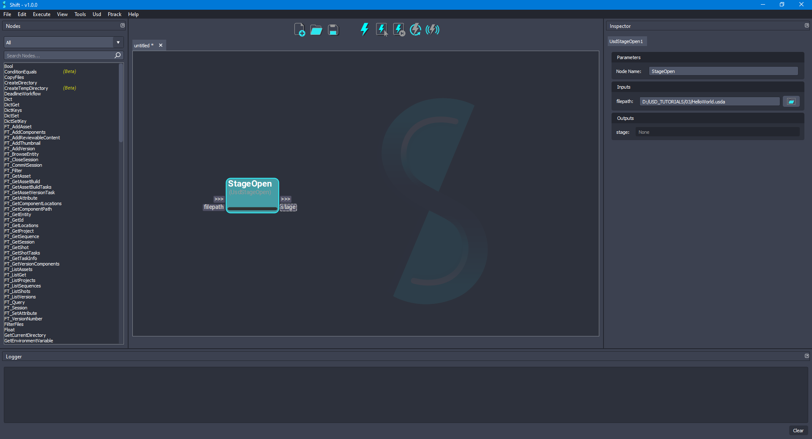
    <figcaption><b>Figure 2</b>: Added the 'StageOpen' node to the board for opening a given USD file.</figcaption>
</figure>

3. Add a new **<tt>UsdPrimGet</tt>** node to the board and rename it to `HelloGet`. Connect the **stage** output plug from the `StageOpen` node to the **stage** input plug of the new node. Set `/hello` as value to the **primpath** input plug. The board should look like the following one:

<figure>
    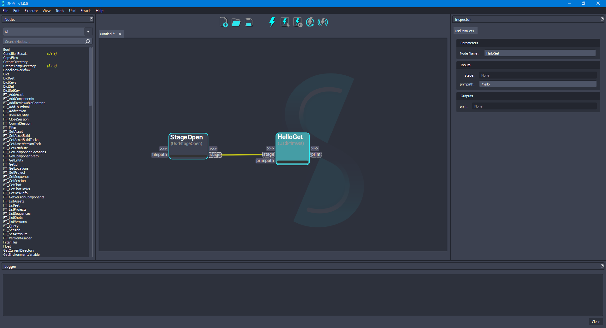
    <figcaption><b>Figure 3</b>: Added the 'HelloGet' node to the board connected to the 'StageOpen' node.</figcaption>
</figure>

4. Add a new **<tt>UsdStageDefaultPrimSet</tt>** node to the board and rename it to `DefaultPrimSet`. Connect the **stage** output plug from the `StageOpen` node to the **stage** input plug of the new node, also, connect the **prim** output plug from the `HelloGet` node to the **prim** input plug of the new node. The board should look like the following one:

<figure>
    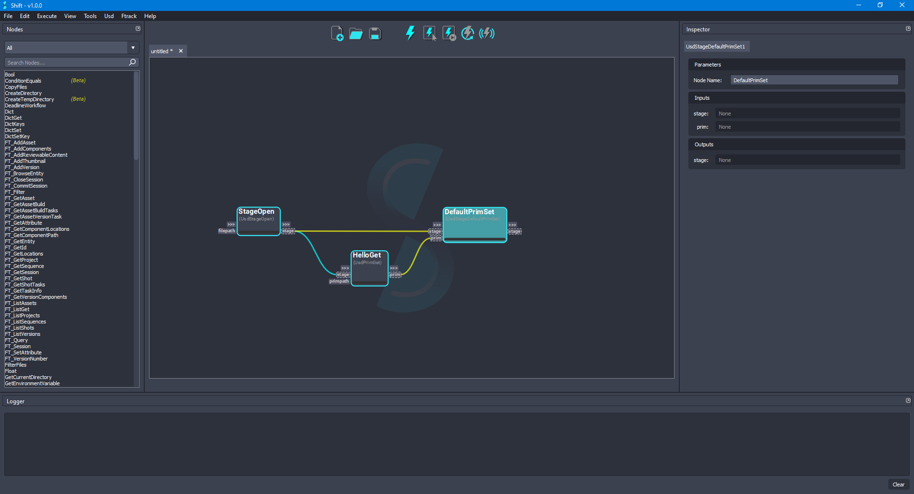
    <figcaption><b>Figure 4</b>: Added the 'DefaultPrimSet' node to the board connected to the 'HelloGet' and 'StageOpen' nodes.</figcaption>
</figure>

5. For adding a translation to the `Hello` prim, add a new **<tt>UsdXformSet</tt>** node to the board and rename it to `HelloXformSet`. Connect the **prim** output plug from the `HelloGet` node to the **prim** input plug of the new node and connect the **out-trigger** from the `DefaultPrimSet` node to the **in-trigger** of the new node. Set `[4, 5, 6]` as value for the **translate** input plug and leave the **useTime** input plug set as `False`, the **time** input plug set as `0`, and the **rotate**, **scale** and **pivot** input plugs set as `None`. The board should look like the following one:

<figure>
    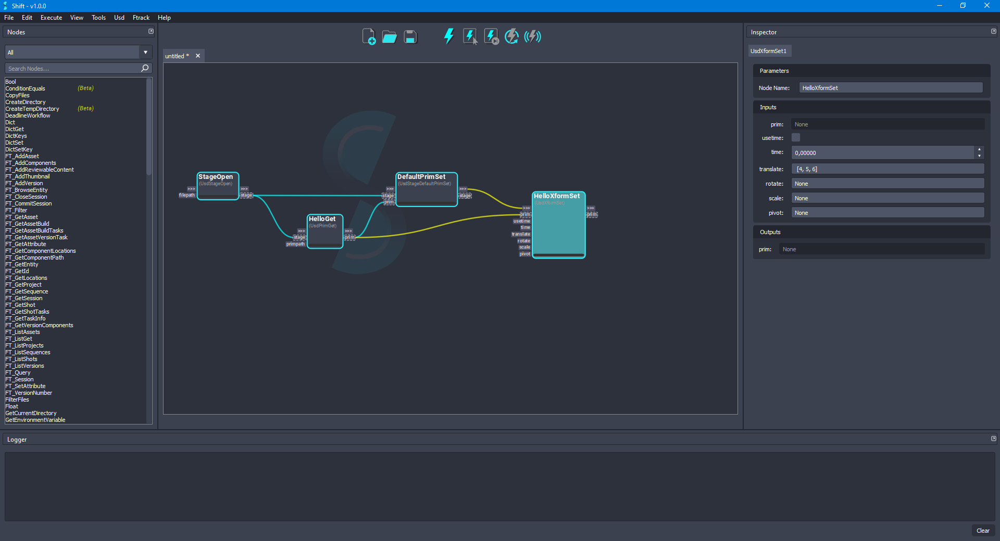
    <figcaption><b>Figure 5</b>: Added the 'HelloXformSet' node to the board connected to the 'DefaultPrimSet' and 'HelloGet' nodes.</figcaption>
</figure>

6. Add a new **<tt>UsdPrimStageGet</tt>** node to the board and rename it to `HelloStageGet`. Connect the **prim** output plug from the `HelloXformSet` node to the **prim** input plug of the new node. The board should look like the following one:

<figure>
    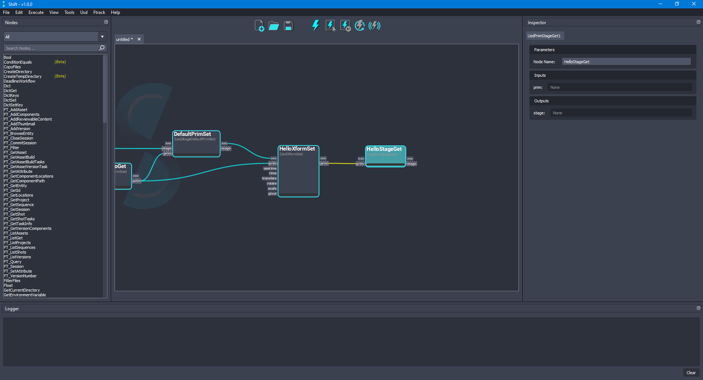
    <figcaption><b>Figure 6</b>: Added the 'HelloStageGet' node to the board connected to the 'HelloXformSet' node.</figcaption>
</figure>

7. Add a new **<tt>UsdStageSave</tt>** node to the board and rename it to `HelloWorldStageSave`. Connect the **stage** output plug from the `HelloStageGet` node to the **stage** input plug of the new node. Leave empty the value for the **filepath** input plug value, doing this, the original file will be overriden. The board should look like the following one:

<figure>
    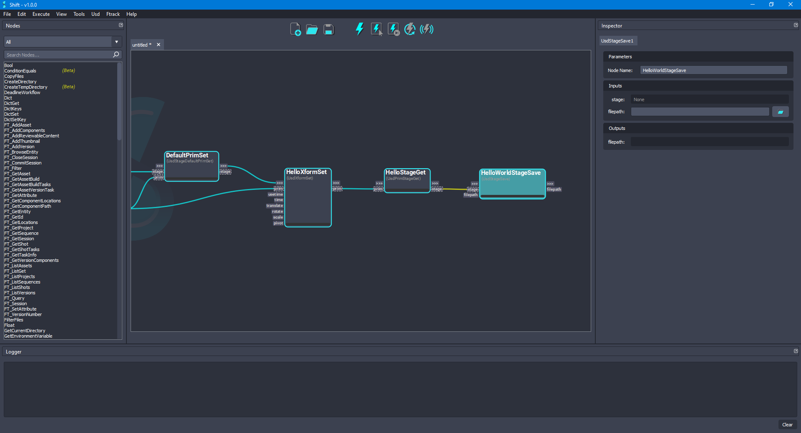
    <figcaption><b>Figure 7</b>: Added the 'HelloWorldStageSave' node to the board connected to the 'HelloStageGet' node.</figcaption>
</figure>

8. Add a new **<tt>UsdStageNew</tt>** node to the board and rename it to `RefExampleStageNew`. Connect the **out-trigger** output plug from the `HelloWorldStageSave` node to the **in-trigger** input plug of the new node. Set as value for the **filepath** input plug a filepath pointing to a file named `RefExample.usda`, that file will be used for adding references of the previous modified stage. The board should look like the following one:

<figure>
    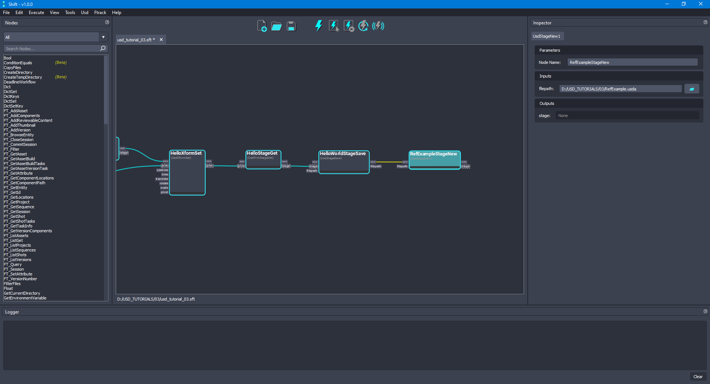
    <figcaption><b>Figure 8</b>: Added the 'RefExampleStageNew' node to the board connected to the 'HelloWorldStageSave' node.</figcaption>
</figure>

9. For overriding a prim in a stage, add a new **<tt>UsdPrimOverride</tt>** node to the board and rename it to `RefSphereOverride`. Connect the **stage** output plug from the `RefExampleStageNew` node to the **stage** input plug of the new node. Set `/refSphere` as value for the **primpath** input plug. The board should look like the following one:

<figure>
    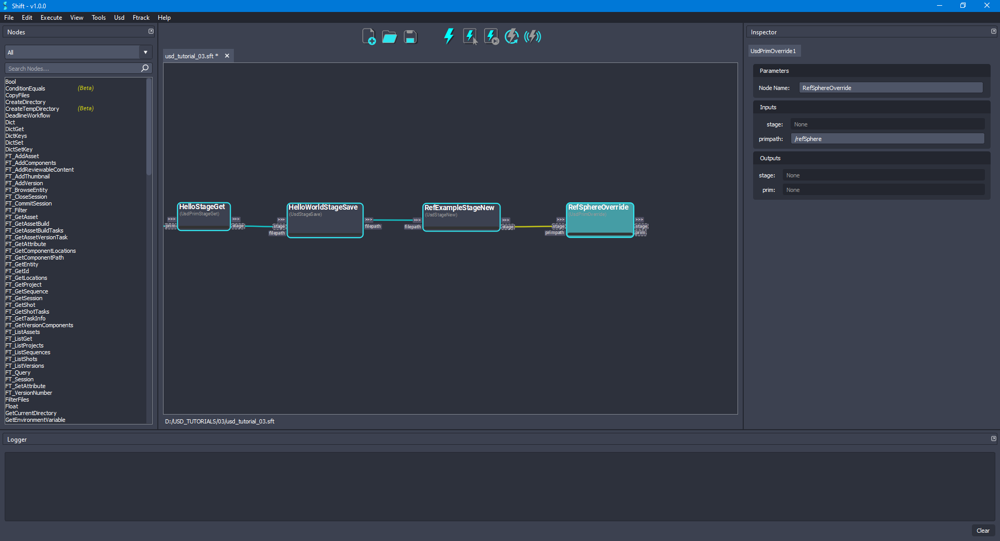
    <figcaption><b>Figure 9</b>: Added the 'RefSphereOverride' node to the board connected to the 'RefExampleStageNew' node.</figcaption>
</figure>

10. Add a new **<tt>UsdPrimReferenceAdd</tt>** node to the board and rename it to `RefSphereReferenceAdd`. Connect the **prim** output plug from the `RefSphereOverride` node to the **prim** input plug of the new node. Set `Reference` as value for the **mode** input plug and `None` as value for the **reference** input plug. For the **filepath** input plug, set as value the path to the updated `HelloWorld.usda` file used at the beginning of the tutorial, for example, `D:/USD_TUTORIALS/03/HelloWorld.usda`. Leave the value empty for the **primpath** input plug, `None` as value for the **variantSet** input plug and empty value for the **variantName** input plug. The board should look like the following one:

<figure>
    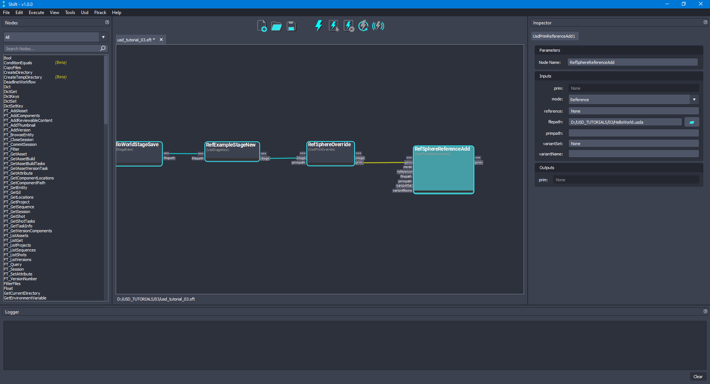
    <figcaption><b>Figure 10</b>: Added the 'RefSphereReferenceAdd' node to the board connected to the 'RefSphereOverride' node.</figcaption>
</figure>

11. Add another **<tt>UsdPrimStageGet</tt>** node to the board and rename it to `RefSphereStageGet`. Connect the **prim** output plug from the `RefSphereReferenceAdd` node to the **prim** input plug of the new node. The board should look like the following one:

<figure>
    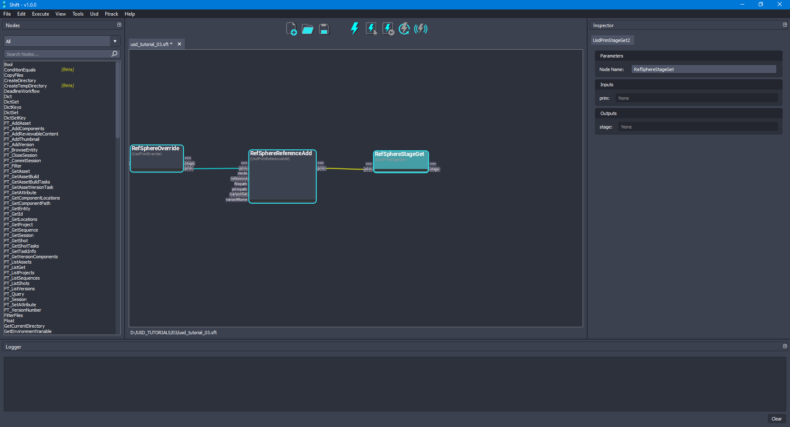
    <figcaption><b>Figure 11</b>: Added the 'RefSphereStageGet' node to the board connected to the 'RefSphereReferenceAdd' node.</figcaption>
</figure>

12. Add another **<tt>UsdStageSave</tt>** node to the board and rename it to `RefSphereStageSave`. Connect the **stage** output plug from the `RefSphereStageGet` node to the **stage** input plug of the new node. Leave empty the value for the **filepath** input plug value, doing this, the original file will be overriden. The board should look like the following one:

<figure>
    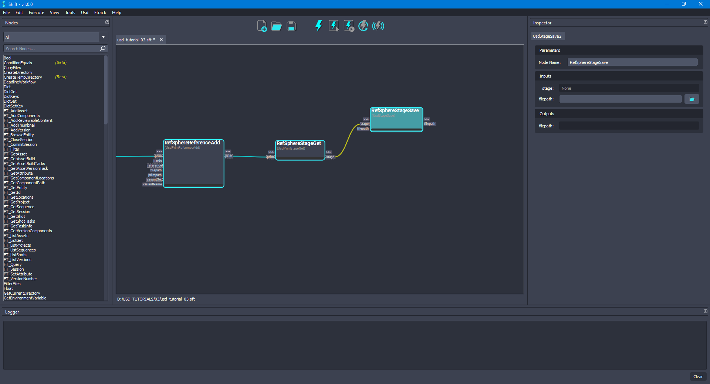
    <figcaption><b>Figure 12</b>: Added the 'RefSphereStageSave' node to the board connected to the 'RefSphereStageGet' node.</figcaption>
</figure>

13. In order to reset the transform of the `/refSphere` prim, add a new **<tt>UsdXformOpOrderClear</tt>** node to the board and rename it to `RefSphereOpOrderClear`. Connect the **prim** output plug from the `RefSphereReferenceAdd` node to the **prim** input plug of the new node, also, connect the **out-trigger** output plug from the `RefSphereStageSave` node to the **in-trigger** plug of the new node. The board should look like the following one:

<figure>
    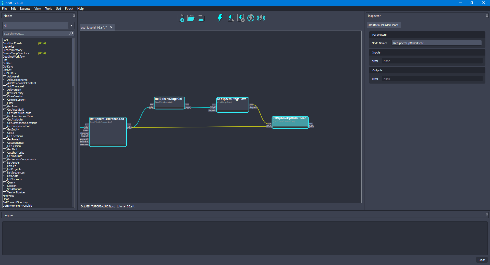
    <figcaption><b>Figure 13</b>: Added the 'RefSphereOpOrderClear' node to the board connected to the 'RefSphereReferenceAdd' and 'RefSphereStageSave' nodes.</figcaption>
</figure>

14. Add a new **<tt>UsdPrimOverride</tt>** node to the board and rename it to `RefSphere2Override`. Connect the **stage** output plug from the `RefSphereStageGet` node to the **stage** input plug of the new node, also, connect the **out-trigger** output plug from the `RefSphereOpOrderClear` node to the **in-trigger** input plug of the new node. Set `/refSphere2` as value for the **primpath** input plug. The board should look like the following one:

<figure>
    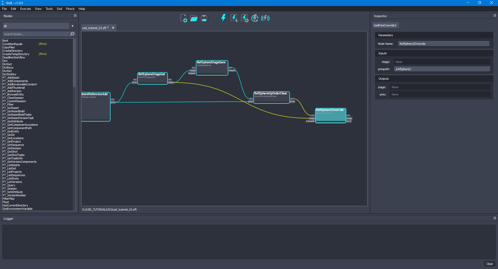
    <figcaption><b>Figure 14</b>: Added the 'RefSphere2Override' node to the board connected to the 'RefSphereStageGet' and 'RefSphereOpOrderClear' nodes.</figcaption>
</figure>

15. Add another **<tt>UsdPrimReferenceAdd</tt>** node to the board and rename it to `RefSphere2ReferenceAdd`. Connect the **prim** output plug from the `RefSphere2Override` node to the **prim** input plug of the new node. As done in the previous step 10, set `Reference` as value for the **mode** input plug and `None` as value for the **reference** input plug. For the **filepath** input plug, set as value the path to the updated `HelloWorld.usda` file used at the beginning of the tutorial, for example, `D:/USD_TUTORIALS/03/HelloWorld.usda`. Leave the value empty for the **primpath** input plug, `None` as value for the **variantSet** input plug and empty value for the **variantName** input plug. The board should look like the following one:

<figure>
    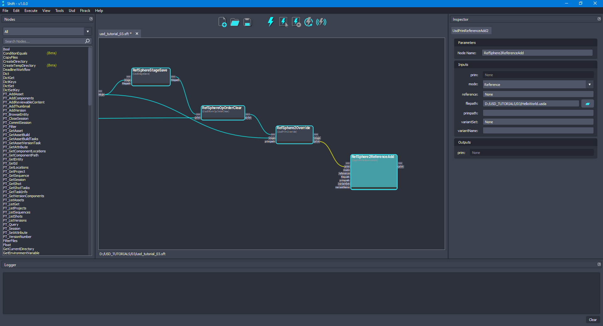
    <figcaption><b>Figure 15</b>: Added the 'RefSphere2ReferenceAdd' node to the board connected to the 'RefSphere2Override' node.</figcaption>
</figure>

16. Add a new **<tt>UsdPrimStageGet</tt>** node to the board and rename it to `RefSphere2StageGet`. Connect the **prim** output plug from the `RefSphere2ReferenceAdd` node to the **prim** input plug of the new node. The board should look like the following one:

<figure>
    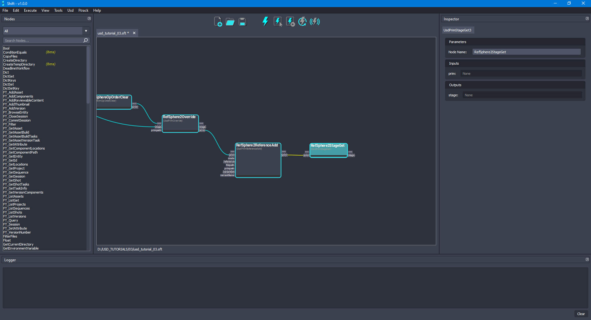
    <figcaption><b>Figure 16</b>: Added the 'RefSphere2StageGet' node to the board connected to the 'RefSphere2ReferenceAdd' node.</figcaption>
</figure>

17. Add another **<tt>UsdStageSave</tt>** node to the board and rename it to `RefSphere2StageSave`. Connect the **stage** output plug from the `RefSphere2StageGet` node to the **stage** input plug of the new node. Leave empty the value for the **filepath** input plug value, doing this, the original file will be overriden. The board should look like the following one:

<figure>
    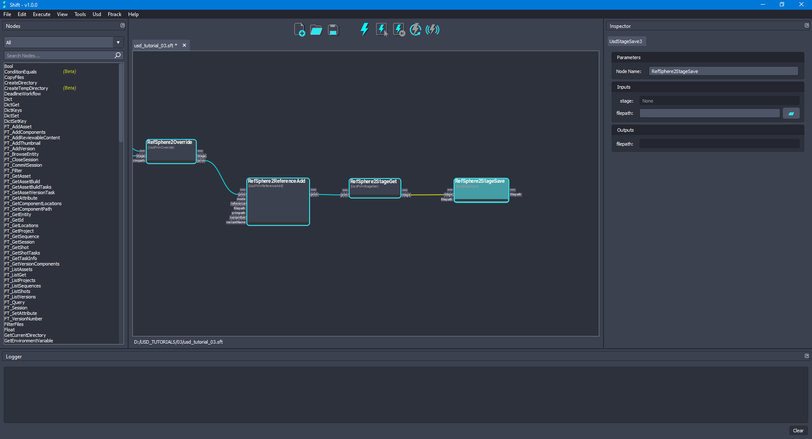
    <figcaption><b>Figure 17</b>: Added the 'RefSphere2StageSave' node to the board connected to the 'RefSphere2StageGet' node.</figcaption>
</figure>

18. Add a new **<tt>UsdPrimGet</tt>** node to the board and rename it to `WorldGet`. Connect the **stage** output plug from the `RefSphere2StageGet` node to the **stage** input plug of the new node. Set `/refSphere2/world` as value of the **primpath** input plug of the new node. Also, connect the **out-trigger** output plug from the `RefSphere2StageSave` node to the **in-trigger** input plug of the new node. The board should look like the following one:

<figure>
    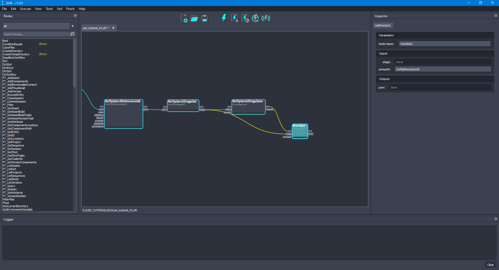
    <figcaption><b>Figure 18</b>: Added the 'WorldGet' node to the board connected to the 'RefSphere2StageGet' and 'RefSphere2StageSave' nodes.</figcaption>
</figure>

19. Add a new **<tt>UsdPrimDisplayColorSet</tt>** node to the board and rename it to `WorldDisplayColorSet`. Connect the **prim** output plug from the `WorldGet` node to the **prim** input plug of the new node. Set `[1, 0, 0]` as value for the **color** input plug, `[]` as value for the **indices** input plug and `constant` as value for the **interpolation** input plug of the new node. The board should look like the following one:

<figure>
    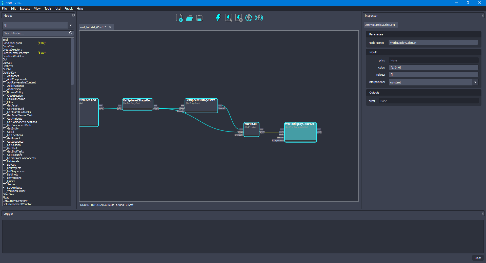
    <figcaption><b>Figure 19</b>: Added the 'WorldDisplayColorSet' node to the board connected to the 'WorldGet' node.</figcaption>
</figure>

20. Add another **<tt>UsdPrimStageGet</tt>** node to the board and rename it to `WorldStageGet`. Connect the **prim** output plug from the `WorldDisplayColorSet` node to the **prim** input plug of the new node. The board should look like the following one:

<figure>
    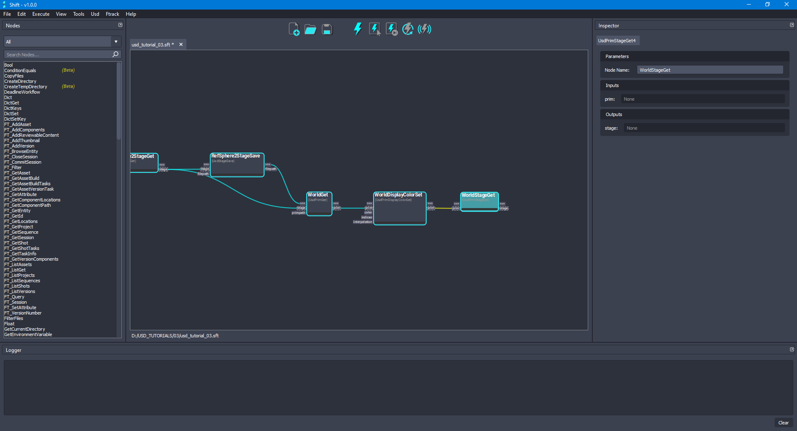
    <figcaption><b>Figure 20</b>: Added the 'WorldStageGet' node to the board connected to the 'WorldDisplayColorSet' node.</figcaption>
</figure>

21. Add another **<tt>UsdStageSave</tt>** node to the board and rename it to `WorldStageSave`. Connect the **stage** output plug from the `WorldStageGet` node to the **stage** input plug of the new node. Leave empty the value for the **filepath** input plug value, doing this, the original file will be overriden. The board should look like the following one:

<figure>
    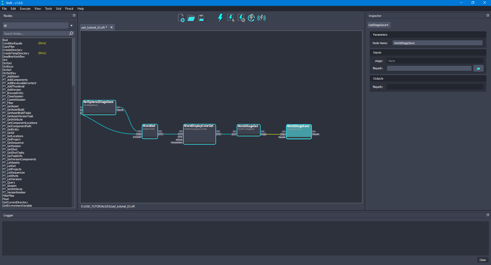
    <figcaption><b>Figure 21</b>: Added the 'WorldStageSave' node to the board connected to the 'WorldStageGet' node.</figcaption>
</figure>

22. Finally, for *flattening* the resulting stage. Following the Pixar's documentation page, *flattening* means producing a single layer of scene description that contains the final “composed data” from a set of composed layers, and retains no composition operators such as references, payloads, inherits, variants, sublayers, and activations. For doing this, add a new **<tt>UsdStageFlatten</tt>** node to the board and rename it to `StageFlatten`. Connect the **stage** output plug from the `WorldStageGet` node to the **stage** input plug of the new node. Leave the **layer** input plug with the default value `None` set. Also, connect the **out-trigger** output plug from the `WorldStageSave` node to the **in-trigger** input plug of the new node. The board should look like the following one:

<figure>
    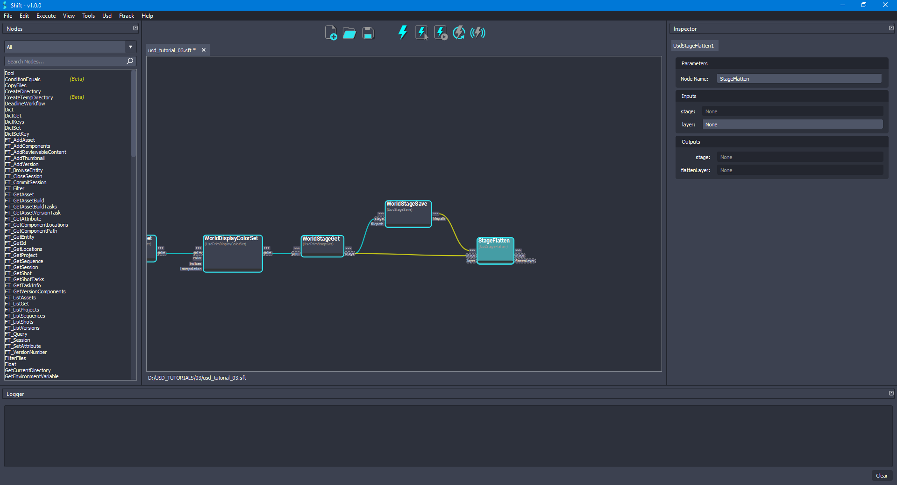
    <figcaption><b>Figure 22</b>: Added the 'StageFlatten' node to the board connected to the 'WorldStageGet' node.</figcaption>
</figure>

23. For saving the stage after flattening it, add another **<tt>UsdStageSave</tt>** node to the board and rename it to `FlattenStageSave`. Connect the **stage** output plug from the `StageFlatten` node to the **stage** input plug of the new node. Now, set the value for the **filepath** input plug value to point to a new `.usda` file for avoiding overwritting the final result, for example, `D:/USD_TUTORIALS/03/RefExampleFlatten.usda`. The board should look like the following one:

<figure>
    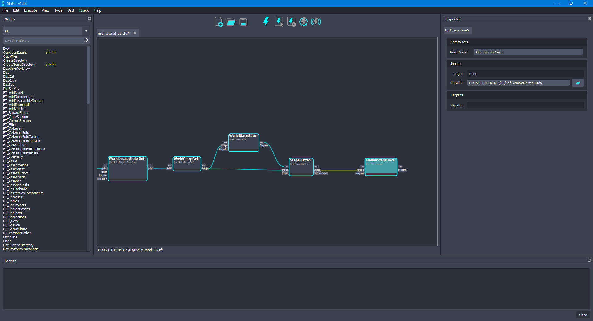
    <figcaption><b>Figure 23</b>: Added the 'FlattenStageSave' node to the board connected to the 'StageFlatten' node.</figcaption>
</figure>

24. Execute the entire workflow. Open the `RefExample.usda` file, it will contain the references and overrides updated. Also, preview the `RefExampleFlatten.usda` for checking how *flattening* the stage works.

### Visualizing the Stage

Use the <tt>usdview</tt> tool shipped with USD to visualise and inspect the stage:

<figure>
    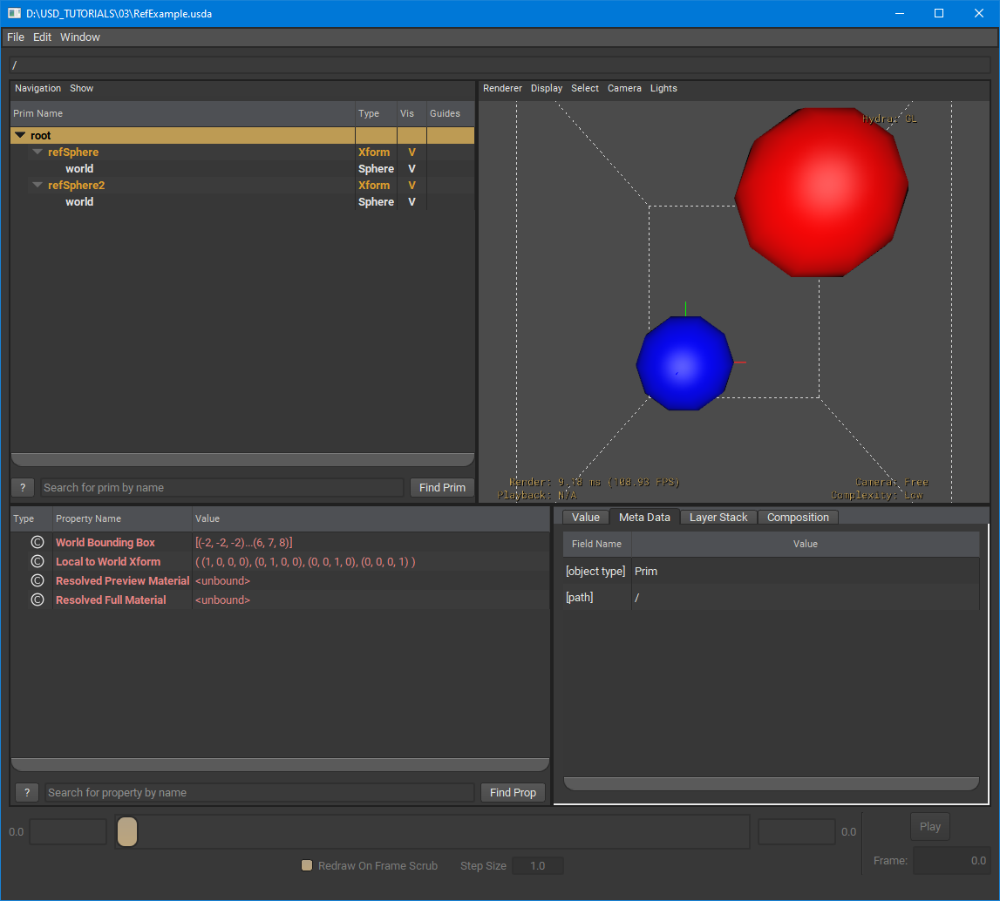
    <figcaption><b>Figure 24</b>: Visualisation of the generated stage.</figcaption>
</figure>
