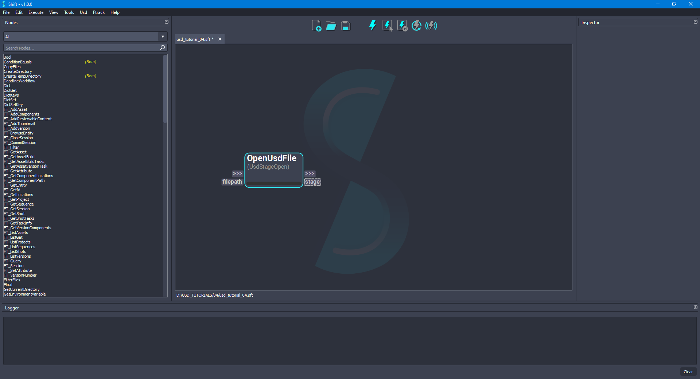
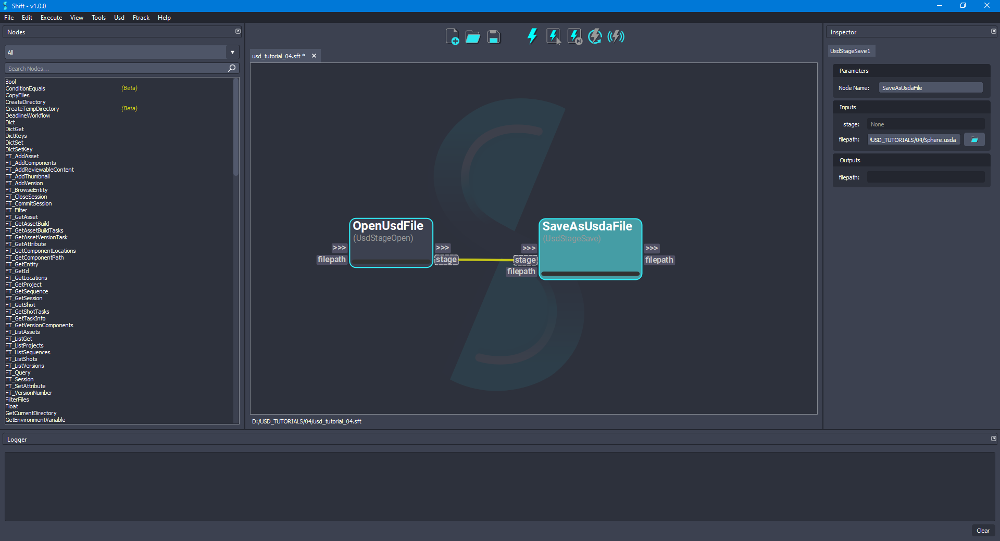
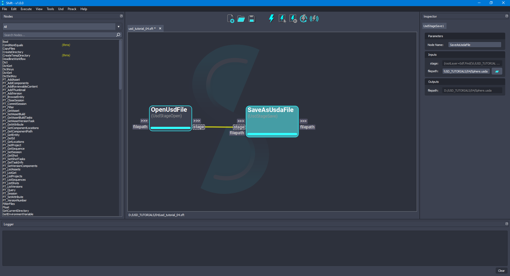
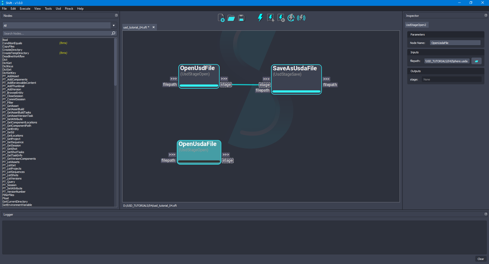
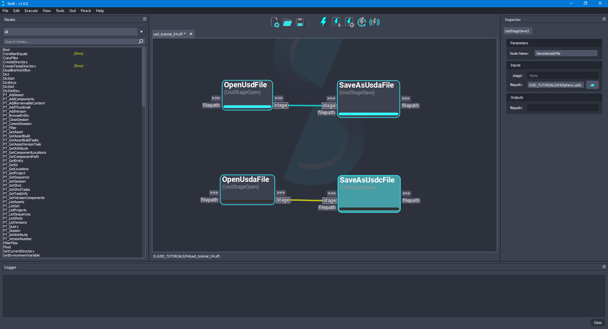
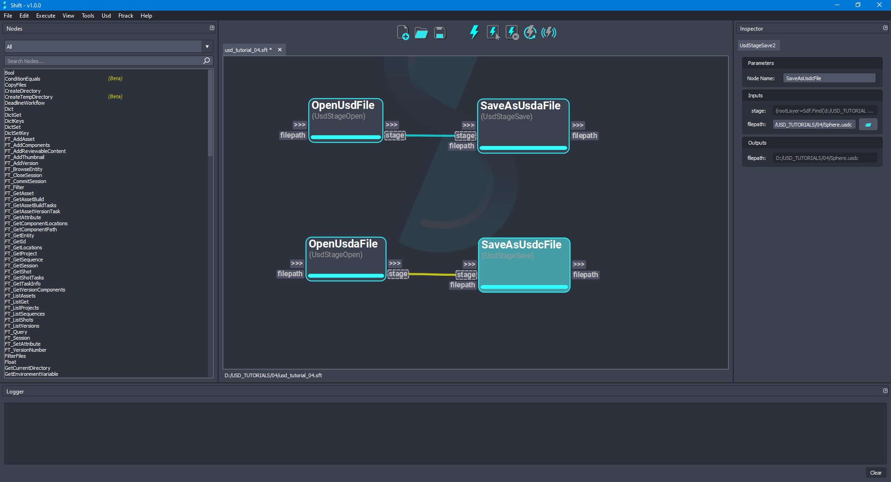
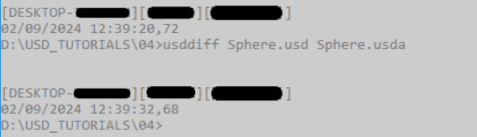
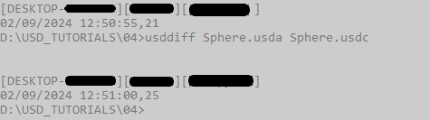

---

[< Referencing Layers](usd_tutorial_03.md)

[Traversing a Stage >](usd_tutorial_05.md)

---

## Converting Between Layer Formats

This tutorial focuses on converting layer files between the different native USD file formats using the operators from the Shift_USD catalog.

The base file for the example, `Sphere.usd`, can be downloaded from the [OpenUSD](https://github.com/PixarAnimationStudios/OpenUSD) Github project repository, from `extras/usd/tutorials/convertingLayerFormats/` folder.

### Converting between .usda/.usdc and .usd

1. Open Shift application. A new window instance of Shift should appear like the following one:

<figure>
    
    <figcaption><b>Figure 1</b>: Shift UI.</figcaption>
</figure>

>[!NOTE]
> Before creating the USD workflow, ensure that the USD nodes appear in the Node List widget. The catalogs combobox should show `sUSD` and `sUSDTypes` if USD is correctly loaded in Shift. If this is not the case, please check again the [Shift_USD installation page](../usd#installation).

2. First, add a new *UsdStageOpen* node to the board and rename it as *OpenUsdFile*. Using the **Inspector** widget, set as the value for the **filepath** input plug a filepath pointing to a `.usd` file. For the purpose of this tutorial, the filepath will be: `D:/USD_TUTORIALS/04/Sphere.usd`. The board should look like the following:

<figure>
    
    <figcaption><b>Figure 2</b>: Added 'OpenUsdFile' node to the board.</figcaption>
</figure>

3. To save a `.usda` file, add a new *UsdStageSave* node to the board and rename it as *SaveAsUsdaFile*. Connect the **stage** output plug from the *OpenUsdFile* node to the **stage** input plug of the new node. Set as the value for the **filepath** input plug a valid filepath to a valid `.usda` file path, such as `D:/USD_TUTORIALS/04/Sphere.usda`. The board should look like the following:

<figure>
    
    <figcaption><b>Figure 3</b>: Added 'SaveAsUsdaFile' node to the board connected to 'OpenUsdFile' node.</figcaption>
</figure>

4. Execute the workflow. Doing this, a new file with the `.usda` extension will be generated using as information the `.usd` file. The board should look like the following:

<figure>
    
    <figcaption><b>Figure 4</b>: Executed the workflow for creating the '.usda' file.</figcaption>
</figure>

5. Add another new *UsdStageOpen* node to the board and rename it as *OpenUsdaFile*. Set the value for the **filepath** input plug of the current node to point to the file generated by the *SaveAsUsdaFile* node, meaning having in the current example the value: `D:/USD_TUTORIALS/04/Sphere.usda`. The board should look like the following:

<figure>
    
    <figcaption><b>Figure 5</b>: Added 'OpenUsdaFile' node to the board.</figcaption>
</figure>

6. To save a `.usdc` file, add a new *UsdStageSave* node to the board and rename it as *SaveAsUsdcFile*. Connect the **stage** output plug from the *OpenUsdaFile* node to the **stage** input plug of the new node. Set as the value for the **filepath** input plug a valid filepath to a `.usdc` file, such as `D:/USD_TUTORIALS/04/Sphere.usdc`. The board should look like the following:

<figure>
    
    <figcaption><b>Figure 6</b>: Added 'SaveAsUsdcFile' node to the board connected to 'OpenUsdaFile' node.</figcaption>
</figure>

7. Execute the workflow again. Now, the workflow will generate a new file with the `.usdc` extension will be generated using the information from the `.usda` file. The board should look like the following:

<figure>
    
    <figcaption><b>Figure 7</b>: Executed the workflow for creating the '.usdc' file.</figcaption>
</figure>

### Run verifications

1. For running the verification between the original `Sphere.usd` file and the generated file `Sphere.usda`, use the terminal for executing the *usddiff* tool shipped with USD for showing the difference between 2 USD files. The terminal should show no differences:

<figure>
    
    <figcaption><b>Figure 8</b>: Usddiff command executed between original 'Sphere.usd' file and generated 'Sphere.usda' file.</figcaption>
</figure>

2. As previously done, for running the verification between the `Sphere.usda` file and the `Sphere.usdc` file, use the terminal for executing the *usddiff* tool. The terminal should show no differences:

<figure>
    
    <figcaption><b>Figure 9</b>: Usddiff command executed between 'Sphere.usda' and 'Sphere.usdc' files.</figcaption>
</figure>

### Workflow Resources

The workflow corresponding to this tutorial can be found in the following path in the Shift installation folder: `<path_to_the_shift_installation_folder>/shift/examples/USD/tutorials/tutorial_04_converting_layer_formats/tutorial_04.sft`.

---

[< Referencing Layers](usd_tutorial_03.md)

[Traversing a Stage >](usd_tutorial_05.md)

---
