## Converting Between Layer Formats

This tutorial is focused on traversing the composed prims on a UsdStage, using the operators from the Shift_USD catalog.

In order to follow easily the steps, it is recommended to read the documentation about the [Shift's interface](../../../getting_started/basics/ui_overview.md) and [workflow execution](../../../getting_started/basics/execute.md).

### Tutorial

1. Open Shift application. A new window's instance of Shift should appear like the following one:

<figure>
    
    <figcaption><b>Figure 1</b>: Shift UI.</figcaption>
</figure>

2. First, add a new **<tt>UsdStageOpen</tt>** node to the board and rename it as `OpenStage`. Using the **Inspector** widget, set as value for the **filepath** input plug a filepath pointing to the `RefExample.usda` file. For doing this, the UI offers a browse button next to the plug input field that opens a browse dialog to facilitate locating the file or it can be added typing manually the path. For the current example, the filepath can be: `D:/USD_TUTORIALS/05/RefExample.usda`. The board should look like the following one:

<figure>
    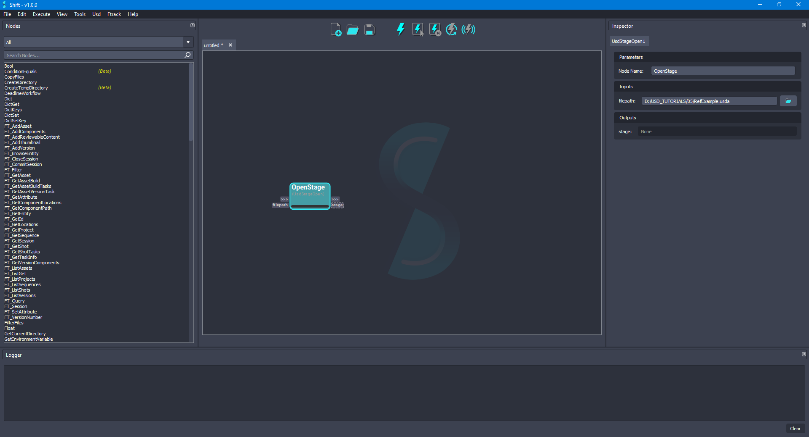
    <figcaption><b>Figure 2</b>: Added 'OpenStage' node to the board.</figcaption>
</figure>

3. For traversing the stage, add a new **<tt>UsdStageTraverse</tt>** node to the board and rename it as `TraverseStage`. Connect the **stage** output plug from the `OpenStage` node to the **stage** input plug of the new node. Leave the **primType** input plug set to `Any` and the **traverseAll** input plug set to `False`. The board should look like the following one:

<figure>
    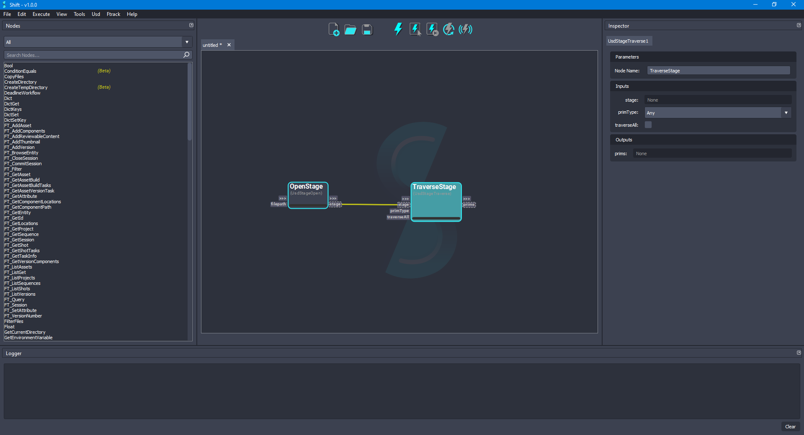
    <figcaption><b>Figure 3</b>: Added 'TraverseStage' node to the board connected to 'OpenStage'.</figcaption>
</figure>

4. Execute the current workflow for checking the **prims** output plug from the `TraverseStage` node. The value of the plug should be: `[Usd.Prim(</refSphere>), Usd.Prim(</refSphere/world>), Usd.Prim(</refSphere2>), Usd.Prim(</refSphere2/world>)]`, containing all the prims that build the stage. The board should look like the following one:

<figure>
    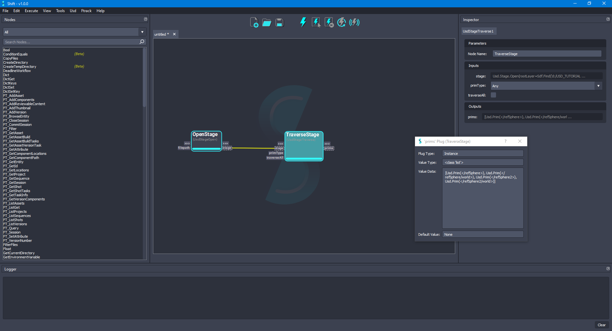
    <figcaption><b>Figure 4</b>: 'TraverseStage' node prims plug value.</figcaption>
</figure>

5. For filtering the values of the **prims** output plug in the `TraverseStage` node, set the **primType** input plug to `Sphere`. Execute again the node for refreshing the output plug result. The value of the plug once the node is executed again should be: `[Usd.Prim(</refSphere/world>), Usd.Prim(</refSphere2/world>)]`. The board should look like the following one:

<figure>
    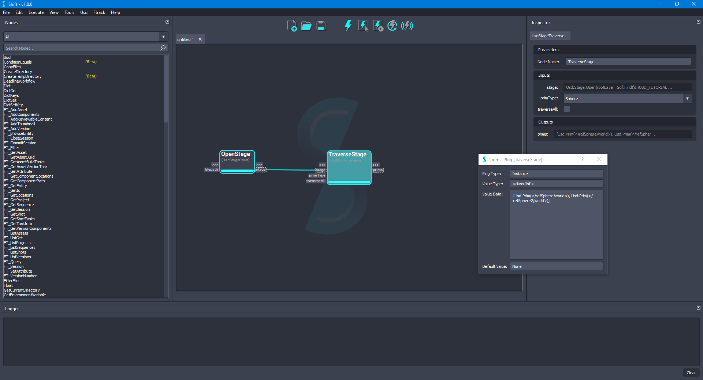
    <figcaption><b>Figure 5</b>: 'TraverseStage' node prims plug value filtering by 'Sphere' primtype.</figcaption>
</figure>

6. In order to activate/deactivate a prim in an specific layer, for the current example, the session layer, add a new **<tt>UsdStageSessionLayerGet</tt>** node and rename it as `SessionLayerGet`. Connect the **stage** output plug from the `OpenStage` node to the **stage** input plug of the new node. The board should look like the following one:

<figure>
    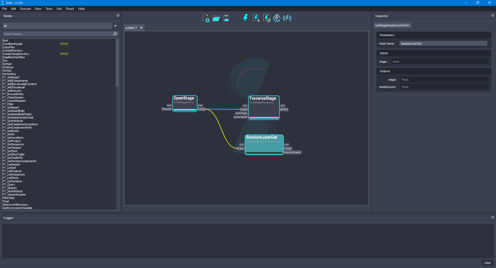
    <figcaption><b>Figure 6</b>: Added the 'SessionLayerGet' node to the board connected to the 'OpenStage' node.</figcaption>
</figure>

7. Now, setting the edit target of the stage is important, in this way, any modification done will affect specifically to that layer instead of the root layer of the stage. Add a new **<tt>UsdStageEditTargetSet</tt>** node and rename it as `SessionLayerTargetSet`. Connect the **stage** and **sessionLayer** output plugs from the `SessionLayerGet` node to the **stage** and **layer** input plugs, respectively, of the new node. The board should look like the following one:

<figure>
    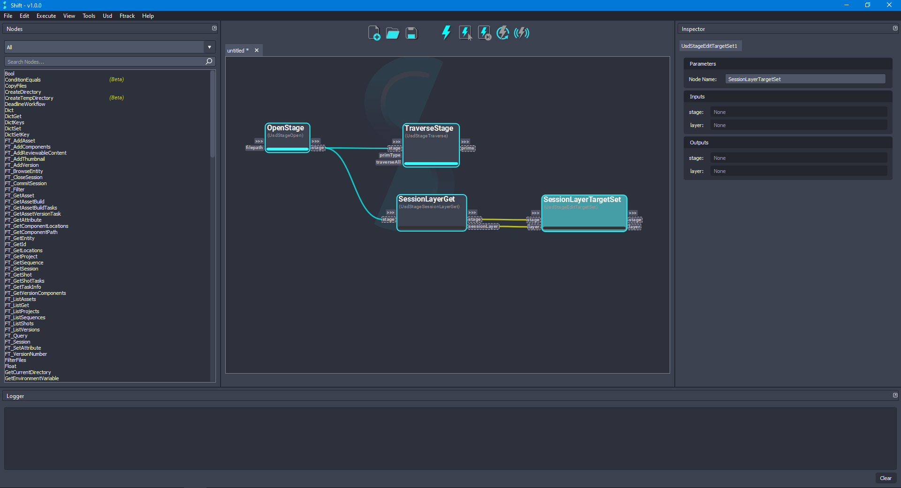
    <figcaption><b>Figure 7</b>: Added the 'SessionLayerTargetSet' node to the board connected to the 'SessionLayerGet' node.</figcaption>
</figure>

8. Add a new **<tt>UsdPrimGet</tt>** node and rename it as `RefSphere2Get`. Connect the **stage** output plug from the `SessionLayerTargetSet` node to the **stage** input plug of the new node and set `/refSphere2` as value for the **primpath** input plug. The board should look like the following one:

<figure>
    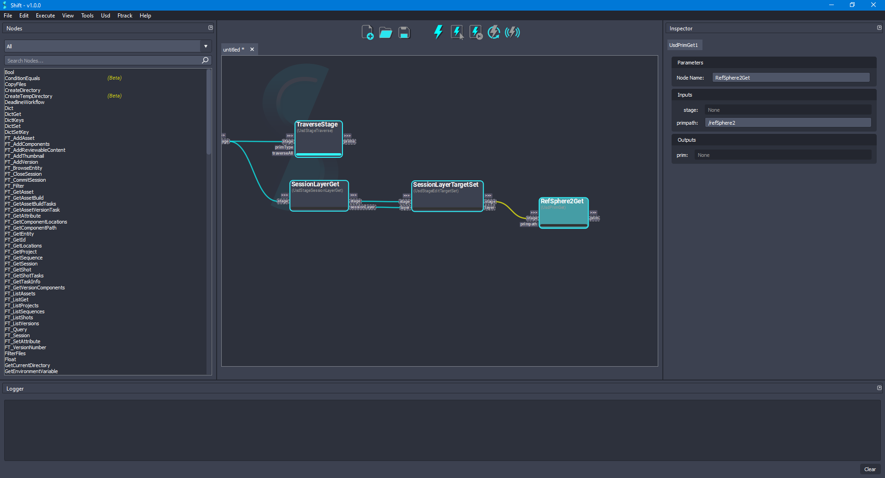
    <figcaption><b>Figure 8</b>: Added the 'RefSphere2Get' node to the board connected to the 'SessionLayerTargetSet' node.</figcaption>
</figure>

9. Add a new **<tt>UsdPrimDisable</tt>** node and rename it as `RefSphere2Disable`. Connect the **prim** output plug from the `RefSphere2Get` node to the **prim** input plug of the new node and set the value of the **disabled** input plug to `True` too. The board should look like the following one:

<figure>
    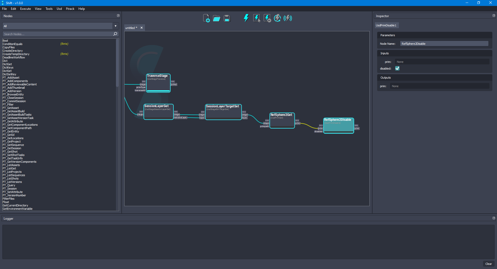
    <figcaption><b>Figure 9</b>: Added the 'RefSphere2Disable' node to the board connected to the 'RefSphere2Get' node.</figcaption>
</figure>

10. Now, select the nodes `SessionLayerGet`, `SessionLayerTargetSet`, `RefSphere2Get` and `RefSphere2Disable` and execute only the selected nodes. Once the execution has finished, the board should look like the following one:

<figure>
    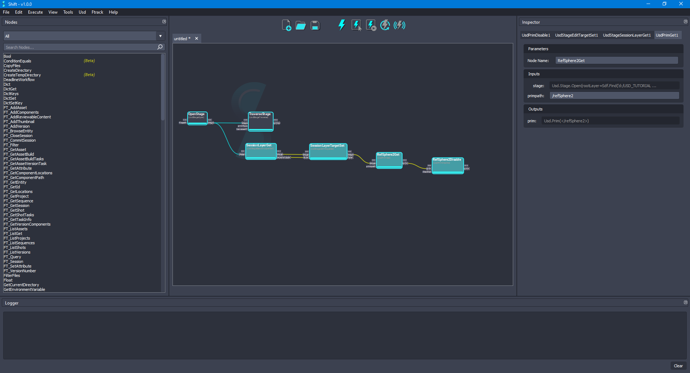
    <figcaption><b>Figure 10</b>: Executing workflow only on 'SessionLayerGet', 'SessionLayerTargetSet', 'RefSphere2Get' and 'RefSphere2Disable' nodes.</figcaption>
</figure>

11. Select the `TraverseStage` node and change the value of the **primType** input plug to `Any`. Execute the selected node only to recompute the **prims** output plug value. The value of the **prims** output plug should be: `[Usd.Prim(</refSphere>), Usd.Prim(</refSphere/world>)]`, the disabled prim and children will be missing now. The board should look like the following one:

<figure>
    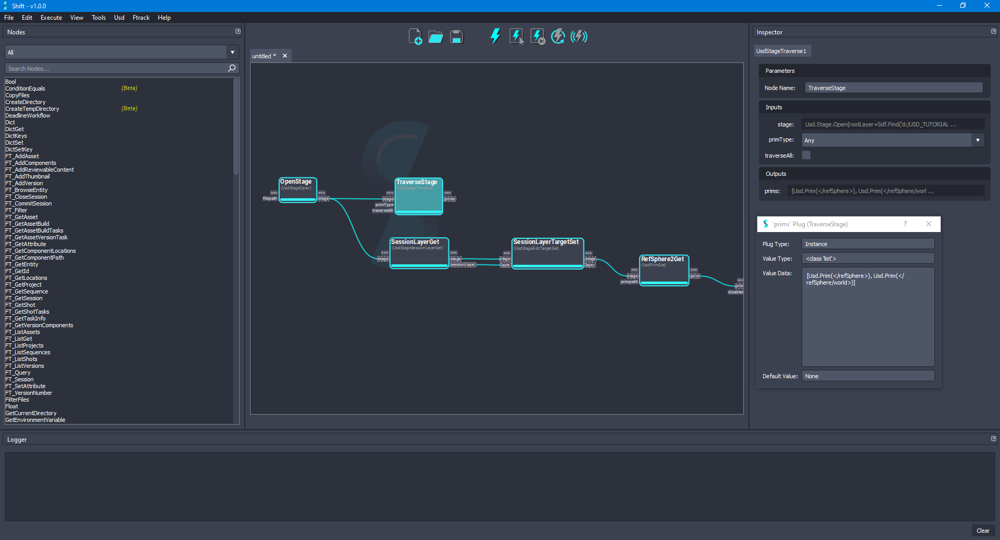
    <figcaption><b>Figure 11</b>: Re-executing the 'TraverseStage' node after deactivating a prim.</figcaption>
</figure>

12. Now, with the `TraverseStage` node selected, set the **traverseAll** input plug value to `True`. Execute the selected node only to recompute the **prims** output plug value. The value of the **prims** output plug should be: `[Usd.Prim(</refSphere>), Usd.Prim(</refSphere/world>), Usd.Prim(</refSphere2>)]`. The board should look like the following one:

<figure>
    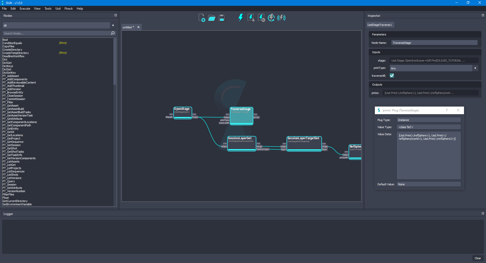
    <figcaption><b>Figure 12</b>: Re-executing the 'TraverseStage' node will traverseAll plug set to True.</figcaption>
</figure>
