## Authoring Variants

This tutorial focuses on creating and authoring a variant set using the *HelloWorld* layer from the [Inspecting and Authoring Properties](usd_tutorial_02.md) tutorial, using the operators from Shift_USD catalog.

Also, the base file for the example, `HelloWorld.usda`, can be downloaded from the [OpenUSD](https://github.com/PixarAnimationStudios/OpenUSD) Github project repository, from `extras/usd/tutorials/authoringVariants/` folder.

### Tutorial

1. Open Shift application. A new window's instance of Shift should appear like the following one:

<figure>
    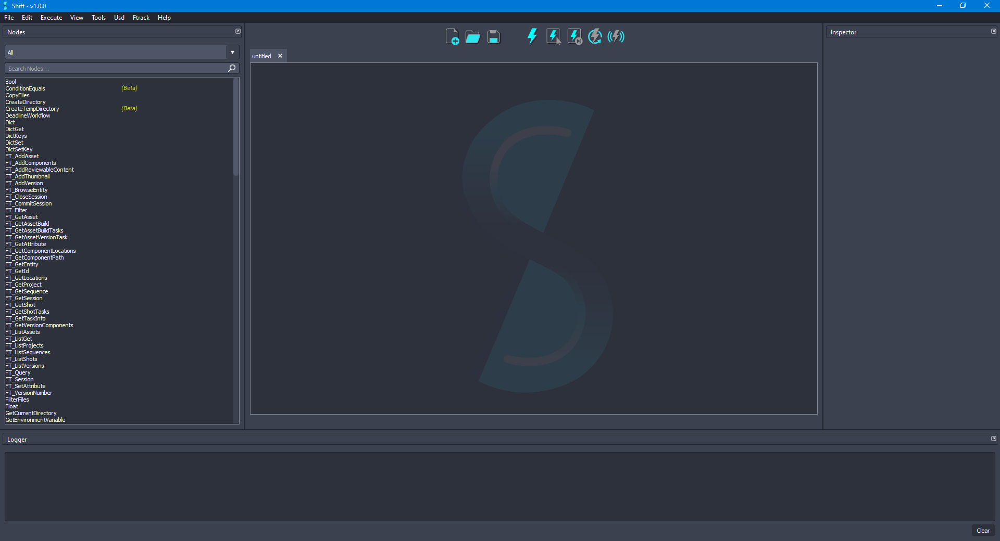
    <figcaption><b>Figure 1</b>: Shift UI.</figcaption>
</figure>

>[!NOTE]
> Before creating the USD workflow, ensure that the USD nodes appear in the Node List widget. The catalogs combobox should show `sUSD` and `sUSDTypes` if USD is correctly loaded in Shift. If this is not the case, please check again the [Shift_USD installation page](../usd#installation).

2. Add a new *UsdStageOpen* node to the board and rename it to *StageOpen*. Using the **Inspector** widget, set as the value for the **filepath** input plug a filepath pointing to the `HelloWorld.usda` file downloaded for the example. The board should look like the following:

<figure>
    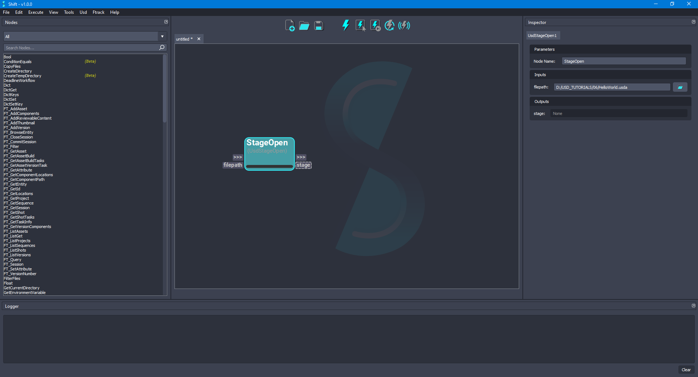
    <figcaption><b>Figure 2</b>: Added the 'StageOpen' node to the board for opening a given USD file.</figcaption>
</figure>

3. Add a new *UsdPrimGet* node to the board and rename it to *WorldGet*. Connect the **stage** output plug from the *StageOpen* node to the **stage** input plug of the new node. Set `/hello/world` as the value to the **primpath** input plug. The board should look like the following:

<figure>
    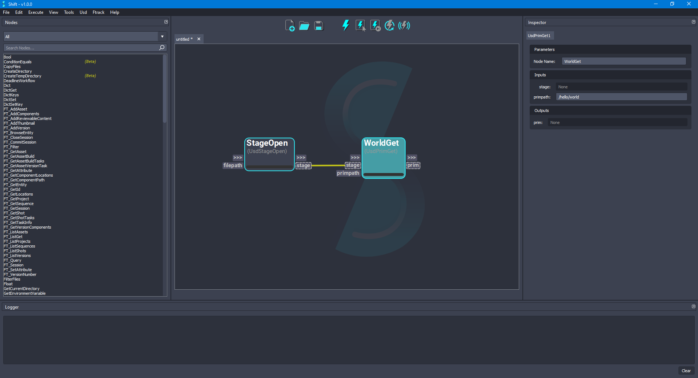
    <figcaption><b>Figure 3</b>: Added the 'WorldGet' node to the board connected to the 'StageOpen' node.</figcaption>
</figure>

4. Add a new *UsdAttributeGet* node to the board and rename it to *DisplayColorAttrGet*. Connect the **prim** output plug from the *WorldGet* node to the **prim** input plug of the new node. Set `primvars:displayColor` as the value to the **name** input plug. The board should look like the following:

<figure>
    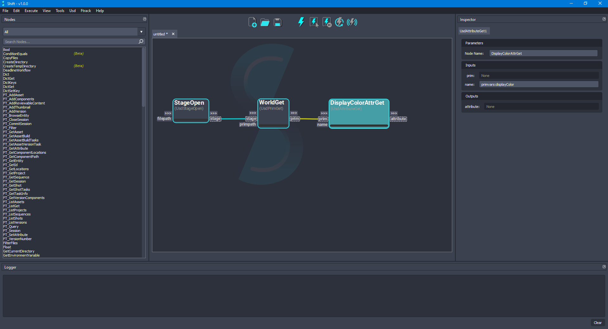
    <figcaption><b>Figure 4</b>: Added the 'DisplayColorAttrGet' node to the board connected to the 'WorldGet' node.</figcaption>
</figure>

5. For cleaning the authored value of the *primvars:displayColor* attribute, add a new *UsdAttributeClear* node to the board and rename it to *DisplayColorAttrClear*. Connect the **attribute** output plug from *DisplayColorAttrGet* node to the **attribute** input plug of the new node. Set the value `False` to the **useTime** input plug and `0` as the value to the **time** input plug. The board should look like the following:

<figure>
    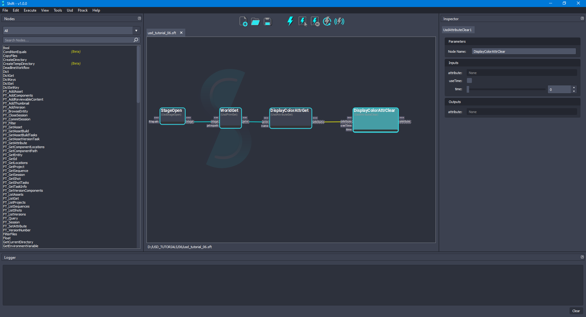
    <figcaption><b>Figure 5</b>: Added the 'DisplayColorAttrClear' node to the board connected to the 'DisplayColorAttrGet' node.</figcaption>
</figure>

6. Add a new *UsdPrimStageGet* node to the board and rename it to *WorldStageGet*. Connect the **prim** output plug from *WorldGet* node to the **prim** input plug of the new node. The board should look like the following:

<figure>
    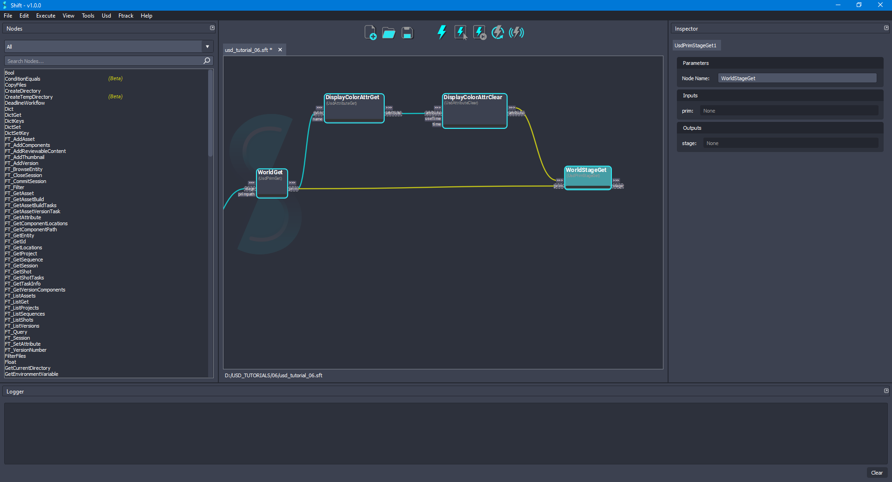
    <figcaption><b>Figure 6</b>: Added the 'WorldStageGet' node to the board connected to the 'WorldGet' node.</figcaption>
</figure>

7. For saving the modifications done to the `HelloWorld.usda` file, add a new *UsdStageSave* node to the board and rename it to *StageSave*. Connect the **stage** output plug from the *WorldStageGet* node to the **stage** input plug of the new node. Leave empty the value for the **filepath** input plug, doing this, the original file will be overriden. The board should look like the following:

<figure>
    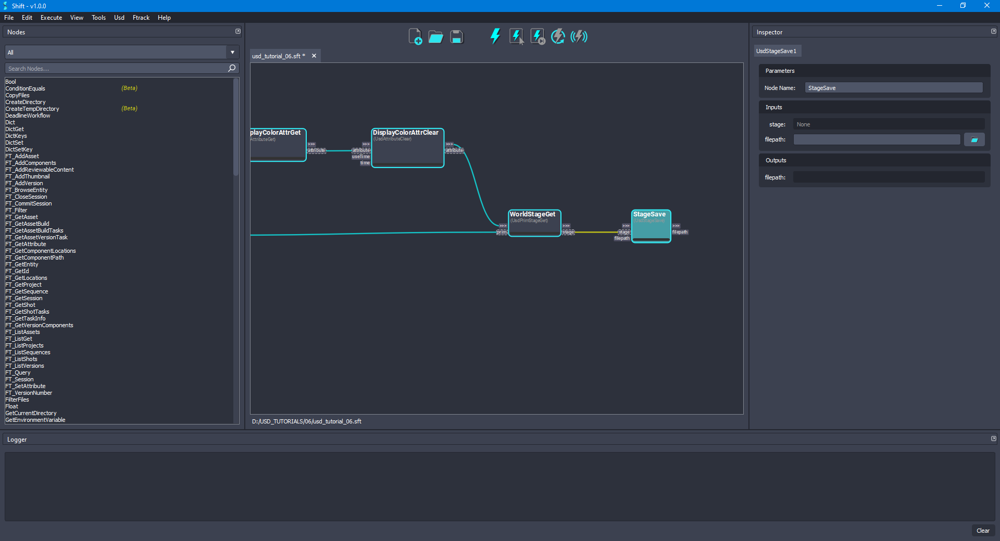
    <figcaption><b>Figure 7</b>: Added the 'StageSave' node to the board connected to the 'WorldStageGet' node.</figcaption>
</figure>

8. Add a new *UsdPrimGet* node to the board and rename it to *HelloGet*. Connect the **stage** output plug from *WorldStageGet* node to the **stage** input plug of the new node, also, connect the **out-trigger** output plug from the *StageSave* node to the **in-trigger** input plug. Set `/hello` as the value to the **primpath** input plug. The board should look like the following:

<figure>
    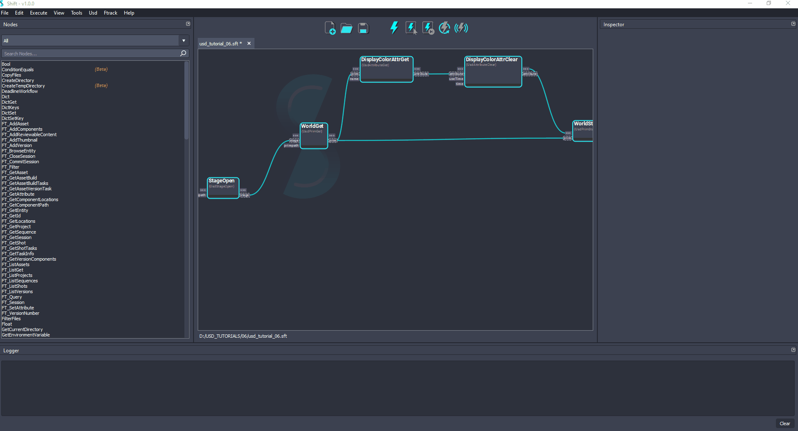
    <figcaption><b>Figure 8</b>: Added the 'HelloGet' node to the board connected to the 'WorldStageGet' and 'StageSave' nodes.</figcaption>
</figure>

9. Add a new *UsdVariantSetAdd* node to the board and rename it to *ShadingVariantSetAdd*. Connect the **prim** output plug from *HelloGet* node to the **prim** input plug of the new node and set `shadingVariant` as the value for the **variantSetName** input plug. The board should look like the following:

<figure>
    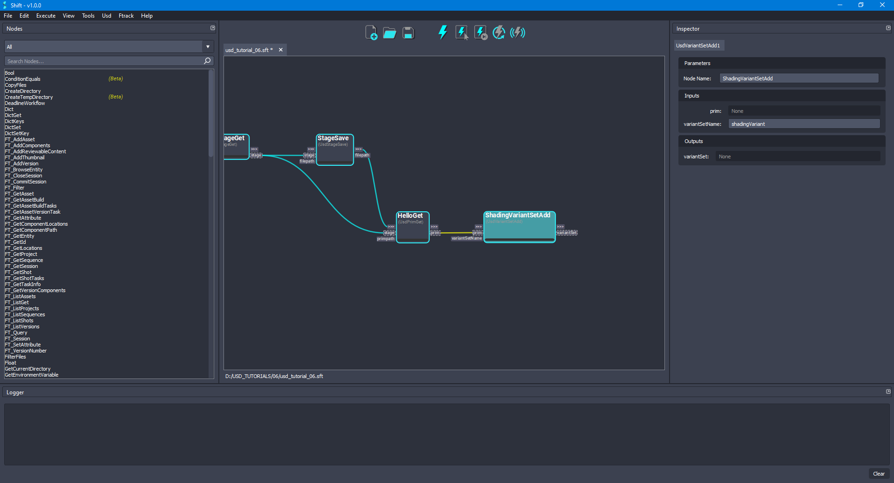
    <figcaption><b>Figure 9</b>: Added the 'ShadingVariantSetAdd' node to the board connected to the 'HelloGet' node.</figcaption>
</figure>

10. For adding the variants to the created variantSet, add a new *UsdVariantAdd* node and rename it to *RedVariantAdd*. Connect the **variantSet** output plug from *ShadingVariantSetAdd* node to the **variantSet** input plug of the new node and set `red` as the value for the **variantName** input plug. The board should look like the following:

<figure>
    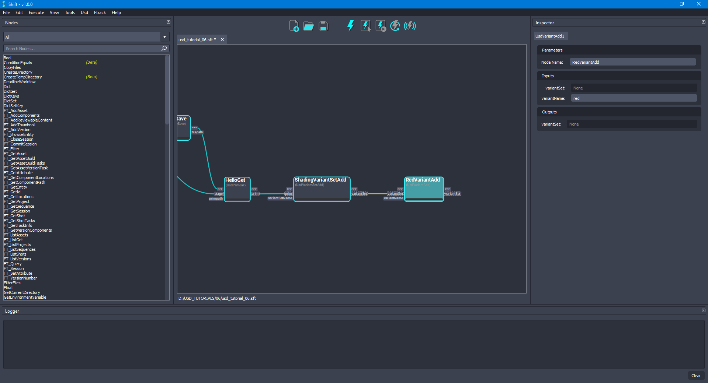
    <figcaption><b>Figure 10</b>: Added the 'RedVariantAdd' node to the board connected to the 'ShadingVariantSetAdd' node.</figcaption>
</figure>

11. As done in the previous step, add another *UsdVariantAdd* node and rename it to *BlueVariantAdd*. Connect the **variantSet** output plug from *RedVariantAdd* node to the **variantSet** input plug of the new node and set `blue` as the value for the **variantName** input plug. The board should look like the following:

<figure>
    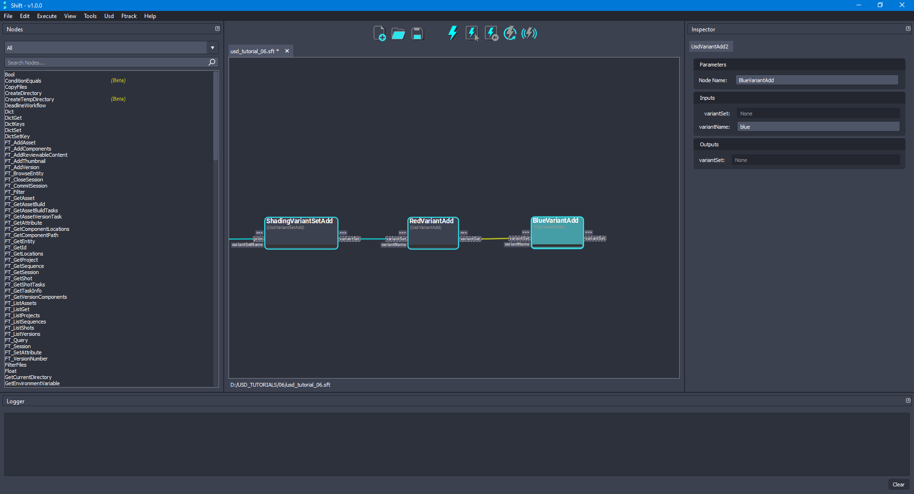
    <figcaption><b>Figure 11</b>: Added the 'BlueVariantAdd' node to the board connected to the 'RedVariantAdd' node.</figcaption>
</figure>

12. As done in the previous step, add another *UsdVariantAdd* node and rename it to *GreenVariantAdd*. Connect the **variantSet** output plug from *BlueVariantAdd* node to the **variantSet** input plug of the new node and set `green` as the value for the **variantName** input plug. The board should look like the following:

<figure>
    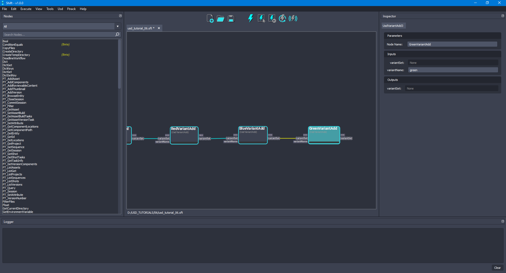
    <figcaption><b>Figure 12</b>: Added the 'GreenVariantAdd' node to the board connected to the 'BlueVariantAdd' node.</figcaption>
</figure>

13. Add a new *UsdVariantSetSelected* node and rename it to *GreenVariantSelect*. Connect the **variantSet** output plug from *GreenVariantAdd* node to the **variantSet** input plug of the new node and set `green` as the value for the **variantName** input plug. The board should look like the following:

<figure>
    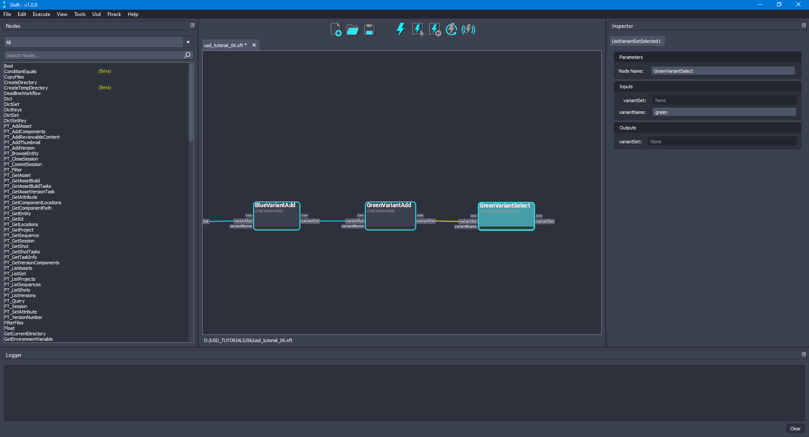
    <figcaption><b>Figure 13</b>: Added the 'GreenVariantSelect' node to the board connected to the 'GreenVariantAdd' node.</figcaption>
</figure>

14. Follow the steps done in the section [Creating a variant workflow](usd_tutorial_06.md#creating-a-variant-workflow) and add a new *UsdVariantWorkflow* node and rename it to *RedVariantDCSet*. Set as the value for the **file** input plug of the node the path to the workflow created in the section, for example, `D:/USD_TUTORIALS/06/set_variant_display_color.sft`. Once the file is properly set, the node will be automatically updated to show the inputs and outputs from the nested workflow. Then, connect the **variantSet** output plug from *GreenVariantSelect* node to the **variantSet** input plug of the new node, also, connect the **prim** output plug from *WorldGet* node to the **prim** input plug of the new node. Set `red` as the value for the **variant** input plug and for the **color** input plug set as the value `[1,0,0]`. The board should look like the following:

<figure>
    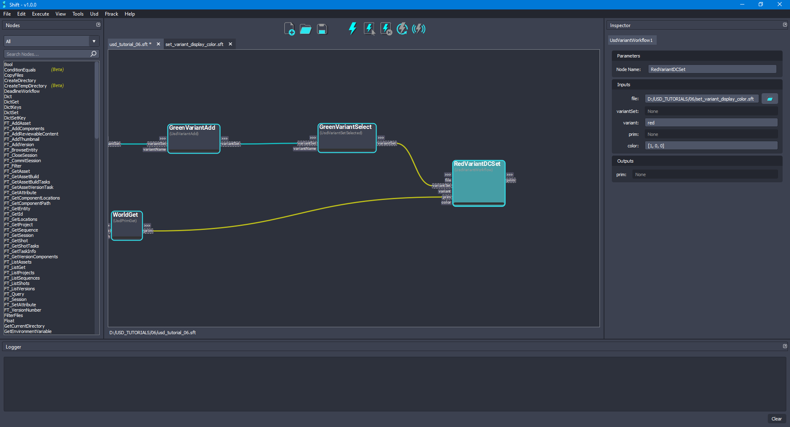
    <figcaption><b>Figure 14</b>: Added the 'RedVariantDCSet' node to the board connected to the 'WorldGet' and 'GreenVariantSelect' node.</figcaption>
</figure>

15. Duplicate the *RedVariantDCSet* node and rename it as *BlueVariantDCSet*. As done before, connect the **variantSet** output plug from *GreenVariantSelect* node to the **variantSet** input plug of the new node, also, connect the **prim** output plug from *WorldGet* node to the **prim** input plug of the new node. Set `blue` as the value for the **variant** input plug and for the **color** input plug set as the value `[0,0,1]`. The board should look like the following: 

<figure>
    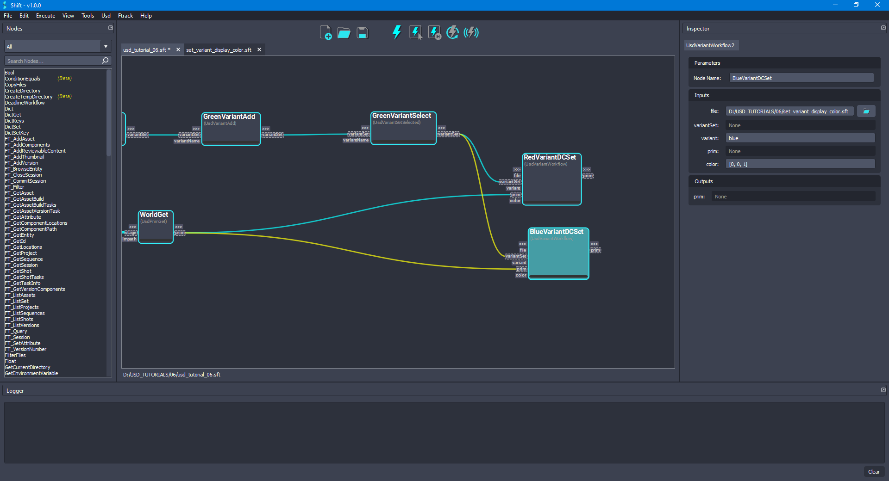
    <figcaption><b>Figure 15</b>: Added the 'BlueVariantDCSet' node to the board connected to the 'WorldGet' and 'GreenVariantSelect' node.</figcaption>
</figure>

16. Duplicate the *RedVariantDCSet* node again and rename it as *GreenVariantDCSet*. As done before, connect the **variantSet** output plug from *GreenVariantSelect* node to the **variantSet** input plug of the new node, also, connect the **prim** output plug from *WorldGet* node to the **prim** input plug of the new node. Set `green` as the value for the **variant** input plug and for the **color** input plug set as the value `[0,1,0]`. The board should look like the following: 

<figure>
    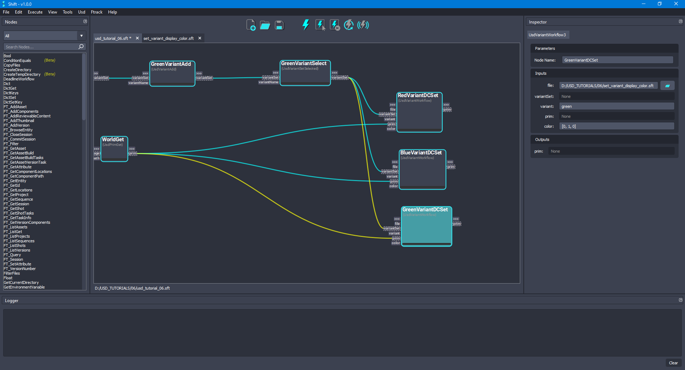
    <figcaption><b>Figure 16</b>: Added the 'GreenVariantDCSet' node to the board connected to the 'WorldGet' and 'GreenVariantSelect' node.</figcaption>
</figure>

17. Add a new *UsdPrimStageGet* node and rename it to *StageFinalGet*. Connect the **prim** output plug from *GreenVariantDCSet* node to the **prim** input plug of the new node. Then, connect the **out-trigger** output plug from the *RedVariantDCSet* and *BlueVariantDCSet* nodes to the **in-trigger** input plug of the new node. The board should look like the following:

<figure>
    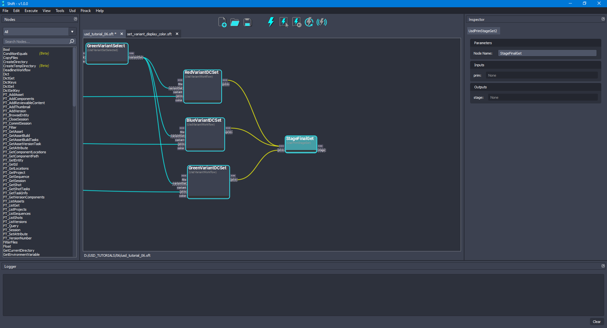
    <figcaption><b>Figure 17</b>: Added the 'StageFinalGet' node to the board connected to the 'GreenVariantDCSet', 'RedVariantDCSet' and 'BlueVariantDCSet' nodes.</figcaption>
</figure>

18. Finally, for saving the modifications done in the stage, add a new *UsdStageSave* node and rename it to *StageFinalSave*. Connect the **stage** output plug from the *StageFinalGet* node to the **stage** input plug of the new node. Leave empty the value for the **filepath** input plug, doing this, the original file will be overriden. The board should look like the following one:

<figure>
    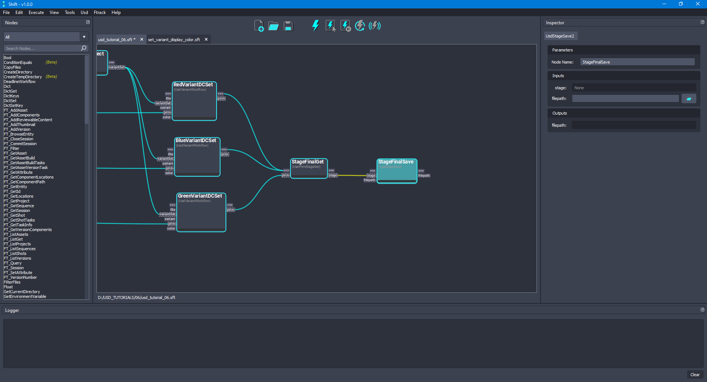
    <figcaption><b>Figure 18</b>: Added the 'StageFinalSave' node to the board connected to the 'StageFinalGet' node.</figcaption>
</figure>

19. Execute the workflow, the `HelloWorld.usda` should appear as modified containing the latest changes for the variants.

### Creating a variant workflow

1. In a new workflow, add a new *UsdPrimDisplayColorSet* node to the board and rename it to *PrimDisplayColorSet*. The board should look like the following:

<figure>
    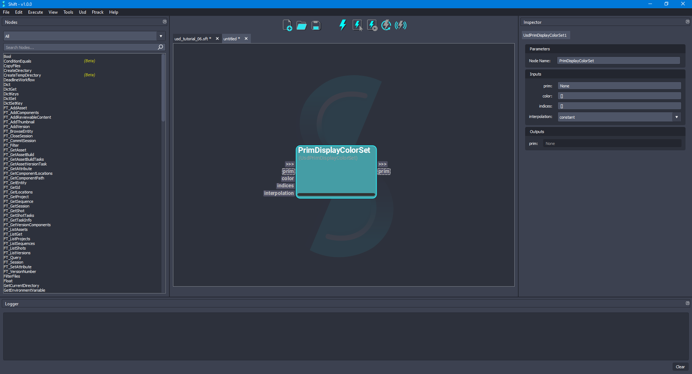
    <figcaption><b>Figure 19</b>: Added the 'PrimDisplayColorSet' node to a new empty board.</figcaption>
</figure>

2. Now, add a new *Input* node to the board and rename it to *Input*. Drag and drop the connection from the *PrimDisplayColorSet* node's **prim** input plug over the *Input* node, using the **Add Plug** dialog, use the preselected options for creating the new plug. Repeat the same steps for the **color** input plug from the *PrimDisplayColorSet* node, creating the plug with the default selected values in the **Add Plug** dialog. The board should look like the following:

<figure>
    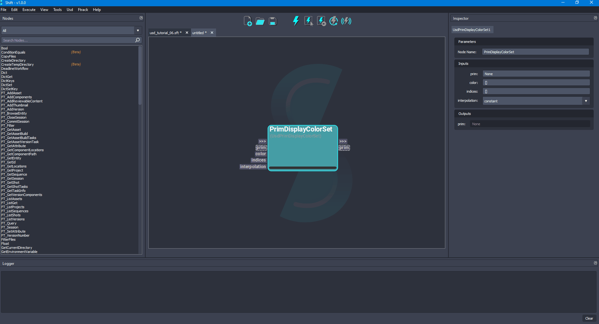
    <figcaption><b>Figure 20</b>: Added the 'Input' node and added the new plugs.</figcaption>
</figure>

3. Finally, add a new *Output* node to the board and rename it to *Output*. Drag and drop the connection from the *PrimDisplayColorSet* node's **prim** output plug over the *Output* node, using the **Add Plug** dialog, use the preselected options for creating the new plug. The board should look like the following:

<figure>
    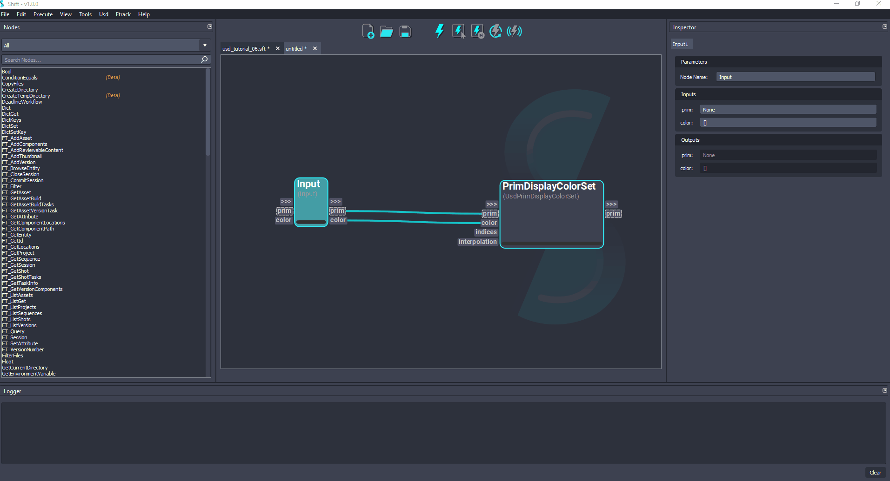
    <figcaption><b>Figure 21</b>: Added the 'Output' node and added the new plug.</figcaption>
</figure>

4. Save the workflow with a proper name like `set_variant_display_color.sft`. This workflow will be reused for the main workflow driving the example.

### Visualizing the Stage

Use the *usdview* tool shipped with USD to visualise and inspect the stage:

<figure>
    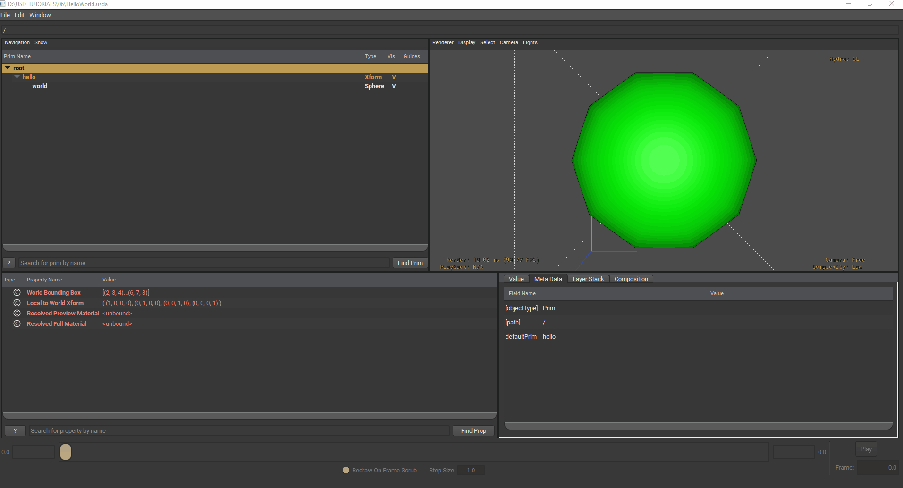
    <figcaption><b>Figure 22</b>: Visualizing the stage.</figcaption>
</figure>

<-- TODO: ADD SUGGESTION FOR USING THE STAGEVIEW PLUGIN -->

### Workflow Resources

The workflows corresponding to this tutorial can be found in the following path in the Shift installation folder: `<path_to_the_shift_installation_folder>/shift/examples/USD/tutorials/tutorial_06_authoring_variants/`.
