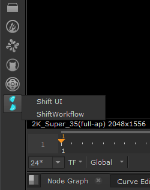
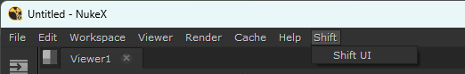

# Nuke

## Running Shift in Nuke

Shift provides a `nshift` utility script to properly bind the Shift UI to Nuke. In order to run and open Shift in Nuke, execute the following code block inside the Nuke *Python Script Editor*:

<pre><code style="white-space: pre; margin: 20px 0; padding: 10px; box-sizing: border-box;">import sys
sys.path.append("&ltpath_to_the_shift_installation_folder&gt")
sys.path.append("&ltpath_to_the_shift_installation_folder&gt/shift/thirdparty/python/Lib/site-packages")

from shift.tools import nshift
nshift.show()
</code></pre>

## Shift installation in Nuke

To install Shift and open it through a *menu.py* entry within Nuke, it is required to set up Shift in the user *init.py* and **menu.py*.py* Python files from Nuke. Shift can be added to the user *init.py* and *menu.py* files from Nuke's preference folder (*<home directory>/.nuke*) or to a custom *init.py* and *menu.py* files inside a custom folder structure. If the directory where these files are stored is a path sourced by Nuke, they will be automatically executed on startup.

### Init File

In the *init.py* file, it is necessary to configure the requirements for Shift to work in Nuke batch and interactive modes. To achieve this, it is only required to add the Shift installation path to the **PATH** environment variable.

<pre><code style="white-space: pre; margin: 20px 0; padding: 10px; box-sizing: border-box;">try:
    import shift
except:
    import sys
    sys.path.append("&ltpath_to_the_shift_installation_folder&gt")
    sys.path.append("&ltpath_to_the_shift_installation_folder&gt/shift/thirdparty/python/Lib/site-packages")
</code></pre>

>[!NOTE]
> If the paths are added at the system level or before opening Nuke, then this configuration step will not be required.

### Menu File

In the *menu.py*.py file it is required to configure the Shift *menu.py* and toolbar entries in the Nuke UI.

<pre><code style="white-space: pre; margin: 20px 0; padding: 10px; box-sizing: border-box;">import os
import nuke

try:
    import shift
    shiftPath = os.path.dirname(shift.__file__)  # Get the directory location of Shift
    # Build the path to the shift_icon for the toolbar
    iconPath = os.path.join(shiftPath, "icons", "shift_icon_window.png")
    shiftCode = "from shift.tools import nshift;nshift.show()"
    # Create the toolbar entry
    menubar = nuke.*menu.py*("Nodes")
    shiftM = menubar.addMenu("Shift", icon=iconPath)
    shiftM.addCommand("Shift UI", shiftCode, '')
    # Create a *menu.py* entry
    menubar = nuke.*menu.py*("Nuke")
    shiftM = menubar.addMenu("Shift")
    shiftM.addCommand("Shift UI", shiftCode, '')
except Exception as e:
    pass  # Skip the Error raise to avoid Nuke failing at opening if setting up the *menu.py* does not work on startup.
</code></pre>

This code, placed in a *menu.py* file and executed by Nuke, will create a Shift toolbar entry (Figure 1) and a Shift *menu.py* entry (Figure 2) when Nuke is initialized.

<figure>
      
      <figcaption><b>Figure 1</b>: Shift *menu.py* entry in the Nuke Nodes Toolbar.</figcaption>
</figure>

<figure>
      
      <figcaption><b>Figure 2</b>: Shift *menu.py* on Nuke's top *menu.py* bar.</figcaption>
</figure>

## Python Interpreter Setup
In Shift it is possible to launch the execution of a workflow via an application's Python interpreter with the [WorkflowProcess](../../reference/nodes/workflow#workflowProcess-node) node. To achieve this for Nuke, set the path to its Python interpreter the following environment variables:

**SHIFT_PROCESS_NUKE** : path to Nuke's Python interpreter (*python*).

The variable can be set in any environment to be able to execute Shift Workflows in Nuke from standalone or other DCC instances.

## Catalogs

Shift provides some catalogs with operators specific to work within Nuke. Most of these nodes are found in the [CreativeSoftware](../../reference/shift_catalogs/creativesoftware) catalog. 

<!-- ### Examples
This section is reserved to an example video of how to use Shift in Nuke.
 -->

