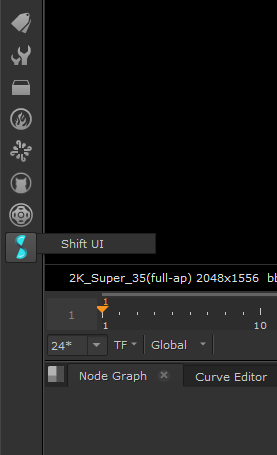
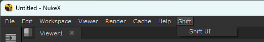

# Nuke

## Running Shift in Nuke

Shift provides a `nshift` utility script to properly bind the Shift UI to Nuke. In order to run and open Shift in Nuke, execute the following code block inside the Nuke *Python Script Editor*:

```python
import sys
sys.path.append("<path_to_your_shift_folder>")
sys.path.append("<path_to_your_shift_folder>/thirdparty/python/Lib/site-packages")

from shift.tools import nshift
nshift.show()
```

## Shift installation in Nuke

In order to have Shift installed inside Nuke and be able to open the Shift UI with a menu entry, is required to setup Shift in the user init and menu python files. It can be added in the user init and menu files from the nuke preference folder ([home directory]/.nuke) or a custom init and menu files inside your pipeline. If the directory were this files are stored is a path read by Nuke, they will be automatically executed on startup.

### Init

In the init.py file is required to configure the Shift basics to work in Nuke batch and interface modes. For that purpose is only required to add the Shift installation path to the environment variables. 

```python
import sys
sys.path.append("<path_to_your_shift_folder>")
sys.path.append("<path_to_your_shift_folder>/shift/thirdparty/python/Lib/site-packages")
```

>[!NOTE]
> If the paths are added in the system or before opening Nuke, then this configuration step will not be required.


### Menu

In the menu.py file it is required to configure the Shift menu and toolbar entries in the Nuke UI.


```python
import os
import nuke

try:
    import shift
    shiftPath = os.path.dirname(shift.__file__)  # Get the directory location of Shift
    # Build the path to the shift_icon for the toolbar
    iconPath = os.path.join(shiftPath, "icons", "shift_icon_window.png")
    shiftCode = "from shift.tools import nshift;nshift.show()"
    # Create the toolbar entry
    menubar = nuke.menu("Nodes")
    shiftM = menubar.addMenu("Shift", icon=iconPath)
    shiftM.addCommand("Shift UI", shiftCode, '')
    # Create a Menu entry
    menubar = nuke.menu("Nuke")
    shiftM = menubar.addMenu("Shift")
    shiftM.addCommand("Shift UI", shiftCode, '')
except Exception as e:
    pass  # Skip the Error raise to avoid Nuke failing at opening if setting up the menu does not work on startup.
```

This code placed in a menu.py file executed by Nuke will create a Shift toolbar entry




and a Shift menu entry



when Nuke is initialized.

## Python Interpreter Setup
In Shift it is possible to launch the execution of a workflow via an application's Python interpreter with the [WorkflowProcess](../reference/nodes/workflow#workflowProcess-node) node. To achieve this for Nuke, set path to its Python interpreter the following environment variables:


**SHIFT_PROCESS_NUKE** : path to Nuke's Python interpreter (python)

You can set this environment variable in any environment to be able to execute Shift Workflows in Nuke even if Shift in running in Standalone or a different Software environment.

## Catalogs

Shift provides some catalogs with operators specific to work within Nuke. Most of these nodes are found in the *CreativeSofware* catalog. 


<!-- ### Examples
This section is reserved to an example video of how to use Shift in Nuke.
 -->

