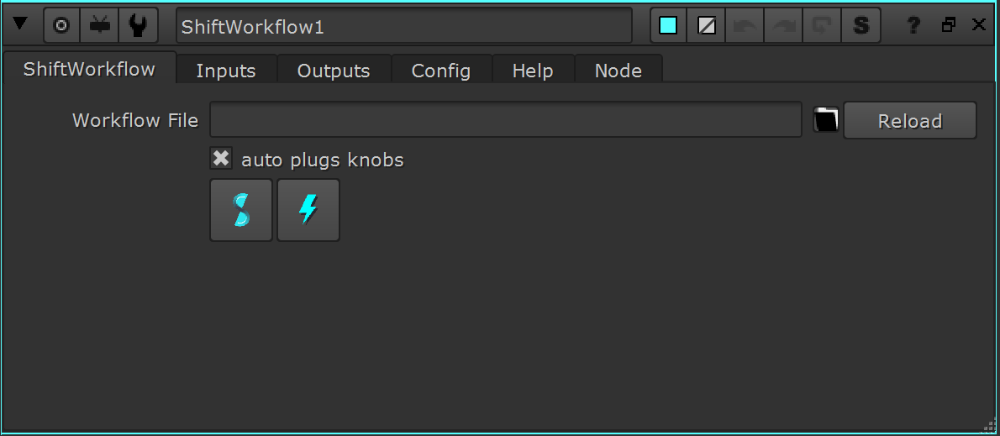
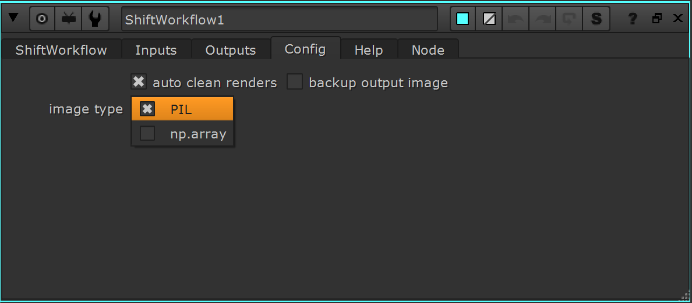

# Nuke

## Running Shift in Nuke

Shift provides a `nshift` utility script to properly bind the Shift UI to Nuke. In order to run and open Shift in Nuke, execute the following code block inside the Nuke *Python Script Editor*:

<pre><code style="white-space: pre; margin: 20px 0; padding: 10px; box-sizing: border-box;">import sys
sys.path.append("&ltpath_to_the_shift_installation_folder&gt")
sys.path.append("&ltpath_to_the_shift_installation_folder&gt/shift/thirdparty/python/Lib/site-packages")

from shift.tools import nshift
nshift.show()
</code></pre>

## Shift installation in Nuke

To install Shift and open it through a menu entry within Nuke, it is required to set up Shift in the environment or in the user *init.py* Python files from Nuke. Shift can be added to the user *init.py* file from Nuke's preference folder (*<home directory>/.nuke*) or to a custom *init.py* file inside a custom folder structure. If the directory where these files are stored is a path sourced by Nuke, they will be automatically executed on startup.

### Init File/Environment requirements

You can add these requirements to your environment before opening Nuke:

<pre><code style="white-space: pre; margin: 20px 0; padding: 10px; box-sizing: border-box;">PATH=&#37;PATH&#37;&semi;"&ltpath_to_the_shift_installation_folder&gt"
PATH=&#37;PATH&#37;&semi;"&ltpath_to_the_shift_installation_folder&gt/shift/thirdparty/python/Lib/site-packages"
NUKE_PATH="&ltpath_to_the_shift_installation_folder&gt/shift/plugins/nuke/startup"&semi;&#37;NUKE_PATH&#37;
</code></pre>

Or you can add them to the *init.py* file to make Shift to work in Nuke batch and interactive modes. To achieve this, it is only required to add the Shift installation path to the **PATH** environment variable.

<pre><code style="white-space: pre; margin: 20px 0; padding: 10px; box-sizing: border-box;">import nuke

try:
    import shift
except:
    import sys
    sys.path.append("&ltpath_to_the_shift_installation_folder&gt")
    sys.path.append("&ltpath_to_the_shift_installation_folder&gt/shift/thirdparty/python/Lib/site-packages")

nuke.pluginAddPath("&ltpath_to_the_shift_installation_folder&gt/shift/plugins/nuke/startup")
</code></pre>

>[!NOTE]
> If the paths are added at the system level or before opening Nuke, then this configuration step will not be required.

## Shift in Nuke

When requirements are added, a Shift menu entry will appear in both the toolbar and top menu in Nuke.

This entry will contain the access to open the Shift UI and to create a ShiftWorkflow Node.

<figure>
      
      <figcaption><b>Figure 1</b>: Shift tools in Nuke nodes menu.</figcaption>
</figure>

<figure>
      
      <figcaption><b>Figure 2</b>: Shift UI on Nuke's top menu bar.</figcaption>
</figure>

You can create ShiftWorkflow nodes by using the tab key in the node graph as well.

<figure>
      
      <figcaption><b>Figure 3</b>: Create ShiftWorkflow nodes in node graph window.</figcaption>
</figure>

## ShiftWorkflow Node

The Shift plugin for Nuke includes a node to execute a Shift workflow within Nuke's node graph.

In the Shiftworkflow node, a Shift workflow can be selected to load it into the node. This will automatically generate the required input and output knobs and connections, if the auto plugs option is enabled.

<figure>
      
      <figcaption><b>Figure 3</b>: Main Propierties tab of ShiftWorkflow node.</figcaption>
</figure>

You can use relative paths if you use the **SHIFT_PATH_WORKFLOWS** env variable.

### Plugs <--> Knobs/Inputs

This is the correlation of Shift Plugs to Nuke knobs or inputs.

| SPlug Type   | SPlug Code     | Nuke Type                                        | Knob Type                                                    | Note                                                                                                |
|:-------------|:---------------|:-------------------------------------------------|:-------------------------------------------------------------|:----------------------------------------------------------------------------------------------------|
| *Bool*       | -              | Knob                                             | Boolean_Knob                                                 |                                                                                                     |
| *Color*      | -              | Knob                                             | AColor_Knob                                                  |                                                                                                     |
| *Dict*       | -              | Knob                                             | EvalString_Knob                                              | Requires custom implementation                                                                       |

| *Dir*        | -              | Knob                                             | File_Knob                                                    |                                                                                                     |
| *Enumerator* | -              | Knob                                             | Enumeration_Knob                                             |                                                                                                     |
| *FileIn*     | -              | Knob                                             | File_Knob                                                    |                                                                                                     |
| *FileOut*    | -              | Knob                                             | File_Knob                                                    |                                                                                                     |
| *Float*      | -              | Knob                                             | Double_Knob                                                  |                                                                                                     |
| *Instance*   | image*         | Input/Output Knob Knob                   | -  Channel_Knob  File_Knob                           | Provides the input image like a single image. (Current Frame)                                       |
| *Instance*   | images*        | Output Knob Knob                         | -  File_Knob                                             | Provides the input image like a single image. (Current Frame)                                       |
| *Instance*   | imageSequence* | Input/Output Knob Knob Knob Knob | -  Channel_Knob  File_Knob Int_Knob Int_Knob | Provides the input image like an image sequence rendering the full frame range provided in the knob. |

| *Instance*   | -              | Knob                                             | EvalString_Knob                                              | Requires custom implementation                                                                       |
| *Int*        | -              | Knob                                             | Int_Knob                                                     |                                                                                                     |
| *List*       | points*        | Input                                            | -                                                            | Requires to connect a Tracker node to get the points from.                                          |
| *List*       | -              | Knob                                             | EvalString_Knob                                              | Requires custom implementation                                                                       |
| *Object*     | -              | Knob                                             | EvalString_Knob                                              | Requires custom implementation                                                                       |

| *String*     | -              | Knob                                             | EvalString_Knob                                              |                                                                                                     |

### Node config

The node configuration has three options:
- autoClean: Automatically removes all temporary renders created for the input once the execution ends.
- backupOutputImage:  Copies the output image.
- imageType: Specifies the format used to write and read the inputs and outputs for the workflow.  The instance types can be either PIL or np.array.  If the workflow expects or returns a different type, it may not work correctly.

<figure>
      
      <figcaption><b>Figure 3</b>: Node config tab.</figcaption>
</figure>

## Python Interpreter Setup
In Shift it is possible to launch the execution of a workflow via an application's Python interpreter with the [WorkflowProcess](../../reference/nodes/workflow#workflowProcess-node) node. To achieve this for Nuke, set the path to its Python interpreter the following environment variables:

**SHIFT_PROCESS_NUKE** : path to Nuke's Python interpreter (*python*).

The variable can be set in any environment to be able to execute Shift Workflows in Nuke from standalone or other DCC instances.

## Catalogs

Shift provides some catalogs with operators specific to work within Nuke. Most of these nodes are found in the [CreativeSoftware](../../reference/catalogs/shift_catalogs/creativesoftware) catalog. 

<!-- ### Examples
This section is reserved to an example video of how to use Shift in Nuke.
 -->

