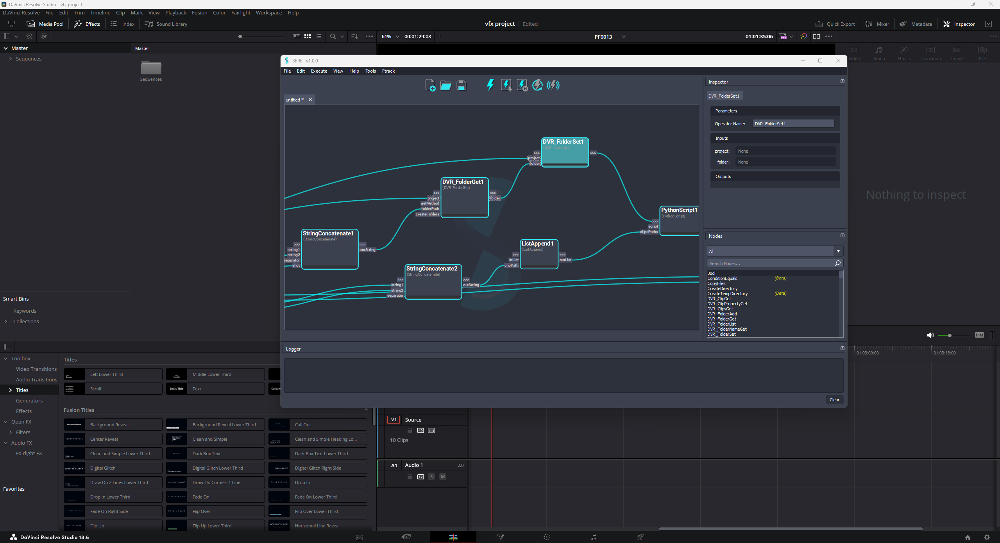
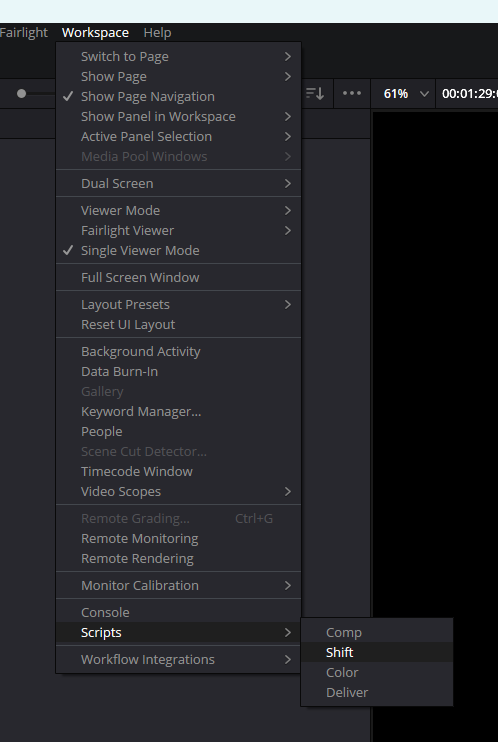

# Davinci Resolve

## Running Shift in Davinci Resolve

Shift can be integrated in Davinci Resolve and used to automate editorial process using all the catalog provided with Shift, but specially the Shift_Resolve catalog.

<figure>
      
      <figcaption><b>Figure 1</b>: Shift UI in Davinci Resolve.</figcaption>
</figure>

To run Shift inside Davinci Resolve it is required to set up the configuration needed by Blackmagic to be able to execute Python code inside Resolve. 

Blackmagic usually provides a `Readme.txt` file where these requirements are detailed for the version in use in the installation folder `C:\ProgramData\Blackmagic Design\DaVinci Resolve\Support\Developer\Scripting\Readme.txt`

Apart from the official requirements, the `PYTHONHOME` environment is required to be set. It must point to the Python interpreter to be used in Resolve.

To use the Python interpreter provided with Shift, set up the variable in this way:

**PYTHONHOME** : <path_to_your_shift_folder>/shift/thirdparty/python

To source Shift in Davinci Resolve the directories of Shift must also be added to the PATH environment variable. The paths to the directories must be set before opening Resolve or in the script that will launch Shift.

- **PATH** : <path_to_the_shift_installation_folder>
- **PATH** : <path_to_the_shift_installation_folder>/shift/thirdparty/python/pip_packages/3.&ltminor_version_of_the_nuke_interpreter&gt

## Shift Menu

Custom sub-menus in DaVinci Resolve are defined by Python files that are added as entries to the `Workspace -> Scripts` menu section. This section is divided into folders, with each one corresponding to a workspace layout.

To add a new entry for the Shift menu in Resolve, it is required to add a Python script to the Resolve Scripts folder. This folder can be different for each Resolve version, and it is recommended to check the right directory for the version that is being used. However, typically the folder is located in one of the following locations:

> [!NOTE = Resolve Scripts Folders]
> === Windows:
>  - All users: %PROGRAMDATA%\Blackmagic Design\DaVinci Resolve\Fusion\Scripts
>  - Specific user: %APPDATA%\Blackmagic Design\DaVinci Resolve\Support\Fusion\Scripts
>
<!-- > === Linux:
>  - All users: /opt/resolve/Fusion/Scripts  (or /home/resolve/Fusion/Scripts/ depending on installation)
>  - Specific user: $HOME/.local/share/DaVinciResolve/Fusion/Scripts -->

To add Shift as a menu option, it is required to create a Python Script inside a workspace folder, `Edit` for example. The Python file name will be used as the menu name, soo name the file `Shift`.

For a Windows local user, the result path for the file will be this one:
`%APPDATA%\Blackmagic Design\DaVinci Resolve\Support\Fusion\Scripts\Edit\Shift.py`

Inside the file, add the following code:

<pre><code style="white-space: pre; margin: 20px 0; padding: 10px; box-sizing: border-box;">try:
    import shift
except:
    import sys
    sys.path.append("&ltpath_to_the_shift_installation_folder&gt")
    sys.path.append("&ltpath_to_the_shift_installation_folder&gt/shift/thirdparty/python/Lib/site-packages")

from shift.tools import shiftui
shiftui.show()
</code></pre>

>[!NOTE]
> If the paths are added to the environment before opening Resolve, then the code to append the Shift installation folders to the **PATH** will not be required.

With this file saved, Resolve will show a Shift menu that can be clicked on to open the Shift UI inside Davinci Resolve.

<figure>
      
      <figcaption><b>Figure 2</b>: Shift Menu on Davinci Resolve's top menu bar.</figcaption>
</figure>

## Catalogs

Shift provides a catalog with operators to work with Davinci Resolve. This catalog is not shipped with Shift, but it can be accessed and downloaded from [Shift_Resolve](https://github.com/Inbibo/Shift_Resolve).

