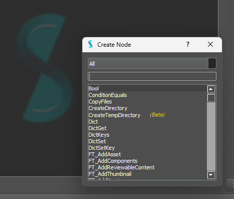
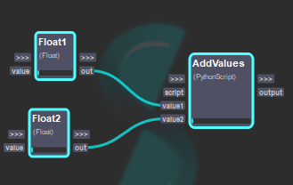
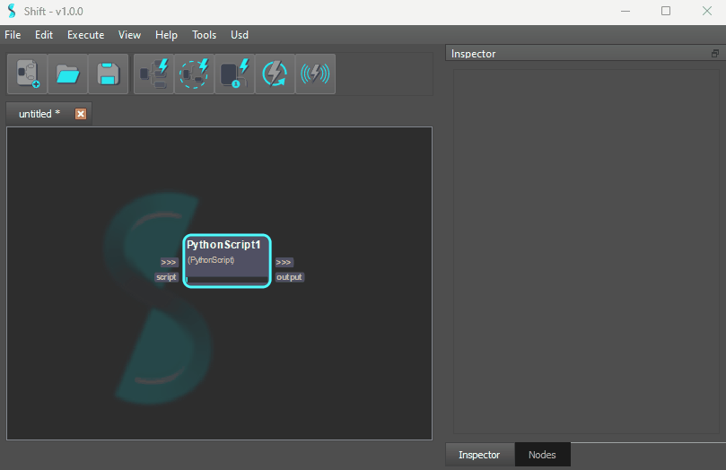
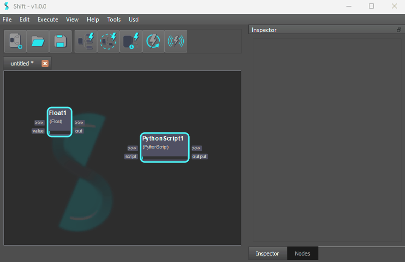
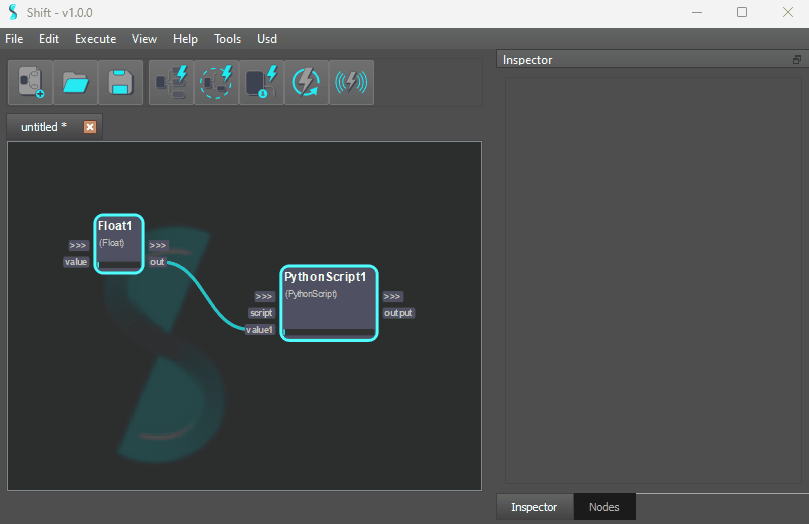

# Workflow Authoring

By opening Shift you will be prompted to an empty board.  

## Creating Your First Node

To create a new operator, you can either press the `Tab Key` or `Double Left-Click` with your mouse.  

  

Then you can choose the type of operator you want to create and double-click on its name to create it.

## Creating Connections

If you want a certain operator to pass information to another one, you can connect their plugs. To do that, you just need to `Left-Click and Drag` from the plug to the plug you want to connect to. This will propagate whatever data is produced by the first operator and pass it to the other one through the connected plug.  

  

This will have created the simplest example of a Shift workflow.

## Creating New Plugs

Certain nodes in Shift allow the creation of new plugs. To do that you can `Right-Click` on the node and select the "*Create New Plug*" option if available. It will prompt you to a new dialog asking to fill in the information needed to create the plug.

You can also prompt the creation of a new plug while you are creating a connection. This will automatically fill in the name and type matching the plug that the connection is coming from.
To do that simply release your mouse over the node when creating the connection.

## Removing a Plug

To remove a plug you can use the `Right-Click` context menu of the plug item. Removing a plug will destroy all the existing connections to that plug.

