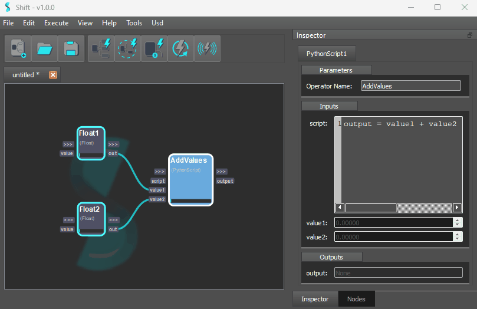
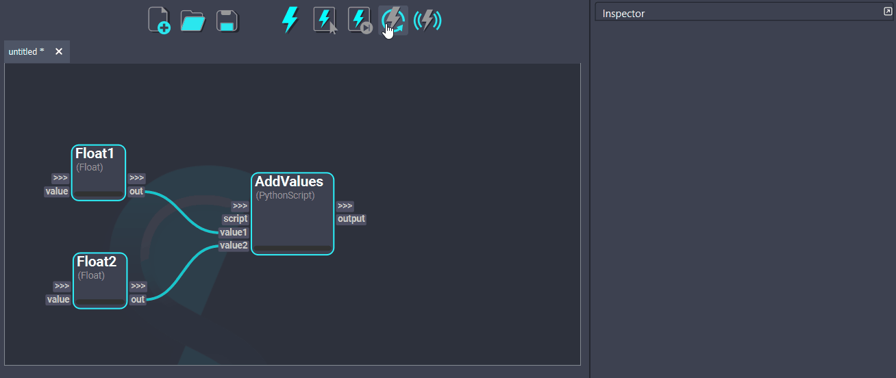
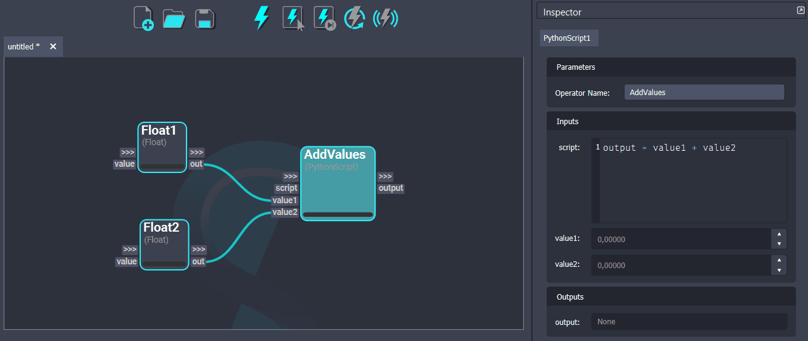

# Executing Your Workflow

You can execute your workflow in different ways:

Click the “Execute” button ({:width="25" height="25"}). You should see the nodes progress bars lighting up.

Shift uses dirty propagation to determine which nodes need to be recomputed. Whenever a plug value on a node is modified, that node is set to be recomputed in the next execution. You can force Shift to recompute all nodes by pressing the “Stop Execution” button ({:width="30" height="30"}).

It is also possible to execute a workflow step-by-step. Simply press the “Execute Next Operator” button ({:width="30" height="30"}) to see the workflow being executed one node at a time.

The execution can also be forced on selected nodes. By selecting the desired nodes and pressing the “Execute Selected” button ({:width="30" height="30"}), Shift will identify the workflow sub-graph required to evaluate the desired nodes and execute it.

Finally, it is also possible to trigger the execution of a workflow whenever a change to any node is done by using the live execution option. Press the “Toggle Live Execution” button ({:width="30" height="30"}) and Shift will execute the workflow automatically every time a change is being made.

While the Live Execution is turned on, the other execution buttons are disabled. To re-enable all the execution buttons, turn Live Execution off.
