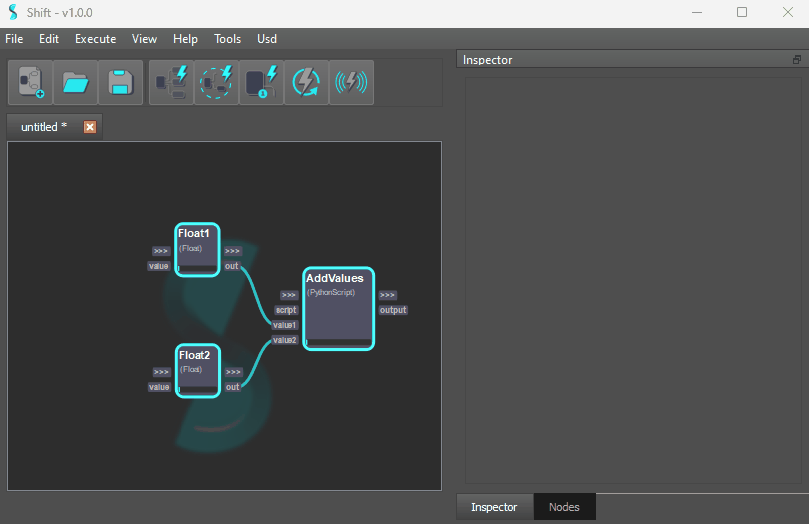
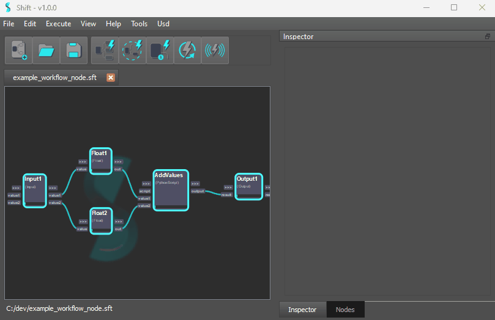

# Nesting Workflows

In Shift any workflow can be added and executed as an operator.

## Setting Workflow I/Os

First of all we need to tell Shift which are the *Inputs* and *Outputs* of the workflow in question. To do that we make use of special operators called `Input` and `Output`. Then we need to create plugs for these operators corresponding to what we expect to be requested by the workflow and what we want to be returned.

## Workflow Operator

The `Workflow` operator allows to embed the execution of a workflow file inside another workflow as an operator.
When setting the file plug content to source a valid *.sft* file, the node will automatically update adding the input and output plugs corresponding to the workflow inputs and outputs.

