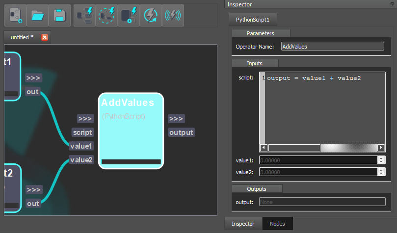

# Python Script Operator

In order to prototype your workflow or perform specific operations that are not included in Shift's builtin catalogs, you can script your custom operator with Python.  
The **Python Script** operator offers the possibility to write your own code to tailor the processing of your data the way you want.  

  

## External Python Packages

You can also import external Python libraries to extend the functionality of your custom operator as long as the Python interpreter you used to start Shift has them available. To do that simply import the modules or packages inside the Python Script operator and use them as you would in any Python code.  

This makes Shift compatible with any software that supports a Python API.
