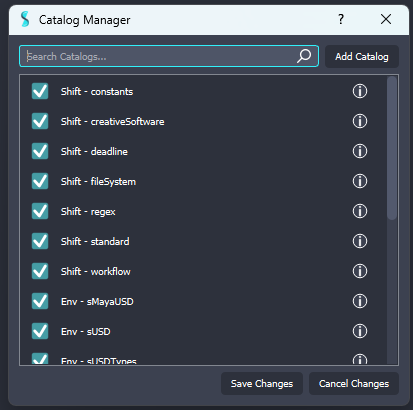
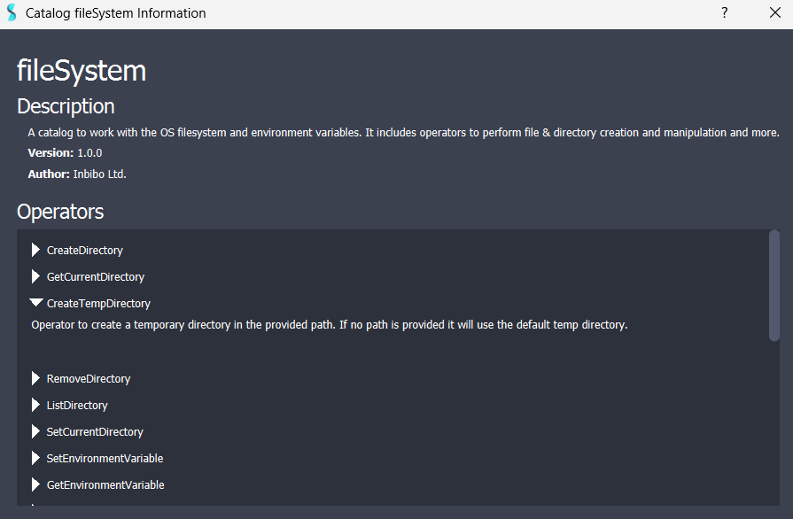

# Catalogs

Catalogs are libraries of operators that define and extend Shift's capabilities, as they provide specialized nodes for different areas of development and automatization. 

Shift comes with six native catalogs that contain the necessary nodes to start building a workflow:

- **Constants catalog**: Provides operators to work with standard Python type objects, such as booleans or strings.
- **Standard catalog**: Provides operators to work with standard Python operations. It provides logic to perform [loop iterations](nodes/iterator.md) and create [scriptable Python nodes](nodes/python_script.md). It also includes operators to read/write JSON files, operate with lists, strings, dictionaries and more.
- **FileSystem catalog**: Provides operators to work with the OS filesystem and environment variables. It includes operators to perform file & directory creation and manipulation and more.
- **Regex catalog**: Provides operators to work with regular expressions and functions.
- **CreativeSoftware catalog**: Provides operators to work with Digital Content Creation softwares. It includes operators for scene management, geometry handling, node graph manipulation and more, across popular DCC tools like Maya, Houdini, Blender, and Nuke.
- **Workflow catalog**: Provides operators to manage and nest Shift workflows. It includes operators to input and output data, store [variables](nodes/variable.md) and execute [sub-workflows](nodes/workflow.md).

>[!NOTE]
> Shift also comes with a native catalog for Deadline. For more information about Shift's integration in Deadline and how to use this catalog, please refer to the [Deadline Integration](../integration_resources/software/deadline.md) documentation.

### Custom Catalogs

Catalogs are scripted Python files that define a list of operators classes and their execution logic. To learn more about how to write a custom catalog, please refer to the [Developer guide](../reference/developer_guide/developing_custom_catalogs.md) for catalogs.

## The Catalog Manager

The Catalog Manager is used to inspect the current available catalogs for Shift, add new ones, and load or unload them. 
To open the Catalog Manager press `P` or click on the menu option under `File -> Catalog Manager`. 

<figure>
      
      <figcaption><b>Figure 1</b>: Catalog Manager UI.</figcaption>   
</figure>

The interface features the list of catalogs found by Shift, which can be divided in three categories:

- **Shift catalogs**: These are catalogs native to Shift.
- **Environment catalogs**: These are catalogs sourced from the environment variable `SHIFT_CATALOGS_PATH`. 
- **User catalogs**: These are catalogs added through the Catalog Manager by the user. 

### Load and Unload Catalogs

To load or unload a catalog, simply indicate in the checkbox at the left of the catalog entry whether it should be loaded or not. Loaded catalogs will have a blue check mark while unloaded catalogs an empty checkbox. Once satisfied with the selection, click on `Save Changes` at the bottom of the dialog. This will change the loaded catalogs configuration in the user preferences and update Shift accordingly.

>[!WARNING]
> It is not possible to have two catalogs with the same name loaded simultaneously. Attempting to do so will require one of them to be unloaded. 
> For instance, if there is an **Environment** catalog named *MyCatalog* and a **User** catalog also named *MyCatalog*, only one of these can be loaded at a time.

### Add a Catalogs

To add a catalog click on the `Add Catalog` button at the top right corner of the Catalog Manager. This will prompt a file browser to search and select the catalog to add to Shift. Once the catalog file is found, click on `Open` in the browser. The new catalog will be added as a **User** catalog to the list, and will be, by default, set to loaded in Shift. Finally, make sure to click on `Save Changes` to commit the latest addition. 

### Inspect Catalogs
The Catalog Manager provides a search bar to find catalogs by name. Additionally, detailed information about a catalog can be read by clicking on the information button at the right of the list entries. By clicking on it, a new dialog will be prompted indicating information about:

- The catalog name.
- The catalog description.
- The catalog version.
- The catalog author.
- The catalog operators and their descriptions.

<figure>
      
      <figcaption><b>Figure 2</b>: Catalog information dialog for the filesystem Shift catalog.</figcaption>   
</figure>
