# standard
A catalog to work with standard Python operations. It provides logic to perform loop iterations and create scriptable Python nodes. It also includes operators to read/write JSON files, operate with lists, strings, dictionaries, regular expressions and more.

---
## ConditionEquals
<i>Beta operator</i>

<figure style="width: 30%">
	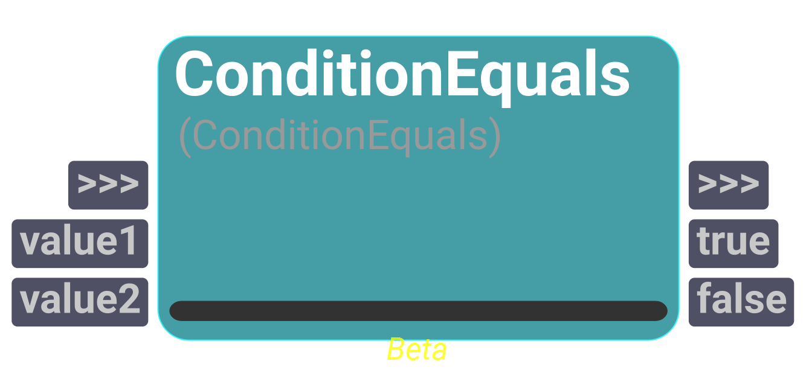
	<figcaption></figcaption>
</figure>

Compares two input objects.
The result of the comparison is used to branch the execution stack.
Outputs two Boolean values, one (truePlug) set to True if the two values are equal and another (falsePlug) set to True if the two values are different.

#### Inputs
| Name | Type | Default
| --- | --- | --- |
| value1 | Object | None
| value2 | Object | None

#### Outputs
| Name | Type | Default |
| --- | --- | --- |
| true | Bool | False
| false | Bool | False

---
## Dict

<figure style="width: 30%">
	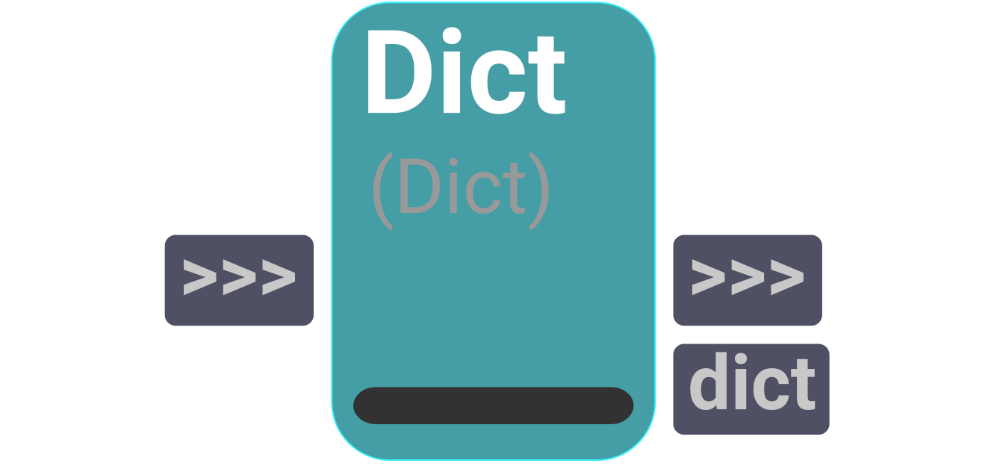
	<figcaption></figcaption>
</figure>

This operator implements a dictionary object in Python.
The operator does not have any input.
To modify the content of the dictionary other operators are used.
Outputs an empty dictionary.

#### Outputs
| Name | Type | Default |
| --- | --- | --- |
| dict | Dict | {}

---
## DictGet

<figure style="width: 30%">
	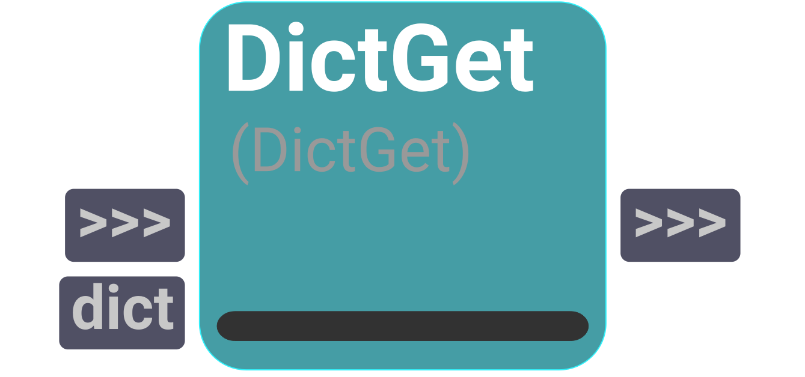
	<figcaption></figcaption>
</figure>

Get values from the dictionary given a series of user-defined output plugs as keys.
Outputs the value assigned to the specified key (output plug) from the dictionary.

<i>Allows creation of custom plugs.</i>

#### Inputs
| Name | Type | Default
| --- | --- | --- |
| dict | Dict | {}

---
## DictKeys

<figure style="width: 30%">
	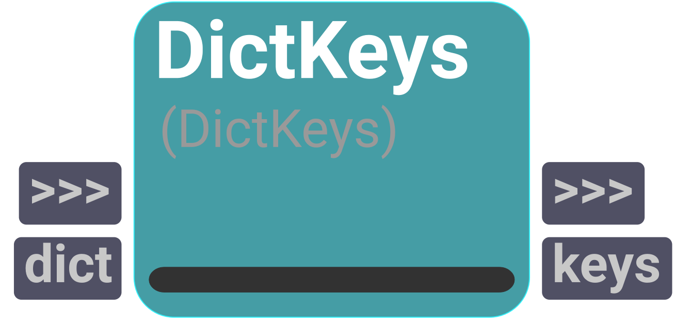
	<figcaption></figcaption>
</figure>

Retrieves the list of keys from a dictionary
Outputs the list of the dictionary's keys.

#### Inputs
| Name | Type | Default
| --- | --- | --- |
| dict | Dict | {}

#### Outputs
| Name | Type | Default |
| --- | --- | --- |
| keys | List | []

---
## DictSet

<figure style="width: 30%">
	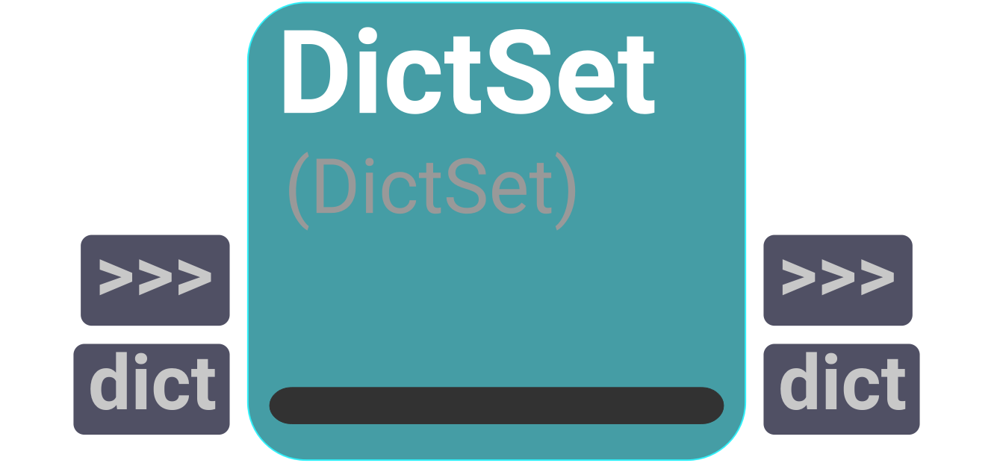
	<figcaption></figcaption>
</figure>

Sets dictionary values by keys defined by the user as input plugs.
The name of the plug relates to the name of the key to be set.
Outputs the dictionary after the new values are set.

<i>Allows creation of custom plugs.</i>

#### Inputs
| Name | Type | Default
| --- | --- | --- |
| dict | Dict | {}

#### Outputs
| Name | Type | Default |
| --- | --- | --- |
| dict | Dict | {}

---
## DictSetKey

<figure style="width: 30%">
	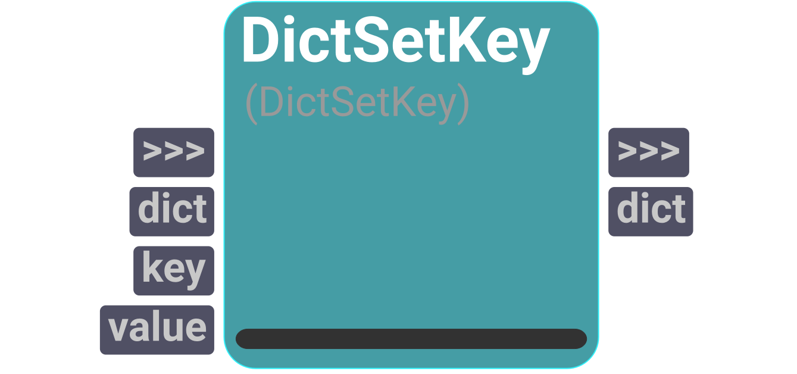
	<figcaption></figcaption>
</figure>

Sets dictionary value of a key defined by the user.
Outputs the dictionary after the new value is set to the provided key.

#### Inputs
| Name | Type | Default
| --- | --- | --- |
| dict | Dict | {}
| key | String | ""
| value | Object | None

#### Outputs
| Name | Type | Default |
| --- | --- | --- |
| dict | Dict | {}

---
## Iterator

<figure style="width: 30%">
	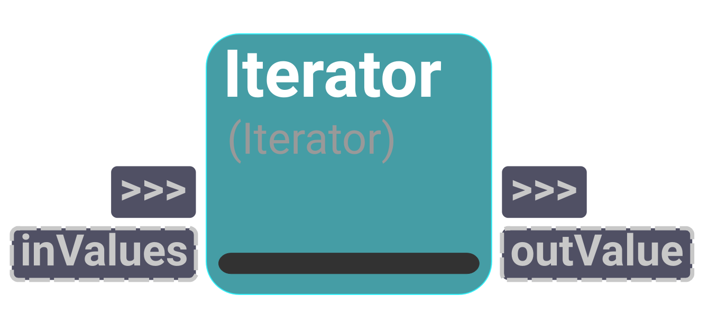
	<figcaption></figcaption>
</figure>

Implements a for loop in Shift.
This works by generating multiple execution stacks, each using a value from an iterable as inputs.
Each execution stack uses one value from the iterable as if it were effectively iterating over the input values.
Outputs the iterated value from the input iterable.

#### Inputs
| Name | Type | Default
| --- | --- | --- |
| inValues | Instance | None

#### Outputs
| Name | Type | Default |
| --- | --- | --- |
| outValue | Instance | None

---
## IteratorEnd

<figure style="width: 30%">
	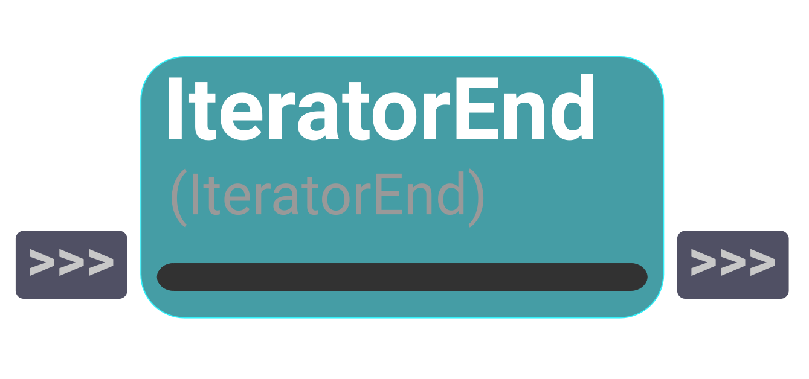
	<figcaption></figcaption>
</figure>

Defined the end of a for loop in Shift.
This specific node is found by the graph evaluator to stop the iterative expansion fo the graph.
This operator accepts an extensible list of plugs (through) to copy the result of the iterator.

<i>Allows creation of custom plugs.</i>

---
## JsonRead

<figure style="width: 30%">
	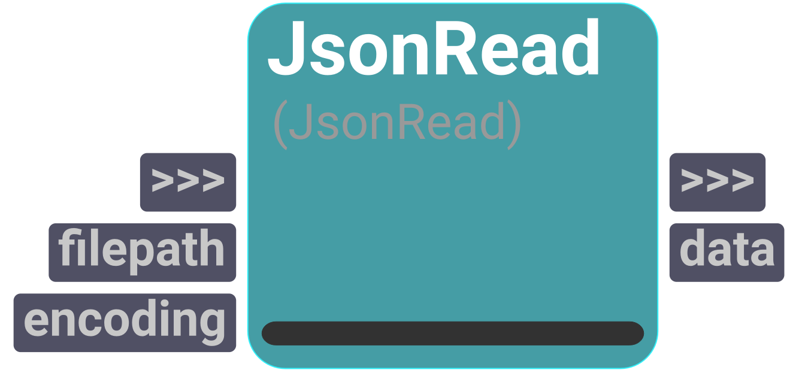
	<figcaption></figcaption>
</figure>

Reads data from a JSON file. Optionally one can define its encoding, by default is utf-8.
Outputs the read data.

#### Inputs
| Name | Type | Default
| --- | --- | --- |
| filepath | FileIn | 
| encoding | String | "utf-8"

#### Outputs
| Name | Type | Default |
| --- | --- | --- |
| data | Dict | {}

---
## JsonStringRead

<figure style="width: 30%">
	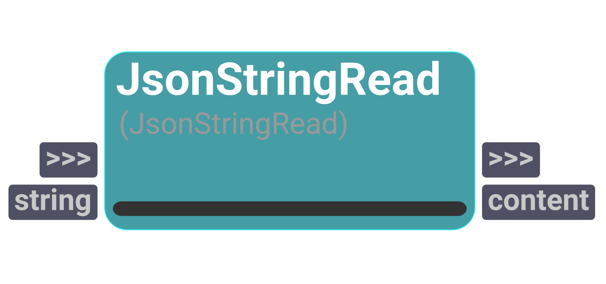
	<figcaption></figcaption>
</figure>

Reads data from a JSON string and deserializes it to a Python object.
Outputs the Python object.

#### Inputs
| Name | Type | Default
| --- | --- | --- |
| string | String | ""

#### Outputs
| Name | Type | Default |
| --- | --- | --- |
| content | Object | None

---
## JsonWrite

<figure style="width: 30%">
	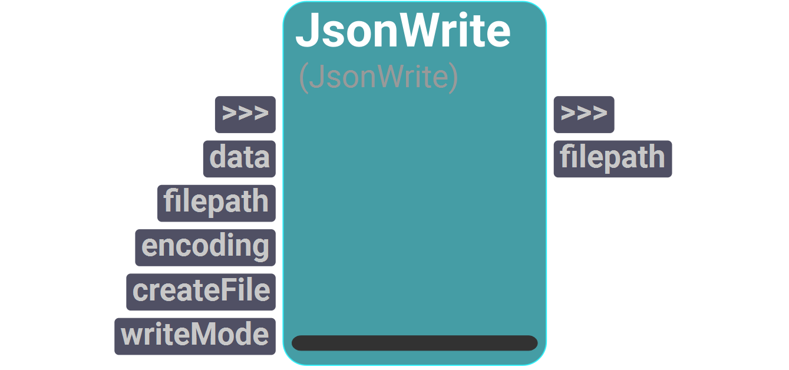
	<figcaption></figcaption>
</figure>

Writes a Python Dictionary to a JSON file.
Optionally one can select the encoding for the write mode. By default it is utf-8.
Optionally one can also select the createFile option, if the file does not exist this will create it. Otherwise, it will raise an error.
The write mode can be selected between Overwrite or Extend.
Outputs the filepath for the JSON file.

#### Inputs
| Name | Type | Default | Options
| --- | --- | --- | --- |
| data | Dict | {} | 
| filepath | FileIn |  | 
| encoding | String | "utf-8" | 
| createFile | Bool | True | 
| writeMode | Enum | Overwrite | Overwrite, Extend

#### Outputs
| Name | Type | Default |
| --- | --- | --- |
| filepath | String | ""

---
## JsonWriteString

<figure style="width: 30%">
	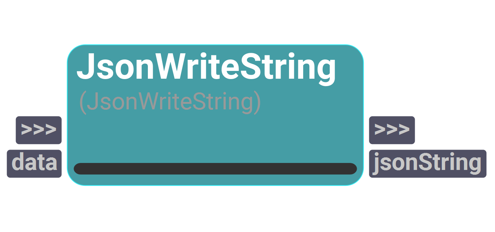
	<figcaption></figcaption>
</figure>

Reads data from a Python Dictionary and serializes it to a JSON string.
Outputs the converted data.

#### Inputs
| Name | Type | Default
| --- | --- | --- |
| data | Dict | {}

#### Outputs
| Name | Type | Default |
| --- | --- | --- |
| jsonString | String | ""

---
## List

<figure style="width: 30%">
	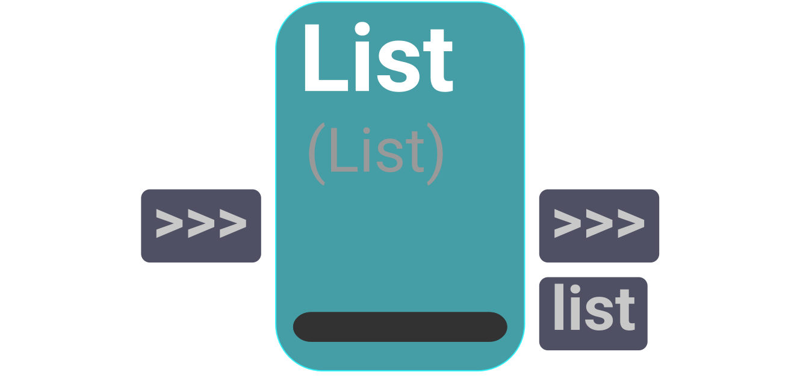
	<figcaption></figcaption>
</figure>

This operator implements a list of Python objects.
The operator does not have any input.
To modify the content of the list other operators are used.
Outputs and empty list.

#### Outputs
| Name | Type | Default |
| --- | --- | --- |
| list | List | []

---
## ListAccumulator

<figure style="width: 30%">
	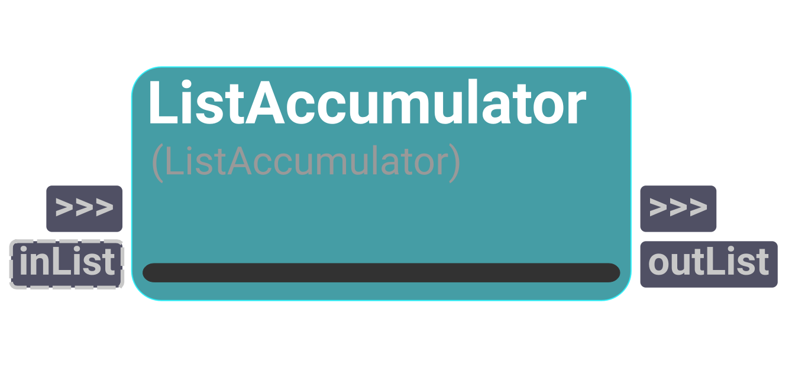
	<figcaption></figcaption>
</figure>

Operator to accumulate an element to a List (based on ListAppend but using kInstance).
The elements to be added are defined by user-defined input plugs added to the operator.
Outputs the list instance (equal to the input list).

<i>Allows creation of custom plugs.</i>

#### Inputs
| Name | Type | Default
| --- | --- | --- |
| inList | Instance | None

#### Outputs
| Name | Type | Default |
| --- | --- | --- |
| outList | List | []

---
## ListAppend

<figure style="width: 30%">
	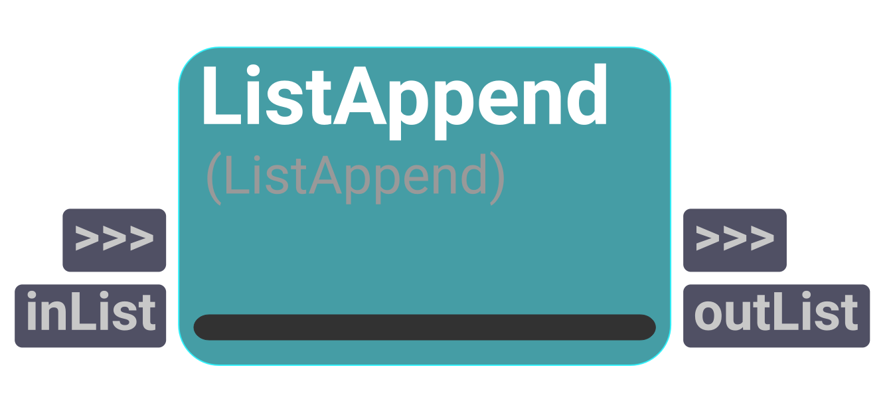
	<figcaption></figcaption>
</figure>

Operator to append an element to a List.
The elements to be added are defined by user-defined input plugs added to the operator.
Outputs the resulting list as a new list instance (does not alter the input list).

<i>Allows creation of custom plugs.</i>

#### Inputs
| Name | Type | Default
| --- | --- | --- |
| inList | List | []

#### Outputs
| Name | Type | Default |
| --- | --- | --- |
| outList | List | []

---
## ListExtend

<figure style="width: 30%">
	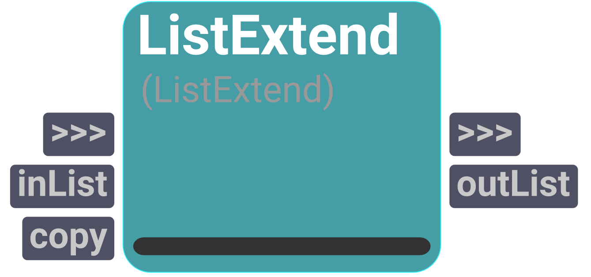
	<figcaption></figcaption>
</figure>

Extends an input list adding another list to it.
It allows selecting whether the input list is mutated or is left immutable.
Outputs the list resulting from the addition of the two input lists.

<i>Allows creation of custom plugs.</i>

#### Inputs
| Name | Type | Default
| --- | --- | --- |
| inList | List | []
| copy | Bool | False

#### Outputs
| Name | Type | Default |
| --- | --- | --- |
| outList | List | []

---
## ListGet

<figure style="width: 30%">
	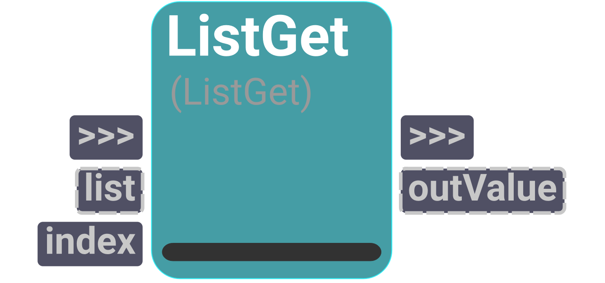
	<figcaption></figcaption>
</figure>

Retrieves the list's element at a given index.
Outputs the Python object at the given index in the list.

#### Inputs
| Name | Type | Default
| --- | --- | --- |
| list | Instance | None
| index | Int | 0

#### Outputs
| Name | Type | Default |
| --- | --- | --- |
| outValue | Instance | None

---
## ListInsert

<figure style="width: 30%">
	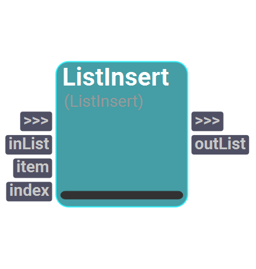
	<figcaption></figcaption>
</figure>

Operator that inserts an item into the given list at the given index.
Outputs the updated list.

<i>Allows creation of custom plugs.</i>

#### Inputs
| Name | Type | Default
| --- | --- | --- |
| inList | List | []
| item | Object | None
| index | Int | 0

#### Outputs
| Name | Type | Default |
| --- | --- | --- |
| outList | List | []

---
## ListLength

<figure style="width: 30%">
	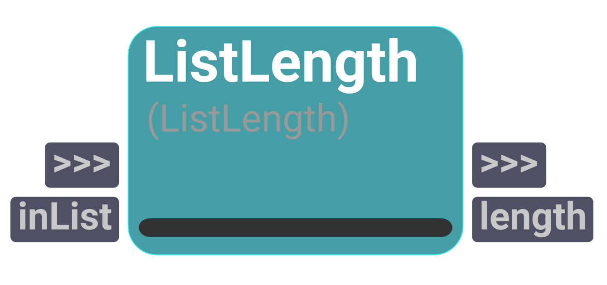
	<figcaption></figcaption>
</figure>

Gets the length of the provided list.

<i>Allows creation of custom plugs.</i>

#### Inputs
| Name | Type | Default
| --- | --- | --- |
| inList | List | []

#### Outputs
| Name | Type | Default |
| --- | --- | --- |
| length | Int | 0

---
## ListPop

<figure style="width: 30%">
	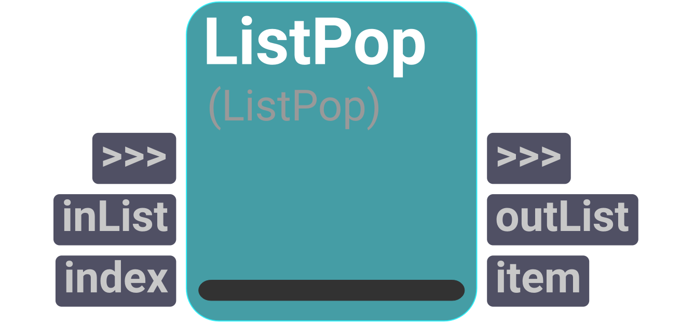
	<figcaption></figcaption>
</figure>

Pops the item placed in the provided index from the provided list.
Outputs the list updated and the item.

<i>Allows creation of custom plugs.</i>

#### Inputs
| Name | Type | Default
| --- | --- | --- |
| inList | List | []
| index | Int | 0

#### Outputs
| Name | Type | Default |
| --- | --- | --- |
| outList | List | []
| item | Object | None

---
## ListRemove

<figure style="width: 30%">
	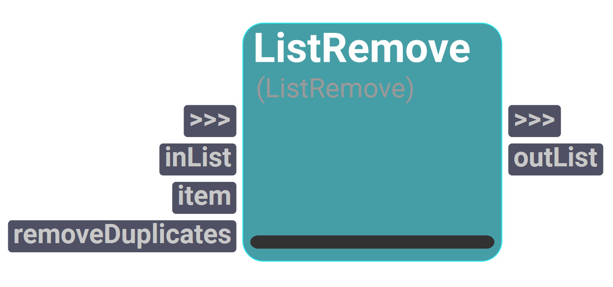
	<figcaption></figcaption>
</figure>

Removes an item from the provided list.
Optionally one can choose to remove the provided item recursively if there is more than 1 occurrence in the list.
Outputs the list with the item removed.

<i>Allows creation of custom plugs.</i>

#### Inputs
| Name | Type | Default
| --- | --- | --- |
| inList | List | []
| item | Object | None
| removeDuplicates | Bool | False

#### Outputs
| Name | Type | Default |
| --- | --- | --- |
| outList | List | []

---
## ListReverse

<figure style="width: 30%">
	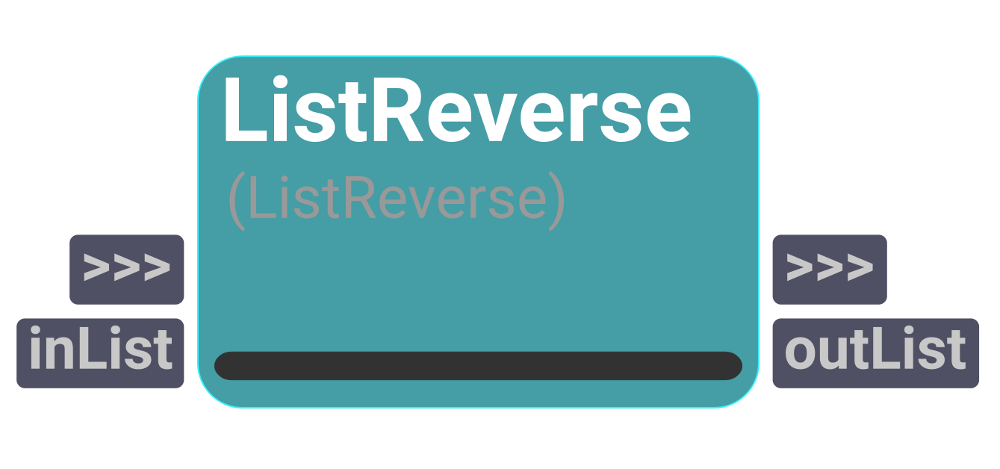
	<figcaption></figcaption>
</figure>

Reverse the items of a list and output the reversed list.

<i>Allows creation of custom plugs.</i>

#### Inputs
| Name | Type | Default
| --- | --- | --- |
| inList | List | []

#### Outputs
| Name | Type | Default |
| --- | --- | --- |
| outList | List | []

---
## ListSort

<figure style="width: 30%">
	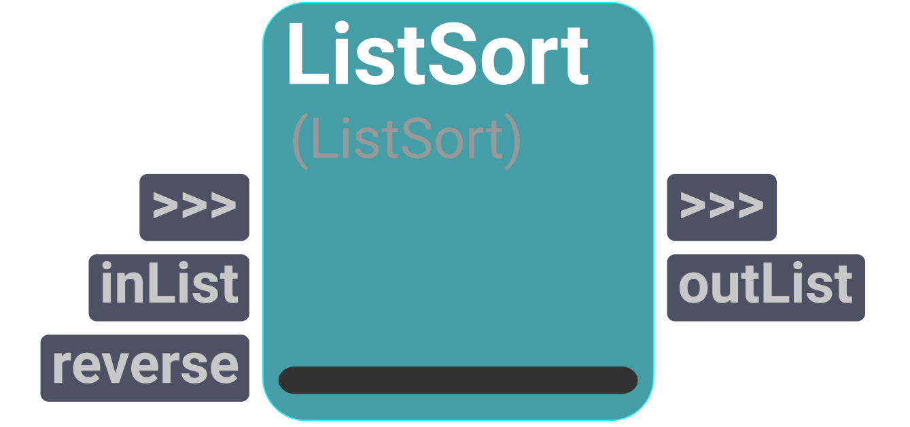
	<figcaption></figcaption>
</figure>

Sorts the items in the given list. 
Optionally one can turn on the reverse option to get the list sorted in reversed.
Outputs the sorted list.

<i>Allows creation of custom plugs.</i>

#### Inputs
| Name | Type | Default
| --- | --- | --- |
| inList | List | []
| reverse | Bool | False

#### Outputs
| Name | Type | Default |
| --- | --- | --- |
| outList | List | []

---
## Print

<figure style="width: 30%">
	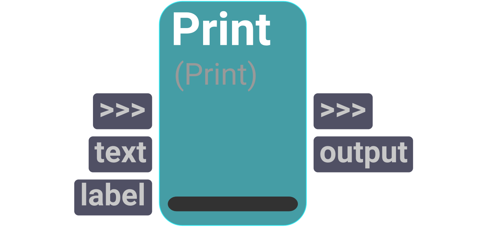
	<figcaption></figcaption>
</figure>

Operator for printing out messages.
Outputs the same message that was printed.

#### Inputs
| Name | Type | Default
| --- | --- | --- |
| text | String | ""
| label | String | ""

#### Outputs
| Name | Type | Default |
| --- | --- | --- |
| output | String | ""

---
## PythonScript

<figure style="width: 30%">
	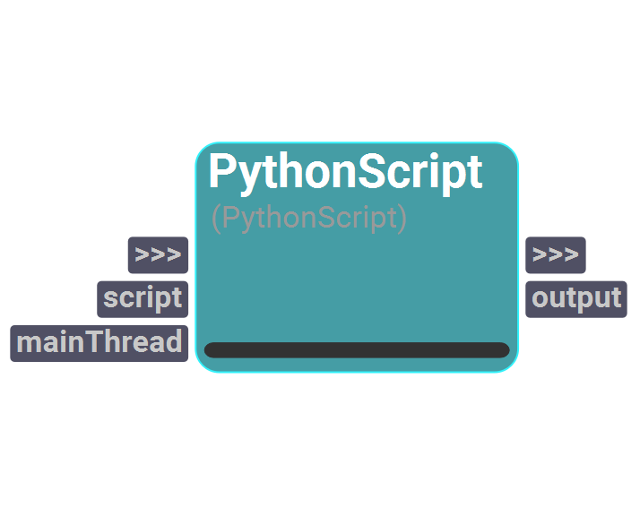
	<figcaption></figcaption>
</figure>

Executes a scripted Python code.
The node accepts any custom object as input.
Outputs the result of the script if the 'output' variable is explicitly set in the code.
The mainThread plug forces the execution of the script in the main thread in DCC context,
it has no effect outside of DCCs.

<i>Allows creation of custom plugs.</i>

#### Inputs
| Name | Type | Default
| --- | --- | --- |
| script | Code | None
| mainThread | Bool | False

#### Outputs
| Name | Type | Default |
| --- | --- | --- |
| output | Object | None

---
## RegexCompile
<i>Beta operator</i>

<figure style="width: 30%">
	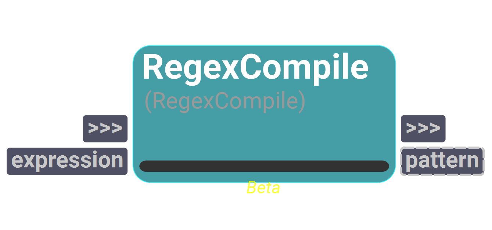
	<figcaption></figcaption>
</figure>

Operator to compile a regex expression.

#### Inputs
| Name | Type | Default
| --- | --- | --- |
| expression | String | ""

#### Outputs
| Name | Type | Default |
| --- | --- | --- |
| pattern | Instance | None

---
## RegexMatch
<i>Beta operator</i>

<figure style="width: 30%">
	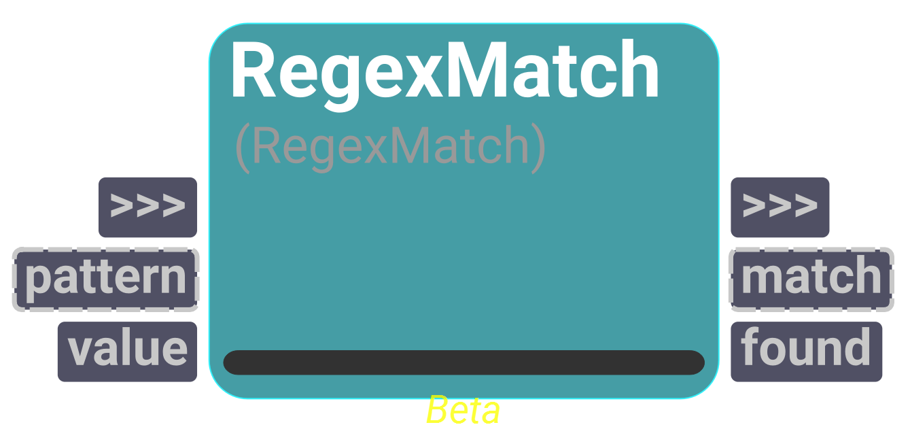
	<figcaption></figcaption>
</figure>

Operator to find a match given a regular expression pattern.
The pattern input can be a compiled pattern or an expression in string format.
The value input is the string in which the match has to be found.
The match output plug stores the match object returned by Regex or None if the pattern is not found.
The found output plug is a boolean signaling whether the search was successful or not

#### Inputs
| Name | Type | Default
| --- | --- | --- |
| pattern | Instance | None
| value | String | ""

#### Outputs
| Name | Type | Default |
| --- | --- | --- |
| match | Instance | None
| found | Bool | False

---
## RegexMatchGroups
<i>Beta operator</i>

<figure style="width: 30%">
	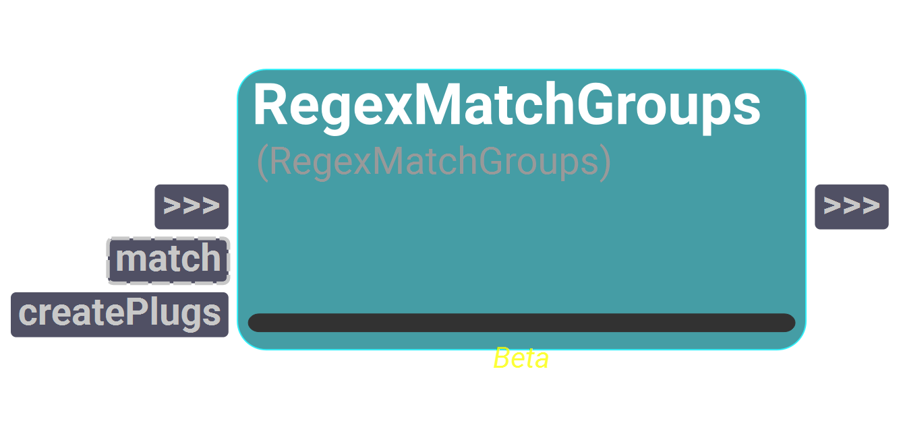
	<figcaption></figcaption>
</figure>

Operator to get all the groups from a Match object.
Set the createPlugs input to True to create one plug for each group found in the match object automatically.

<i>Allows creation of custom plugs.</i>

#### Inputs
| Name | Type | Default
| --- | --- | --- |
| match | Instance | None
| createPlugs | Bool | False

---
## RegexSearch
<i>Beta operator</i>

<figure style="width: 30%">
	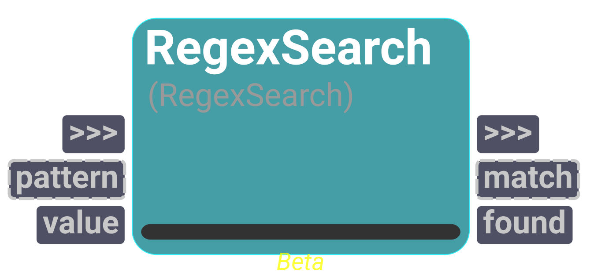
	<figcaption></figcaption>
</figure>

Operator to perform a search using a regular expression pattern.
The pattern input can be a compiled pattern or an expression in string format.
The value input is the string in which the search have to be executed.
The match output plug stores the match object returned by Regex or None if the pattern is not found.
The found output plug is a boolean signaling whether the search was successful or not

#### Inputs
| Name | Type | Default
| --- | --- | --- |
| pattern | Instance | None
| value | String | ""

#### Outputs
| Name | Type | Default |
| --- | --- | --- |
| match | Instance | None
| found | Bool | False

---
## RegexSubstitute
<i>Beta operator</i>

<figure style="width: 30%">
	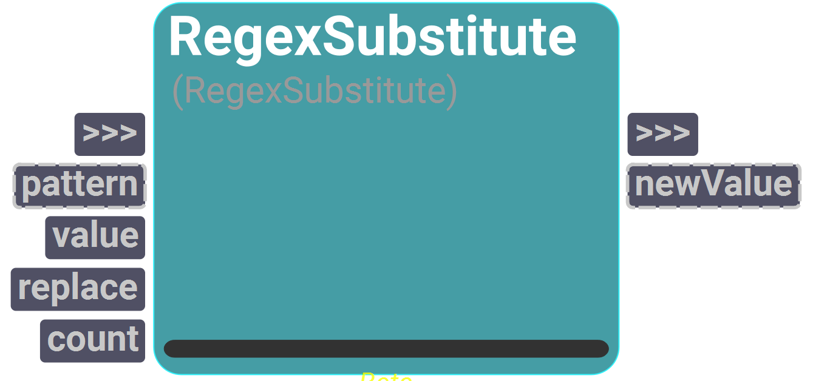
	<figcaption></figcaption>
</figure>

Operator to substitute pattern matches in the value string with a given replace string.
The replace input is the value to replace for each match with the given pattern.
The count plug controls the number of matches to substitute. The default value of 0 will substitute all matches.

#### Inputs
| Name | Type | Default
| --- | --- | --- |
| pattern | Instance | None
| value | String | ""
| replace | String | ""
| count | Int | 0

#### Outputs
| Name | Type | Default |
| --- | --- | --- |
| newValue | Instance | None

---
## Sleep

<figure style="width: 30%">
	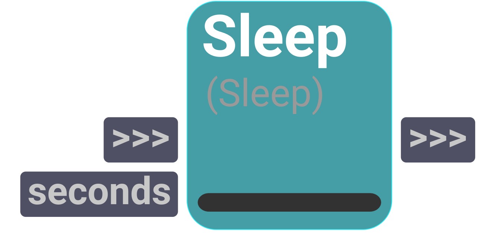
	<figcaption></figcaption>
</figure>

Operator that puts the current thread execution to sleep for a given number of seconds.

#### Inputs
| Name | Type | Default
| --- | --- | --- |
| seconds | Float | 0.0

---
## StringConcatenate

<figure style="width: 30%">
	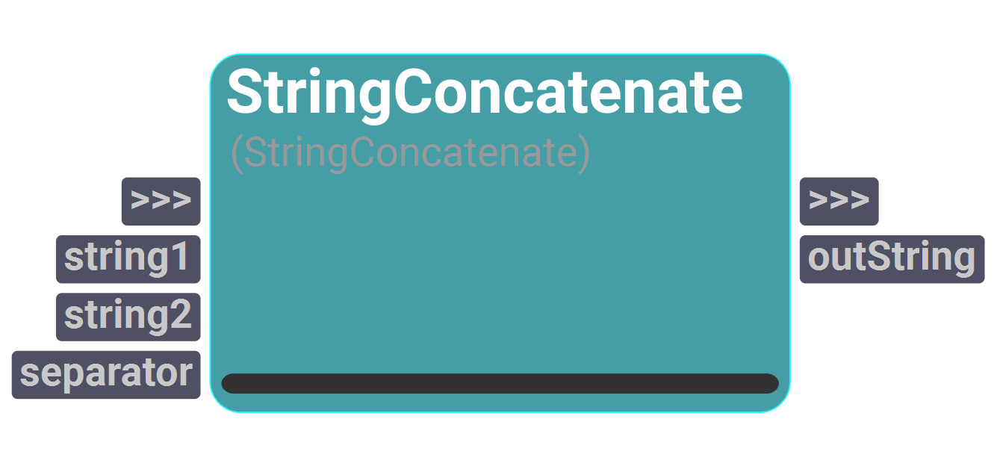
	<figcaption></figcaption>
</figure>

Operator to concatenate the provided strings.
The operator provides the user with two standard string plugs to concatenate.
If the operator needs to concatenate more than 2 strings, custom string plugs can be added as needed.
Optionally the resulting string can have a separator between each provided string. By default, it is an empty string.
Outputs the resulting string.

<i>Allows creation of custom plugs.</i>

#### Inputs
| Name | Type | Default
| --- | --- | --- |
| string1 | String | ""
| string2 | String | ""
| separator | String | ""

#### Outputs
| Name | Type | Default |
| --- | --- | --- |
| outString | String | ""

---
## StringFormat

<figure style="width: 30%">
	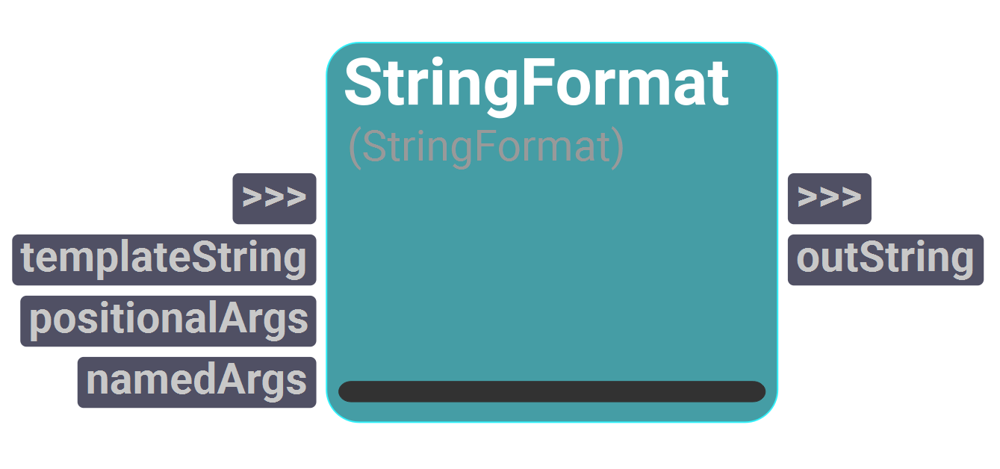
	<figcaption></figcaption>
</figure>

Formats the given template string by using the arguments provided.
Two types of arguments can be specified, positional (list) or named (dictionary).
Outputs the formatted string.

#### Inputs
| Name | Type | Default
| --- | --- | --- |
| templateString | String | ""
| positionalArgs | List | []
| namedArgs | Dict | {}

#### Outputs
| Name | Type | Default |
| --- | --- | --- |
| outString | String | ""

---
## StringLength

<figure style="width: 30%">
	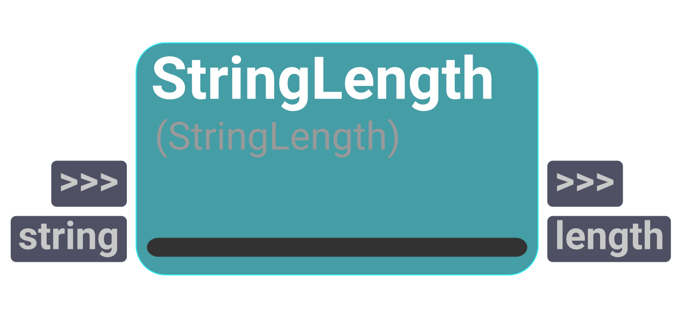
	<figcaption></figcaption>
</figure>

Returns the length of the string passed in.

#### Inputs
| Name | Type | Default
| --- | --- | --- |
| string | String | ""

#### Outputs
| Name | Type | Default |
| --- | --- | --- |
| length | Int | 0

---
## StringSplit

<figure style="width: 30%">
	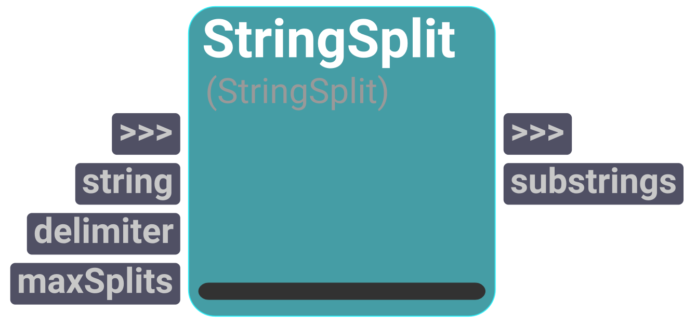
	<figcaption></figcaption>
</figure>

Operator that splits the given string into substrings.
One can select the delimiter to the substrings, by default the delimiter is a whitespace.
One can also select the maximum splits to be applied, by default the value is -1 which means unlimited splits.
Outputs a list containing all the substrings.

#### Inputs
| Name | Type | Default
| --- | --- | --- |
| string | String | ""
| delimiter | String | ""
| maxSplits | Int | -1

#### Outputs
| Name | Type | Default |
| --- | --- | --- |
| substrings | List | []

---
## PythonExecute
<i>Deprecated operator</i>

<figure style="width: 30%">
	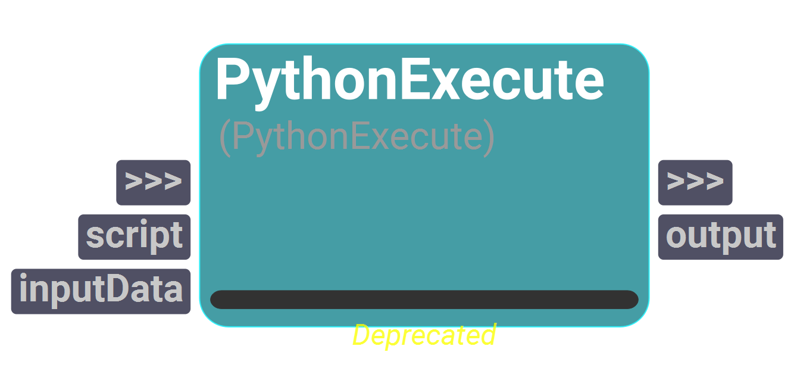
	<figcaption></figcaption>
</figure>

Executes a scripted Python code.
The node accepts a Python Object (can even be a list or a dictionary) as input.
Outputs the result of the script if the 'output' variable is explicitly set in the code.

#### Inputs
| Name | Type | Default
| --- | --- | --- |
| script | Code | None
| inputData | Object | None

#### Outputs
| Name | Type | Default |
| --- | --- | --- |
| output | Object | None

