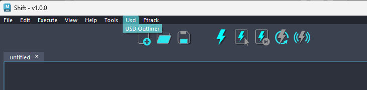

# Extending Shift

## Custom Catalogs

In Shift it is possible to create customized catalogs with operators tailored for specific use cases and softwares.

Custom catalogs are written in Python and include a global variable called `catalog`. This variable is a Python dictionary containing the information for the catalog, such as a description, version and authors. Additionally, this dictionary will define the list of operator classes included in the catalog.

**Catalog Dictionary Example**
```python
catalog = {"Description": "This catalog includes fundamental Python type operators.",
           "Version": "1.0.0",
           "Author": "Shift's development team", 
           "Operators":[[String,  []],
                        [Integer, []],
                        [Float,   []],
                        [Bool,    []]]}
```

>[!NOTE]
> The *Operators* list from the `catalog` is a list of lists containing two elements. The first one corresponds to the operator class, and the second one is a list of compatible hosts for the operator. For example, if the second element is `["maya", "houdini"]`the operator will be only compatible with those DCC's and work under those contexts. Refer to [Integrations & Resources](../../integration_resources/integrations_resources.md) for more information.

There are two ways of adding a custom catalog to Shift:

- **As a User Catalog**: Use the [Catalog Manager](../catalogs/#the-catalog-manager) to source the catalog file and add it to Shift. This catalog is saved in the user preferences.
- **As a Environment Catalog**: Add the **path to the directory** the containing the catalog file to the `SHIFT_CATALOG_PATH` environment variable. All files in this path containing a `catalog` object will be identified as custom catalogs and loaded by Shift.

## Operator Syntax

All Shift operators inherit from the `SOperator` Shift's Python class. To write a custom operator, the `__init__` and `execute` methods must be overwritten. 

Here is an example of an operator class syntax:

```python
from shift.core.workflow import SOperator
from shift.core.workflow import SPlug
from shift.core.constants import SType
from shift.core.constants import SDirection
 
class MyOperator(SOperator):

    def __init__(self, code, parent=None):

        super(self.__class__, self).__init__(code, parent)

        inPlug1 = SPlug(code="input1",
                       value=0,
                       type=SType.kInt,
                       direction=SDirection.kIn,
                       parent=self)

        inPlug2 = SPlug(code="input2",
                       value=0,
                       type=SType.kInt,
                       direction=SDirection.kIn,
                       parent=self)

        outPlug = SPlug(code="output",
                       value=0,
                       type=SType.kInt,
                       direction=SDirection.kOut,
                       parent=self)

        self.addPlug(inPlug1)
        self.addPlug(inPlug2)
        self.addPlug(outPlug)

    def execute(self, force=False):

        input1 = self.getPlug("input1", SDirection.kIn).value()
        input2 = self.getPlug("input2", SDirection.kOut).value()

        output = input1 * input2

        self.getPlug("output").setValue(output)
        super(self.__class__, self).execute(force)
```

The `SOperator` constructor method takes care of initializing the plug objects and adding them to the operator. Each plug must be initialized specifying a unique code name, its value, type, and a direction which can be either `SDirection.kIn` or `SDirection.kOut`.

The **execute** method takes care of defining the list of steps to be performed when the execution of the operator is issued inside Shift. In the example above the execute method picks up the values of the two input plugs and multiplies them together. Finally it stores the result in the output plug.

Please refer to the Shift API documentation to know more about which plug types are present in Shift, and which additional methods the `SPlug` and `SOperator` classes offer.

## Creating a Plugin

TO BE REVIEWED BY ISSUE #17

Finally Shift allows you to create your own Qt-based custom tools that can be integrated in the Shift interface, to allow visual feedback or interaction for your workflows. An example of this could be the *Usd Outliner* from *Shift_USD* which allows the user to traverse the Usd Stages loaded by the catalog Operators and visualize the Prim hierachy.

Similarly to the custom catalog you can create your custom Plugin for Shift in a Python file. The Plugin must follow the syntax in the example in order for it to correctly communicate with the Shift operators and interface:

```python
from PySide2 import QtWidgets

class MyPlugin(QtWidgets.QDialog):

    def __init__(self, parent=None):
        super(MyPlugin, self).__init__(parent)

        <your_qt_logic>

        # Connect the Qt Signals from Shift
        self.getShiftBoard().currentChanged.connect(self.myUpdateUIMethod)
        self.getMainWindow().newBoardCreated.connect(self.connectBoardSignals)

    def getMainWindow(self):
        return self._mainWindow

    def getShiftBoard(self):
        return self._mainWindow._boardTabsWidget

    def connectBoardSignals(self):
        """Method to connect Qt signals when a new board is created."""
        self.getShiftBoard().currentWidget().workflowExecuted.connect(self.myUpdateUIMethod)
        self.getShiftBoard().currentWidget().nodeSelected.connect(self.myUpdateUIMethod)
        self.getShiftBoard().currentWidget().nodeRenamed.connect(self.myUpdateUIMethod)
        self.myUpdateUIMethod()

    def myUpdateUIMethod(self):

        <your_qt_update_logic>
```

This is a basic implementation example to show how the interaction with the Shift UI with Qt signals should be initialized. The `MyPlugin` class is parented to the Shift Main Window which gives us access to certain signals for the global interaction with the Shift UI (like `newBoardCreated`). Then the workflow specific actions like node selection, node removal or workflow execution are controlled by the specific Shift board which contains the operators we are working with. As each board in Shift is a separate Python instance, we must connect its signals every time a new board is created. We suggest to organize this logic in the `connectBoardSignals` method like in the example code. An API `SPlugin` class will come in the future to take care of simplifying the implementation of this logic.

Plugins need an additional file to setup the information needed by Shift to integrate the Plugin in the UI.
Such file is a *json* and should be called `plugins.json`. Here is an example of its content:

```json
"My Plugin": {
        "menu": "My Menu",
        "path": "<path_to_the_plugin_file>/myPlugin.py",
        "class": "myPlugin",
    },
"My Other Plugin": {
        "menu": "My Menu",
        "path": "<path_to_the_plugin_file>/myOtherPlugin.py",
        "class": "myOtherPlugin"
    }
```

As we can see from the example in this file we can list several plugins to be initialized and specify the path to the python file containing the specific Plugin class and the top menu to add the new entry to. If the mentioned menu is not present already, Shift will take care of creating it for you.

Here is an example of how the plugin menu entry will look like:


