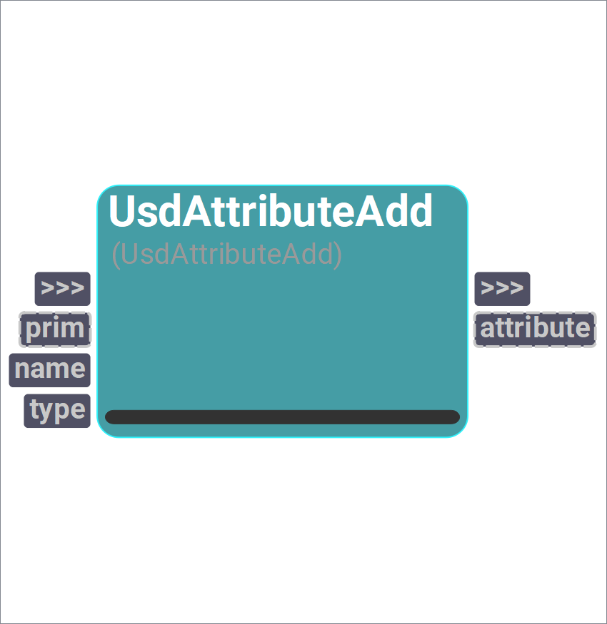

# sUSD
This catalog doesn't have a description

## *sUSD* Operators
## UsdAttributeAdd
<figure style="width: 30%">
	
	<figcaption><b>Figure 1</b>: Catalog Manager UI.</figcaption>   
</figure>

Add UsdAttribute to UsdPrim.

#### Inputs
| Name | Type | Default | Options
| --- | --- | --- | --- |
| prim | Instance | None | 
| name | String | "" | 
| type | Enum | Asset | Asset, AssetArray, Bool, BoolArray, Color3d, Color3dArray, Color3f, Color3fArray, Color3h, Color3hArray, Color4d, Color4dArray, Color4f, Color4fArray, Color4h, Color4hArray, Double, Double2, Double2Array, Double3, Double3Array, Double4, Double4Array, DoubleArray, Find, Float, Float2, Float2Array, Float3, Float3Array, Float4, Float4Array, FloatArray, Frame4d, Frame4dArray, Group, Half, Half2, Half2Array, Half3, Half3Array, Half4, Half4Array, HalfArray, Int, Int2, Int2Array, Int3, Int3Array, Int4, Int4Array, Int64, Int64Array, IntArray, Matrix2d, Matrix2dArray, Matrix3d, Matrix3dArray, Matrix4d, Matrix4dArray, Normal3d, Normal3dArray, Normal3f, Normal3fArray, Normal3h, Normal3hArray, Opaque, Point3d, Point3dArray, Point3f, Point3fArray, Point3h, Point3hArray, Quatd, QuatdArray, Quatf, QuatfArray, Quath, QuathArray, String, StringArray, TexCoord2d, TexCoord2dArray, TexCoord2f, TexCoord2fArray, TexCoord2h, TexCoord2hArray, TexCoord3d, TexCoord3dArray, TexCoord3f, TexCoord3fArray, TexCoord3h, TexCoord3hArray, TimeCode, TimeCodeArray, Token, TokenArray, UChar, UCharArray, UInt, UInt64, UInt64Array, UIntArray, Vector3d, Vector3dArray, Vector3f, Vector3fArray, Vector3h, Vector3hArray

#### Outputs
| Name | Type | Default |
| --- | --- | --- |
| attribute | Instance | None

## UsdAttributeClear
<figure style="width: 30%">
	
</figure>

Clears the authored value from the given UsdAttribute.
    If useTime plug is set to True, the attribute value will be cleared at the given time.
    Otherwise, the attribute value will be cleared in all time samples.

    

#### Inputs
| Name | Type | Default
| --- | --- | --- |
| attribute | Instance | None
| useTime | Bool | False
| time | Int | 0

#### Outputs
| Name | Type | Default |
| --- | --- | --- |
| attribute | Instance | None

## UsdAttributeConnectionAdd
<figure style="width: 30%">
	
</figure>

Add connection between two UsdAttributes.

#### Inputs
| Name | Type | Default
| --- | --- | --- |
| source | Instance | None
| destination | Instance | None

#### Outputs
| Name | Type | Default |
| --- | --- | --- |
| destination | Instance | None

## UsdAttributeConnectionRemove
<figure style="width: 30%">
	
</figure>

Remove connection between two UsdAttributes.

#### Inputs
| Name | Type | Default
| --- | --- | --- |
| source | Instance | None
| destination | Instance | None

#### Outputs
| Name | Type | Default |
| --- | --- | --- |
| destination | Instance | None

## UsdAttributeCopy
<figure style="width: 30%">
	
</figure>

Copy Usd.Attribute from source Usd.Prim to target Usd.Prim.

#### Inputs
| Name | Type | Default
| --- | --- | --- |
| sourcePrim | Instance | None
| sourceAttribute | String | ""
| targetPrim | Instance | None
| targetAttribute | String | ""

#### Outputs
| Name | Type | Default |
| --- | --- | --- |
| targetPrim | Instance | None
| targetAttribute | Instance | None

## UsdAttributeGet
<figure style="width: 30%">
	
</figure>

Get UsdAttribute from UsdPrim.

#### Inputs
| Name | Type | Default
| --- | --- | --- |
| prim | Instance | None
| name | String | ""

#### Outputs
| Name | Type | Default |
| --- | --- | --- |
| attribute | Instance | None

## UsdAttributeRemove
<figure style="width: 30%">
	
</figure>

Remove UsdAttribute .

#### Inputs
| Name | Type | Default
| --- | --- | --- |
| prim | Instance | None
| name | String | ""

#### Outputs
| Name | Type | Default |
| --- | --- | --- |
| prim | Instance | None

## UsdAttributeTypeGet
<figure style="width: 30%">
	
</figure>

Get the type name for UsdAttribute.

#### Inputs
| Name | Type | Default
| --- | --- | --- |
| attribute | Instance | None

#### Outputs
| Name | Type | Default |
| --- | --- | --- |
| typeName | String | ""

## UsdAttributeValueGet
<figure style="width: 30%">
	
</figure>

Get UsdAttribute value.

#### Inputs
| Name | Type | Default
| --- | --- | --- |
| attribute | Instance | None
| useTime | Bool | False
| time | Int | 0

#### Outputs
| Name | Type | Default |
| --- | --- | --- |
| value | Instance | None

## UsdAttributeValueSet
<figure style="width: 30%">
	
</figure>

Get UsdAttribute value.

#### Inputs
| Name | Type | Default
| --- | --- | --- |
| attribute | Instance | None
| value | Instance | None
| useTime | Bool | False
| time | Int | 0

#### Outputs
| Name | Type | Default |
| --- | --- | --- |
| attribute | Instance | None

## UsdAttributesGetDict
<figure style="width: 30%">
	
</figure>

Returns a dictionary with the attribute names and their respective values.

#### Inputs
| Name | Type | Default
| --- | --- | --- |
| prim | Instance | None

#### Outputs
| Name | Type | Default |
| --- | --- | --- |
| attributesDict | Dict | {}

## UsdInstanceNameGet
<figure style="width: 30%">
	
</figure>

Get the name of Usd instance.

#### Inputs
| Name | Type | Default
| --- | --- | --- |
| usdInstance | Instance | None

#### Outputs
| Name | Type | Default |
| --- | --- | --- |
| name | String | ""

## UsdInstancePathGet
<figure style="width: 30%">
	
</figure>

Get the Sdf.Path for Usd instance.

#### Inputs
| Name | Type | Default
| --- | --- | --- |
| usdInstance | Instance | None

#### Outputs
| Name | Type | Default |
| --- | --- | --- |
| sdfPath | Instance | None
| pathString | String | ""

## UsdLayerAdd
<figure style="width: 30%">
	
</figure>

Adds a given source layer to the subLayerPaths of the destination layer.
    The mode plug allows to specify in which position the source layer should 
    be added in the subLayerPaths.
    By default, the mode is 'Append', meaning that the source layer will be inserted at the end of the subLayerPaths.
    Setting mode as 'Prepend', the source layer will be inserted at the beginning of the subLayerPaths.
    Setting mode as 'Insert At', the source layer will be inserted at the specified index by the position plug.

    

#### Inputs
| Name | Type | Default | Options
| --- | --- | --- | --- |
| destinationLayer | Instance | None | 
| sourceLayer | Instance | None | 
| mode | Enum | Append | Append, Prepend, Insert At
| position | Int | 0 | 

#### Outputs
| Name | Type | Default |
| --- | --- | --- |
| sourceLayer | Instance | None

## UsdLayerCreateAnonymous
<figure style="width: 30%">
	
</figure>

Creates a new anonymous layer with an optional given tag.

#### Inputs
| Name | Type | Default
| --- | --- | --- |
| tag | String | ""

#### Outputs
| Name | Type | Default |
| --- | --- | --- |
| layer | Instance | None

## UsdLayerCreateNew
<figure style="width: 30%">
	
</figure>

Creates a new empty layer in the given filepath.

#### Inputs
| Name | Type | Default
| --- | --- | --- |
| filepath | FileOut | 

#### Outputs
| Name | Type | Default |
| --- | --- | --- |
| layer | Instance | None

## UsdLayerFindOrOpen
<figure style="width: 30%">
	
</figure>

Returns an existing SdfLayer with the given identifier.
    The identifier can be an absolute or relative path to an existing USD file or a URI.

    

#### Inputs
| Name | Type | Default
| --- | --- | --- |
| identifier | String | ""

#### Outputs
| Name | Type | Default |
| --- | --- | --- |
| layer | Instance | None

## UsdLayerGet
<figure style="width: 30%">
	
</figure>

Returns a layer in the given position from the given UsdStage layer stack.

#### Inputs
| Name | Type | Default
| --- | --- | --- |
| stage | Instance | None
| position | Int | 0
| includeSessionLayers | Bool | False

#### Outputs
| Name | Type | Default |
| --- | --- | --- |
| layer | Instance | None

## UsdLayerPathGet
<figure style="width: 30%">
	
</figure>

Gets the path and the identifier from the given SdfLayer.

#### Inputs
| Name | Type | Default
| --- | --- | --- |
| layer | Instance | None

#### Outputs
| Name | Type | Default |
| --- | --- | --- |
| layerPath | String | ""
| layerIdentifier | String | ""

## UsdLoadedLayersGet
<figure style="width: 30%">
	
</figure>

Returns all layers currently held by the layer registry.

#### Outputs
| Name | Type | Default |
| --- | --- | --- |
| loadedLayers | Instance | None

## SdfSubLayersGet
<figure style="width: 30%">
	
</figure>

Get the sublayers from the given SdfLayer.

#### Inputs
| Name | Type | Default
| --- | --- | --- |
| layer | Instance | None

#### Outputs
| Name | Type | Default |
| --- | --- | --- |
| subLayers | Instance | None

## UsdPrimAdd
<figure style="width: 30%">
	
</figure>

Add UsdPrim to UsdStage.

#### Inputs
| Name | Type | Default | Options
| --- | --- | --- | --- |
| stage | Instance | None | 
| primpath | String | "" | 
| primType | Enum | None | None, Backdrop, BasisCurves, BlendShape, Boundable, BoundableLightBase, Camera, Capsule, Cone, Cube, Curves, Cylinder, CylinderLight, DiskLight, DistantLight, DomeLight, Field3DAsset, FieldAsset, FieldBase, GenerativeProcedural, GeomSubset, GeometryLight, Gprim, HermiteCurves, Imageable, LightFilter, Material, Mesh, NodeGraph, NonboundableLightBase, NurbsCurves, NurbsPatch, OpenVDBAsset, PackedJointAnimation, PhysicsCollisionGroup, PhysicsDistanceJoint, PhysicsFixedJoint, PhysicsJoint, PhysicsPrismaticJoint, PhysicsRevoluteJoint, PhysicsScene, PhysicsSphericalJoint, Plane, PluginLight, PluginLightFilter, PointBased, PointInstancer, Points, PortalLight, RectLight, RenderDenoisePass, RenderPass, RenderProduct, RenderSettings, RenderSettingsBase, RenderVar, Scope, Shader, SkelAnimation, SkelRoot, Skeleton, SpatialAudio, Sphere, SphereLight, Typed, Volume, Xform, Xformable

#### Outputs
| Name | Type | Default |
| --- | --- | --- |
| stage | Instance | None
| prim | Instance | None

## UsdPrimChildAppend
<figure style="width: 30%">
	
</figure>

Append child prim to UsdPrim.

#### Inputs
| Name | Type | Default
| --- | --- | --- |
| prim | Instance | None
| child | String | ""

#### Outputs
| Name | Type | Default |
| --- | --- | --- |
| prim | Instance | None
| childPrim | Instance | None

## UsdPrimCopy
<figure style="width: 30%">
	
</figure>

Copy UsdPrim from source UsdStage to target UsdStage.

#### Inputs
| Name | Type | Default
| --- | --- | --- |
| sourceStage | Instance | None
| sourcePrimpath | String | ""
| targetStage | Instance | None
| targetPrimpath | String | ""

#### Outputs
| Name | Type | Default |
| --- | --- | --- |
| targetStage | Instance | None
| targetPrim | Instance | None

## UsdPrimDisable
<figure style="width: 30%">
	
</figure>

Disable UsdPrim inside UsdStage.

#### Inputs
| Name | Type | Default
| --- | --- | --- |
| prim | Instance | None
| disabled | Bool | False

#### Outputs
| Name | Type | Default |
| --- | --- | --- |
| prim | Instance | None

## UsdPrimDisplayColorGet
<figure style="width: 30%">
	
</figure>

Get display color primvar of the given Usd prim.

#### Inputs
| Name | Type | Default
| --- | --- | --- |
| prim | Instance | None

#### Outputs
| Name | Type | Default |
| --- | --- | --- |
| color | List | []
| indices | List | []
| interpolation | String | "constant"

## UsdPrimDisplayColorSet
<figure style="width: 30%">
	
</figure>

Sets display color primvar to the given Usd prim.

#### Inputs
| Name | Type | Default | Options
| --- | --- | --- | --- |
| prim | Instance | None | 
| color | List | [] | 
| indices | List | [] | 
| interpolation | Enum | constant | constant, faceVarying, uniform, varying, vertex

#### Outputs
| Name | Type | Default |
| --- | --- | --- |
| prim | Instance | None

## UsdPrimGet
<figure style="width: 30%">
	
</figure>

Get UsdPrim from prim path inside UsdStage.

#### Inputs
| Name | Type | Default
| --- | --- | --- |
| stage | Instance | None
| primpath | String | ""

#### Outputs
| Name | Type | Default |
| --- | --- | --- |
| prim | Instance | None

## UsdPrimInternalReferenceAdd
<figure style="width: 30%">
	
</figure>

Internal reference a UsdPrim.

#### Inputs
| Name | Type | Default
| --- | --- | --- |
| prim | Instance | None
| primpath | String | ""
| reference | Instance | None

#### Outputs
| Name | Type | Default |
| --- | --- | --- |
| prim | Instance | None

## UsdPrimKindGet
<figure style="width: 30%">
	
</figure>

Get UsdPrim Kind.

#### Inputs
| Name | Type | Default
| --- | --- | --- |
| prim | Instance | None

#### Outputs
| Name | Type | Default |
| --- | --- | --- |
| kind | String | ""

## UsdPrimKindSet
<figure style="width: 30%">
	
</figure>

Set UsdPrim Kind.

#### Inputs
| Name | Type | Default | Options
| --- | --- | --- | --- |
| prim | Instance | None | 
| kind | Enum | model | assembly, component, group, model, subcomponent

#### Outputs
| Name | Type | Default |
| --- | --- | --- |
| prim | Instance | None

## UsdPrimOverride
<figure style="width: 30%">
	
</figure>

Add an override UsdPrim to UsdStage.

#### Inputs
| Name | Type | Default
| --- | --- | --- |
| stage | Instance | None
| primpath | String | ""

#### Outputs
| Name | Type | Default |
| --- | --- | --- |
| stage | Instance | None
| prim | Instance | None

## UsdPrimPropertyNamesGet
<figure style="width: 30%">
	
</figure>

Get the list of property names of a prim.

#### Inputs
| Name | Type | Default
| --- | --- | --- |
| prim | Instance | None

#### Outputs
| Name | Type | Default |
| --- | --- | --- |
| propertyNames | List | []

## UsdPrimPurposeGet
<figure style="width: 30%">
	
</figure>

Get UsdPrim Purpose.

#### Inputs
| Name | Type | Default
| --- | --- | --- |
| prim | Instance | None

#### Outputs
| Name | Type | Default |
| --- | --- | --- |
| purpose | String | ""

## UsdPrimPurposeSet
<figure style="width: 30%">
	
</figure>

Set UsdPrim Purpose.

#### Inputs
| Name | Type | Default | Options
| --- | --- | --- | --- |
| prim | Instance | None | 
| purpose | Enum | render | default, guide, proxy, render

#### Outputs
| Name | Type | Default |
| --- | --- | --- |
| prim | Instance | None

## UsdPrimReferenceAdd
<figure style="width: 30%">
	
</figure>

Adds a reference to a UsdPrim.
    If a valid variantSet and variantName are given, the reference will be added only
    on that specific variant. Otherwise, it will add the reference out of the variant context.

    

#### Inputs
| Name | Type | Default | Options
| --- | --- | --- | --- |
| prim | Instance | None | 
| mode | Enum | Reference | Reference, Payload
| reference | Instance | None | 
| filepath | FileIn |  | 
| primpath | String | "" | 
| variantSet | Instance | None | 
| variantName | String | "" | 

#### Outputs
| Name | Type | Default |
| --- | --- | --- |
| prim | Instance | None

## UsdPrimReferenceGet
<figure style="width: 30%">
	
</figure>

Get the filepaths References from a UsdPrim.

#### Inputs
| Name | Type | Default
| --- | --- | --- |
| prim | Instance | None

#### Outputs
| Name | Type | Default |
| --- | --- | --- |
| referencesList | Instance | None
| payloadsList | Instance | None

## UsdPrimReferenceRemove
<figure style="width: 30%">
	
</figure>

Remove the filepath Referenced to a UsdPrim.

#### Inputs
| Name | Type | Default | Options
| --- | --- | --- | --- |
| prim | Instance | None | 
| mode | Enum | Reference | Reference, Payload
| reference | Instance | None | 
| filepath | FileIn |  | 
| primpath | String | "" | 

#### Outputs
| Name | Type | Default |
| --- | --- | --- |
| prim | Instance | None

## UsdPrimStageGet
<figure style="width: 30%">
	
</figure>

Get the UsdStage for UsdPrim.

#### Inputs
| Name | Type | Default
| --- | --- | --- |
| prim | Instance | None

#### Outputs
| Name | Type | Default |
| --- | --- | --- |
| stage | Instance | None

## UsdPrimTypeGet
<figure style="width: 30%">
	
</figure>

Get the type name for UsdPrim.

#### Inputs
| Name | Type | Default
| --- | --- | --- |
| prim | Instance | None

#### Outputs
| Name | Type | Default |
| --- | --- | --- |
| typeName | String | ""

## UsdSdfReferenceCreate
<figure style="width: 30%">
	
</figure>

Create a Usd Sdf Reference with filepath and primpath.

#### Inputs
| Name | Type | Default | Options
| --- | --- | --- | --- |
| mode | Enum | Reference | Reference, Payload
| filepath | FileIn |  | 
| primpath | String | "" | 

#### Outputs
| Name | Type | Default |
| --- | --- | --- |
| reference | Instance | None

## UsdSdfReferenceQuery
<figure style="width: 30%">
	
</figure>

Get the filepath and primpath from a Usd Sdf Reference.

#### Inputs
| Name | Type | Default
| --- | --- | --- |
| reference | Instance | None

#### Outputs
| Name | Type | Default |
| --- | --- | --- |
| filepath | String | ""
| primpath | String | ""

## UsdShadeAttributeAdd
<figure style="width: 30%">
	
</figure>

Add UsdShade.Input Or UsdShade.Output to UsdShade prims.

#### Inputs
| Name | Type | Default | Options
| --- | --- | --- | --- |
| prim | Instance | None | 
| name | String | "" | 
| mode | Enum | Input | Input, Output
| type | Enum | Asset | Asset, AssetArray, Bool, BoolArray, Color3d, Color3dArray, Color3f, Color3fArray, Color3h, Color3hArray, Color4d, Color4dArray, Color4f, Color4fArray, Color4h, Color4hArray, Double, Double2, Double2Array, Double3, Double3Array, Double4, Double4Array, DoubleArray, Find, Float, Float2, Float2Array, Float3, Float3Array, Float4, Float4Array, FloatArray, Frame4d, Frame4dArray, Group, Half, Half2, Half2Array, Half3, Half3Array, Half4, Half4Array, HalfArray, Int, Int2, Int2Array, Int3, Int3Array, Int4, Int4Array, Int64, Int64Array, IntArray, Matrix2d, Matrix2dArray, Matrix3d, Matrix3dArray, Matrix4d, Matrix4dArray, Normal3d, Normal3dArray, Normal3f, Normal3fArray, Normal3h, Normal3hArray, Opaque, Point3d, Point3dArray, Point3f, Point3fArray, Point3h, Point3hArray, Quatd, QuatdArray, Quatf, QuatfArray, Quath, QuathArray, String, StringArray, TexCoord2d, TexCoord2dArray, TexCoord2f, TexCoord2fArray, TexCoord2h, TexCoord2hArray, TexCoord3d, TexCoord3dArray, TexCoord3f, TexCoord3fArray, TexCoord3h, TexCoord3hArray, TimeCode, TimeCodeArray, Token, TokenArray, UChar, UCharArray, UInt, UInt64, UInt64Array, UIntArray, Vector3d, Vector3dArray, Vector3f, Vector3fArray, Vector3h, Vector3hArray

#### Outputs
| Name | Type | Default |
| --- | --- | --- |
| prim | Instance | None
| shadeAttribute | Instance | None

## UsdShadeAttributeGet
<figure style="width: 30%">
	
</figure>

Get UsdShade.Input Or UsdShade.Output belong to UsdShade prims.

#### Inputs
| Name | Type | Default | Options
| --- | --- | --- | --- |
| prim | Instance | None | 
| name | String | "" | 
| mode | Enum | Input | Input, Output

#### Outputs
| Name | Type | Default |
| --- | --- | --- |
| shadeAttribute | Instance | None

## UsdStage
<figure style="width: 30%">
	
</figure>

Defines an USD stage instance.

#### Inputs
| Name | Type | Default
| --- | --- | --- |
| stage | Instance | None

#### Outputs
| Name | Type | Default |
| --- | --- | --- |
| stage | Instance | None

## UsdStageDefaultPrimClear
<figure style="width: 30%">
	
</figure>

Clears the default prim layer metadata in the given UsdStage root layer.

#### Inputs
| Name | Type | Default
| --- | --- | --- |
| stage | Instance | None

#### Outputs
| Name | Type | Default |
| --- | --- | --- |
| stage | Instance | None

## UsdStageDefaultPrimGet
<figure style="width: 30%">
	
</figure>

Gets the default prim in the given UsdStage root layer.

#### Inputs
| Name | Type | Default
| --- | --- | --- |
| stage | Instance | None

#### Outputs
| Name | Type | Default |
| --- | --- | --- |
| prim | Instance | None

## UsdStageDefaultPrimSet
<figure style="width: 30%">
	
</figure>

Sets the default prim to the given UsdStage root layer.

#### Inputs
| Name | Type | Default
| --- | --- | --- |
| stage | Instance | None
| prim | Instance | None

#### Outputs
| Name | Type | Default |
| --- | --- | --- |
| stage | Instance | None

## UsdStageEditTargetGet
<figure style="width: 30%">
	
</figure>

Returns the current edit target and its associated layer from the given USD stage.

#### Inputs
| Name | Type | Default
| --- | --- | --- |
| stage | Instance | None

#### Outputs
| Name | Type | Default |
| --- | --- | --- |
| editTarget | Instance | None
| editTargetLayer | Instance | None

## UsdStageEditTargetSet
<figure style="width: 30%">
	
</figure>

Sets the edit target to the given USD stage using the given layer.

#### Inputs
| Name | Type | Default
| --- | --- | --- |
| stage | Instance | None
| layer | Instance | None

#### Outputs
| Name | Type | Default |
| --- | --- | --- |
| stage | Instance | None
| layer | Instance | None

## UsdStageFlatten
<figure style="width: 30%">
	
</figure>

Returns a single, anonymous, merged SdfLayer from the given UsdStage or SdfLayer, and a UsdStage that uses the resulting merged layer.
    If a UsdStage is passed, the operator do the merge from the root layer of the UsdStage.
    Otherwise, if a SdfLayer is passed, the operator needs to use a temporary UsdStage to compute the flattening using the given layer.
    If both inputs are given, the SdfLayer has priority over the UsdStage.

    

#### Inputs
| Name | Type | Default
| --- | --- | --- |
| stage | Instance | None
| layer | Instance | None

#### Outputs
| Name | Type | Default |
| --- | --- | --- |
| stage | Instance | None
| flattenLayer | Instance | None

## UsdStageMetadataGet
<figure style="width: 30%">
	
</figure>

Get UsdStage metadata.

#### Inputs
| Name | Type | Default | Options
| --- | --- | --- | --- |
| stage | Instance | None | 
| metadataKey | Enum | comment | comment, defaultPrim, documentation, endFrame, endTimeCode, metersPerUnit, renderSettingsPrimPath, startFrame, startTimeCode, timeCodesPerSecond, upAxis

#### Outputs
| Name | Type | Default |
| --- | --- | --- |
| stage | Instance | None
| metadataValue | Object | None

## UsdStageMetadataSet
<figure style="width: 30%">
	
</figure>

Set UsdStage metadata.

#### Inputs
| Name | Type | Default | Options
| --- | --- | --- | --- |
| stage | Instance | None | 
| metadataKey | Enum | comment | comment, defaultPrim, documentation, endFrame, endTimeCode, metersPerUnit, renderSettingsPrimPath, startFrame, startTimeCode, timeCodesPerSecond, upAxis
| metadataValue | Object | None | 

#### Outputs
| Name | Type | Default |
| --- | --- | --- |
| stage | Instance | None

## UsdStageNew
<figure style="width: 30%">
	
</figure>

Creating a new USD stage instance. The filepath (or identifier) should be written in a valid USD file format.
    If no filepath is provided, the stage will be created in memory as an anonymous layer.

    

#### Inputs
| Name | Type | Default
| --- | --- | --- |
| filepath | FileOut | 

#### Outputs
| Name | Type | Default |
| --- | --- | --- |
| stage | Instance | None

## UsdStageOpen
<figure style="width: 30%">
	
</figure>

Open a new USD stage instance from the given file path.

#### Inputs
| Name | Type | Default
| --- | --- | --- |
| filepath | FileIn | 

#### Outputs
| Name | Type | Default |
| --- | --- | --- |
| stage | Instance | None

## UsdStageRootLayerGet
<figure style="width: 30%">
	
</figure>

Returns the root layer from the given UsdStage.

#### Inputs
| Name | Type | Default
| --- | --- | --- |
| stage | Instance | None

#### Outputs
| Name | Type | Default |
| --- | --- | --- |
| stage | Instance | None
| rootLayer | Instance | None

## UsdStageSave
<figure style="width: 30%">
	
</figure>

Save an exist USD stage instance .

#### Inputs
| Name | Type | Default
| --- | --- | --- |
| stage | Instance | None
| filepath | FileOut | 

#### Outputs
| Name | Type | Default |
| --- | --- | --- |
| filepath | String | ""

## UsdStageSessionLayerGet
<figure style="width: 30%">
	
</figure>

Returns the session layer from the given UsdStage.

#### Inputs
| Name | Type | Default
| --- | --- | --- |
| stage | Instance | None

#### Outputs
| Name | Type | Default |
| --- | --- | --- |
| stage | Instance | None
| sessionLayer | Instance | None

## UsdStageToString
<figure style="width: 30%">
	
</figure>

Converts the stage dada into a flattened Usd text representation.
    
    

#### Inputs
| Name | Type | Default
| --- | --- | --- |
| stage | Instance | None

#### Outputs
| Name | Type | Default |
| --- | --- | --- |
| result | Code | None

## UsdStageSubLayerAdd
<figure style="width: 30%">
	
</figure>

Add UsdLayer to the UsdStage subLayerPaths using the given file path.

#### Inputs
| Name | Type | Default
| --- | --- | --- |
| stage | Instance | None
| filepath | FileIn | 
| index | Int | -1

#### Outputs
| Name | Type | Default |
| --- | --- | --- |
| stage | Instance | None

## UsdStageLayerStackGet
<figure style="width: 30%">
	
</figure>

Get the layer stack from the given UsdStage.
    If includeSessionLayers is set to True, the result list will include the session layer.
    Otherwise, the session layer will be skipped from the result list.
    If includeMutedLayers is set to True, the muted layers will be included in the result list in the same order of the stack.
    Otherwise, the muted layers will be skipped from the result list.

    

#### Inputs
| Name | Type | Default
| --- | --- | --- |
| stage | Instance | None
| includeSessionLayers | Bool | False
| includeMutedLayers | Bool | False

#### Outputs
| Name | Type | Default |
| --- | --- | --- |
| layers | Instance | None

## UsdStageSubLayerRemove
<figure style="width: 30%">
	
</figure>

Remove UsdLayer to the UsdStage subLayerPaths using the given file path.

#### Inputs
| Name | Type | Default
| --- | --- | --- |
| stage | Instance | None
| filepath | FileIn | 

#### Outputs
| Name | Type | Default |
| --- | --- | --- |
| stage | Instance | None

## UsdStageTraverse
<figure style="width: 30%">
	
</figure>

Traverses the UsdStage and returns the UsdPrims that are active, defined, loaded, and concrete.
    If primtype is not 'Any', it will filter by the selected prim type. Otherwise, it will return all the prims without filtering.
    If traverseAll is checked, it will return also the inactive prims. Otherwise, only the active ones.

    

#### Inputs
| Name | Type | Default | Options
| --- | --- | --- | --- |
| stage | Instance | None | 
| primType | Enum | Any | Any, Backdrop, BasisCurves, BlendShape, Boundable, BoundableLightBase, Camera, Capsule, Cone, Cube, Curves, Cylinder, CylinderLight, DiskLight, DistantLight, DomeLight, Field3DAsset, FieldAsset, FieldBase, GenerativeProcedural, GeomSubset, GeometryLight, Gprim, HermiteCurves, Imageable, LightFilter, Material, Mesh, NodeGraph, NonboundableLightBase, NurbsCurves, NurbsPatch, OpenVDBAsset, PackedJointAnimation, PhysicsCollisionGroup, PhysicsDistanceJoint, PhysicsFixedJoint, PhysicsJoint, PhysicsPrismaticJoint, PhysicsRevoluteJoint, PhysicsScene, PhysicsSphericalJoint, Plane, PluginLight, PluginLightFilter, PointBased, PointInstancer, Points, PortalLight, RectLight, RenderDenoisePass, RenderPass, RenderProduct, RenderSettings, RenderSettingsBase, RenderVar, Scope, Shader, SkelAnimation, SkelRoot, Skeleton, SpatialAudio, Sphere, SphereLight, Typed, Volume, Xform, Xformable
| traverseAll | Bool | False | 

#### Outputs
| Name | Type | Default |
| --- | --- | --- |
| prims | Instance | None

## UsdStageUpAxisGet
<figure style="width: 30%">
	
</figure>

Get the UsdStage's up axis.

#### Inputs
| Name | Type | Default
| --- | --- | --- |
| stage | Instance | None

#### Outputs
| Name | Type | Default |
| --- | --- | --- |
| upAxis | String | ""

## UsdStageUpAxisSet
<figure style="width: 30%">
	
</figure>

Set the UsdStage's up axis, which must be Y or Z.

#### Inputs
| Name | Type | Default | Options
| --- | --- | --- | --- |
| stage | Instance | None | 
| upAxis | Enum | Y | Y, Z

#### Outputs
| Name | Type | Default |
| --- | --- | --- |
| stage | Instance | None

## UsdSubLayersPathGet
<figure style="width: 30%">
	
</figure>

Get the sublayers paths from the given SdfLayer.
    If includeParentLayer is set to True, the given parent layer will be added
    at the beginning of the result list. Otherwise, the parent layer won't be included.

    

#### Inputs
| Name | Type | Default
| --- | --- | --- |
| parentLayer | Instance | None
| includeParentLayer | Bool | False

#### Outputs
| Name | Type | Default |
| --- | --- | --- |
| layersPaths | List | []

## UsdVariantAdd
<figure style="width: 30%">
	
</figure>

Adds a variant with the given name to the input variant set.

    @param code str: code name of the operator.
    @param parent shift.core.workflow.SWorkflow: the workflow owning the operator.

    

#### Inputs
| Name | Type | Default
| --- | --- | --- |
| variantSet | Instance | None
| variantName | String | ""

#### Outputs
| Name | Type | Default |
| --- | --- | --- |
| variantSet | Instance | None

## UsdVariantGetAll
<figure style="width: 30%">
	
</figure>

Get all variants for the input variant set.

    @param code str: code name of the operator.
    @param parent shift.core.workflow.SWorkflow: the workflow owning the operator.

    

#### Inputs
| Name | Type | Default
| --- | --- | --- |
| variantSet | Instance | None

#### Outputs
| Name | Type | Default |
| --- | --- | --- |
| variantsList | List | []

## UsdVariantGetSelected
<figure style="width: 30%">
	
</figure>

Get the selected variant for the input variant set.

    @param code str: code name of the operator.
    @param parent shift.core.workflow.SWorkflow: the workflow owning the operator.

    

#### Inputs
| Name | Type | Default
| --- | --- | --- |
| variantSet | Instance | None

#### Outputs
| Name | Type | Default |
| --- | --- | --- |
| variantName | String | ""

## UsdVariantSetAdd
<figure style="width: 30%">
	
</figure>

Adds a variant set to the prim.

    @param code str: code name of the operator.
    @param parent shift.core.workflow.SWorkflow: the workflow owning the operator.

    

#### Inputs
| Name | Type | Default
| --- | --- | --- |
| prim | Instance | None
| variantSetName | String | ""

#### Outputs
| Name | Type | Default |
| --- | --- | --- |
| variantSet | Instance | None

## UsdVariantSetGet
<figure style="width: 30%">
	
</figure>

Get a variant set to the prim.

    @param code str: code name of the operator.
    @param parent shift.core.workflow.SWorkflow: the workflow owning the operator.

    

#### Inputs
| Name | Type | Default
| --- | --- | --- |
| prim | Instance | None
| variantSetName | String | ""

#### Outputs
| Name | Type | Default |
| --- | --- | --- |
| variantSet | Instance | None

## UsdVariantSetSelected
<figure style="width: 30%">
	
</figure>

Set the selected variant for the input variant set.

    @param code str: code name of the operator.
    @param parent shift.core.workflow.SWorkflow: the workflow owning the operator.

    

#### Inputs
| Name | Type | Default
| --- | --- | --- |
| variantSet | Instance | None
| variantName | String | ""

#### Outputs
| Name | Type | Default |
| --- | --- | --- |
| variantSet | Instance | None

## UsdVariantWorkflow
<figure style="width: 30%">
	
</figure>

The variant workflow operator executes an external Shift workflow within a USD variant context.
    The operator expands its plugs dynamically to enable access to its input and output data.

    @param code str: code name of the operator.
    @param parent shift.core.workflow.SWorkflow: the workflow owning the operator.

    

#### Inputs
| Name | Type | Default
| --- | --- | --- |
| file | FileIn | 
| variantSet | Instance | None
| variant | String | ""

## UsdXformSet
<figure style="width: 30%">
	
</figure>

Set UsdGeom xform operations.

#### Inputs
| Name | Type | Default
| --- | --- | --- |
| prim | Instance | None
| usetime | Bool | False
| time | Float | 0.0
| translate | Object | None
| rotate | Object | None
| scale | Object | None
| pivot | Object | None

#### Outputs
| Name | Type | Default |
| --- | --- | --- |
| prim | Instance | None

