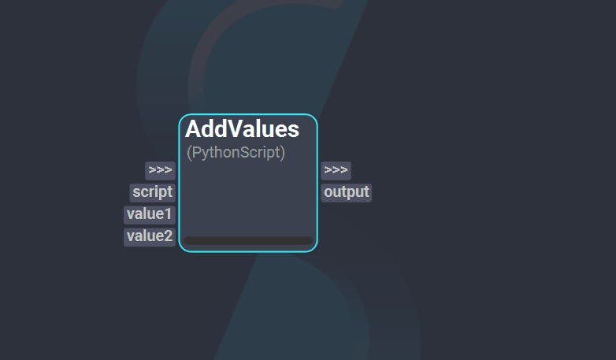
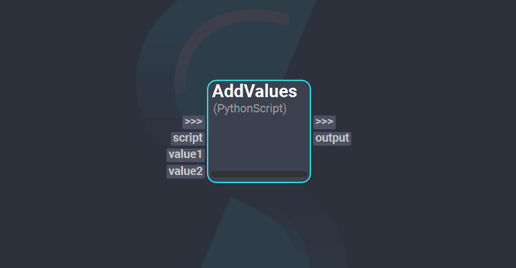
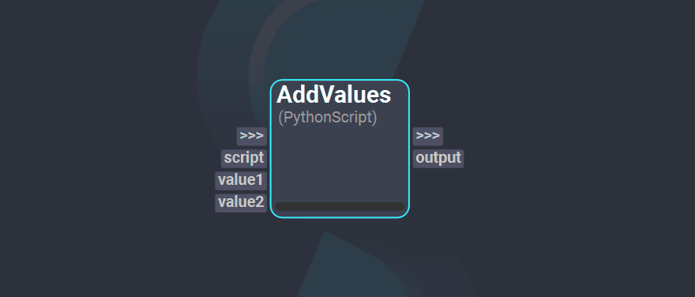

# Shift Nodes

Nodes are the graphic units that build up the workflow. Each node is associated to an [operator](../basics/terminology/#operator), which defines the execution logic of the node, and are connected to other nodes through [plugs](../basics/terminology/#plug).

## Node Interface

There are five main interface elements that compose the node: the node's name, the operator type, the trigger plugs, the i/o's plugs and the progress bar.

  

* **Node Name**: Defines the name of the node. On creation, the name of the node is the name of the operator with an enumerated suffix. The name of the node can be changed through the [*Inspector Widget*](../getting_started/basics/ui_overview#the-inspector).
* **Operator Type**: The associated operator to the node. It determines the native plugs of the node.
* **Trigger Plugs**: The trigger plugs (`>>>`) are plugs meant to define the node's position in the execution graph. They do not pass any data. If the node has other input or output plugs connected to another node, the trigger plugs do not need to be connected; otherwise, it is recommended to connect these plugs to indicate when the node needs to get computed.
* **I/O's Plugs**: Input and output plugs are define the incoming data required by the operator and the resulting data after it is computed. 
* **Progress bar**: A visual indicator of the percentage of the node's execution that is complete. 

### Inspect a Node

To read further information about a node, `Right-Click` on the node and `Click` on the *Help* option. This will prompt a dialog with the following information:

* The node's name.
* The operator type and the [Catalog](../reference/catalogs/#catalogs) it belongs to.
* The operator description.
* The input and output plugs with their corresponding plug types.

## Plugs

Plugs define the input and output data of the nodes. Data values can be set through the [*Inspector Widget*](../getting_started/basics/ui_overview#the-inspector) or by connecting plugs, which allows nodes to pass data from one to another. The kind of data compatible with a plug is defined by the plug type.

**Plug Types**

| Type | Description | Compatible Python Type |
| :--- | :---------- | :---|
| *Bool* | Defines a boolean value.|`Bool`|
| *Code* | Defines a python code block. This type is used whenever custom scripting is required in a node. A plug of this type displays as an embedded text editor in the inspector. |`String`|
| *Color* | Defines a color in RGBA. Interacting with a plug of this type opens a color picker dialog.|`List`|
| *Dict* | Defines a dictionary value.|`Dict`|
| *Dir* | Defines a directory path. Interacting with a plug of this type opens a directory browser dialog.|`String`|
| *Enumerator* | Defines a list of selectable values. It is not possible to create custom Enumerator plugs in a node.|`String`|
| *FileIn* | Defines an input file. This type is used for open and import operations. Interacting with a plug of this type opens a file browser dialog to select an existing file.|`String`|
| *FileOut* | Defines an output file. This type is used for save and export operations. Interacting with a plug of this type opens a file browser dialog, although it is possible to enter a not existing file. Selecting an existing file will override the file the after execution. |`String`|
| *Float* | Defines a float value.|`Float`|
| *Instance* | Defines an object instance. These plugs can be differentiated by their dotted outline.|`Any`|
| *Int* | Defines a integer value.|`Int`|
| *List* | Defines a list value.|`List`|
| *Object* | Defines a generic Python object.|`Any`|
| *String* | Defines a string value.|`String`|
| *Trigger* | Defines the node's position in the execution graph based on the connected nodes.|`-`|

### Inspect a Plug

To read further information about an existing plug in a node, `Right-Click` on the plug and `Click` on the *Show* option. This will prompt a dialog with the following information:

* The plug type.
* The plug value python type.
* The plug current value.
* The plug default value.

Alternatively, this information can also be accessed by doing `Right-Click` on the associated widget for the plug in the inspector widget and `Click` on the *Show* option. 

### Rename a Plug

In some nodes it is possible to set a nice name to a plug. Usually, when creating a plug, the unique code name of the plug corresponds to the plug's nice name. To change the nice name, `Right-Click` on the node's plug and `Click` on the *Rename Plug* option if available. This will prompt a text box where a new name can be set.

### Reorder Plugs

All plugs, except for trigger plugs, can be reordered within a node. To reorder plugs, `Right-Click` on the node and `Click` on the *Reorder Plugs* option. This will prompt a dialog with two lists, one for input plugs and another for output plugs. `Drag and drop` the plugs around their corresponding list until they are in the desired order. Finally, `Click` on *Apply* or *Accept* to set the new plug order in the node.

