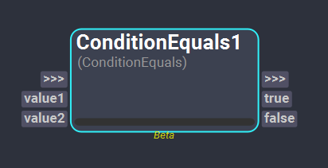
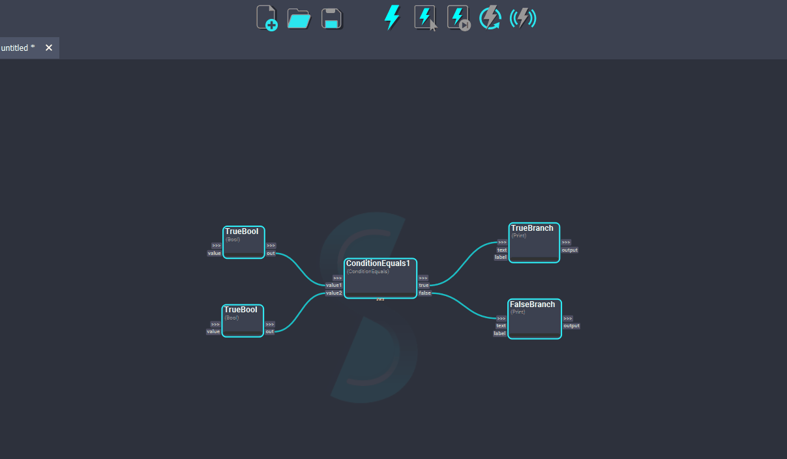

# Conditional Nodes

## ConditionEquals Node
>[!NOTE]
> This node is currently a *Beta* operator. Beta operators are supposed to be used for testing purposes only and their behavior may change in the future.

The *ConditionalEquals* node allows to compare if two values are equal. Depending on the result of the comparison, the execution of the workflow will continue through one graph branch or another. 

<figure style="width:80%;" markdown>
    
    <figcaption><b>Figure 1</b>: ConditionEquals Node UI.</figcaption>
</figure>

### Inputs
- **value1**: This plug of type Object is used as one of the values to compare.
- **value2**: This plug of type Object is used as one of the values to compare.

### Outputs
- **true**: This plug of type [Bool](../nodes#plugs) indicates if the compared values are equal. If that is the case (the value of this plug is `True`), the nodes connected to this plug will be executed.
- **false**: This plug of type [Bool](../nodes#plugs) indicates if the compared values are not equal. If that is the case (the value of this plug is `True`), the nodes connected to this plug will be executed.

In this example, we are comparing two `True` boolean values. The result of the ConditionalEquals evaluation is **true**, therefore, the branch connected to the *true* plug will be evaluated.
<figure style="width:80%;" markdown>
    
    <figcaption><b>Figure 2</b>: ConditionEquals execution for a true evaluation.</figcaption>
</figure

<!-- ### Examples
TODO: #62
This section is reserved to an example video of how to use the Conditional nodes.

 -->