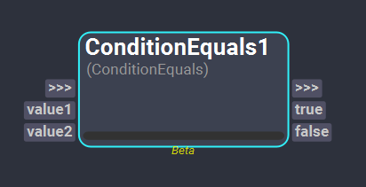

# Conditional Nodes

## ConditionEquals Node
>[!NOTE]
> This node is currently a *Beta* operator. Beta operators are supposed to be used for testing purposes only and their behavior may change in the future.

The *ConditionalEquals* node allows to compare if two values are equal. Depending on the result of the comparison, the execution of the workflow will continue through one graph branch or another. 

  

### Inputs
- **value1**: This plug of type Object is used as one of the values to compare.
- **value2**: This plug of type Object is used as one of the values to compare.

### Outputs
- **true**: This plug of type [Bool](../nodes/#plugs) indicates if the compared values are equal. If that is the case (the value of this plug is `True`), the nodes connected to this plug will be executed.
- **false**: This plug of type [Bool](../nodes/#plugs) indicates if the compared values are not equal. If that is the case (the value of this plug is `True`), the nodes connected to this plug will be executed.

<!-- ### Examples

This section is reserved to an example video of how to use the Python Script node.

 -->