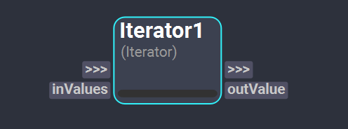
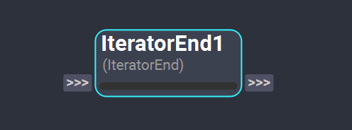
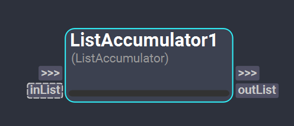

# Iteration Nodes

Iteration Nodes are used to create and define loops within a workflow. 

## Iterator Node
The *Iterator* node is used to create a loop in a workflow. This node generates multiple execution subgraphs with the nodes following the *Iterator* node. Each execution of the loop uses one value from the input iterable object as if it was effectively iterating over its elements.

 

>[!NOTE]
> *Iterator* Nodes can be nested, meaning that another *Iterator* node can be placed inside the loop of an *Iterator* node to achieve multiple levels of iteration.

### Inputs

- **inValues** : This plug of type [Object](../nodes/#plugs) expects an iterable Python object, such as lists, dictionaries, sets or tuples. The number of elements of the iterable object will determine the number of loops the *Iterator* node will execute.

### Outputs
- **outValue**: This plug of type [Object](../nodes/#plugs) will output one value of the input iterable object corresponding to the current iteration. This means that the output of this plug will change dynamically for each loop the iteration Node executes. 

## IteratorEnd Node
The *IteratorEnd* node is used to define the end of a loop started by an *Iterator* node. This means that all nodes between an *Iterator* and a *IteratorEnd* will be part of the execution loop. It is recommended to always have an *IteratorEnd* node per *Iterator* node in a workflow.

  

>[!NOTE]
> It is advised to connect to the *IteratorEnd* node the output generated in the loop via a custom `through` plug. The output plugs of the *IteratorEnd* node will contain the the values of the last iteration. 

## ListAccumulator Node
The *ListAccumulator* node allows to accumulate the result of each iteration of the loop. The elements to be appended to the list are defined by custom input plugs added to the node.

  

### Inputs

- **inList**: This plug of type [Instance](../nodes/#plugs) expects the list where the values will be accumulated into.

Custom plugs should be added to the *ListAccumulator* plug to define which elements should be accumulated in the list. There is no limit of custom input plugs that can be added. The elements will be appended in the same order they were created in the node. 

### Outputs

- **outList**: This plug of type [List](../nodes/#plugs) will output a copy of the list with the new appended values.

<!-- ### Examples

This section is reserved to an example video of how to use the Iterators nodes.

 -->