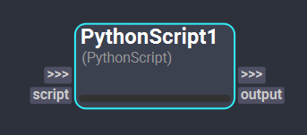
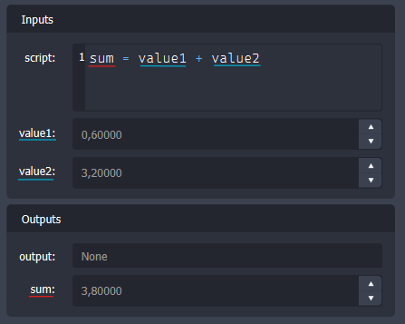

# Python Script Node

The *PythonScript* node offers the possibility to write custom Python code to develop new and specific execution behaviors. This feature is useful for prototyping workflows or processing specialized tasks not covered by other Shift nodes.

External Python libraries can be imported to enhance the capabilities of the *PythonScript* node, as long as the environment used to launch Shift supports those libraries. To do this, simply import the modules or packages within the *PythonScript* node and use them as you would in any Python code.

<figure style="width:80%;" markdown>
    
    <figcaption><b>Figure 1</b>: PythonScript Node UI.</figcaption>
</figure>

### Inputs

- **Script**: This plug of type [Code](../nodes#plugs) defines the logic of the *PythonScript* node. On the [Inspector](../../getting_started/basics/ui_overview#the-inspector), this plug provides a script editor for Python to write the block of code to be executed.

The *PythonScript* node allows for any type of custom plugs too. Custom input plugs can receive data from other nodes that can be imported into the code by just using the plug name as a variable.

### Outputs

- **Output**: This plug of type [Object](../nodes#plugs) outputs the result of the logic executed by the *PythonScript*.  Assign the value to output to a variable named `output` (the plug's name).

If outputting several values is needed, new output plugs of any type, including Instance plugs, can be added to the node. All custom outputs can be used the same way as the default output plug to return any data from the Python script execution.

<figure style="width:80%;" markdown>
    
    <figcaption><b>Figure 2</b>: Custom plugs in a Python script nodes. The blue underline indicates input plugs, and the red, output plugs. </figcaption>
</figure>

>[!NOTE]
> Plugs in *PythonScript* nodes cannot be renamed, as it is important to keep the plug's name unique and consistent for the node's correct function. 

<!-- ### Examples
TODO: #62
This section is reserved to an example video of how to use the Python Script node.

 -->
