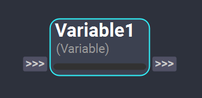

# Variable Node

The *Variable* node provides a way to save and reuse data throughout the workflow. Plugs set in a *Variable* node will be treated as global variables of the workflow, allowing their values to be accessed at any point in the graph. This node is helpful when multiple nodes across large workflows need to share data or a variable needs to be updated for each step of an iteration loop.

<figure style="width:80%;" markdown>
    
</figure> 

### Inputs

When an input plug is added in a *Variable* node, Shift will create an internal workflow global variable with the name of the plug. When the *Variable* node gets executed, the global variable will be updated with the value set in the input plug of the node. 

### Outputs

Output plugs in the *Variable* node are used to retrieve the data from the global variables with a **matching plug name**. When the *Variable* node gets executed, the global variable value will be set as the value of the output plug.

>[!NOTE]
> Plugs in *Variable* nodes cannot be renamed, as it is important to keep the plug's name unique and consistent for the node's correct function. 

<!-- ### Examples

This section is reserved to an example video of how to use the Variable node.

 -->