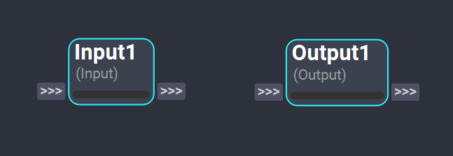
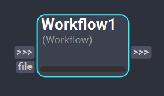
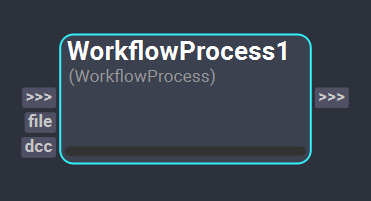

# Workflow Nodes
The following nodes are used to define the inputs and outputs of a workflow and nest it within another workflow.

## Input & Output Nodes
*Input* and *Output* nodes are used to define the required inputs and outputs of a workflow to be executed externally. Setting these nodes is essential to be able to nest workflows or executing the workflow in [batch mode](../../getting_started/basics/batch.md). The custom plugs from these nodes, which should be of type `through`, will act as data pathways, linking information set externally in the workflow to the current workflow and viceversa. 

<figure markdown>
    
</figure>

## Workflow Node
The *Workflow* node executes an external workflow. This node allows to nest workflows embedding the execution logic of entire Shift workflows in one single node. The node updates its plugs dynamically depending on the sourced workflow file to enable access to the referenced workflow input and output data.

<figure markdown>
    
</figure>

### Inputs

- **File**: This plug of type [FileIn](../nodes/#plugs) is used to reference the workflow file (*.sft* extension) that will be executed by the node. When the `file` plug content is set, the node will automatically update by creating the input and output plugs corresponding to the sourced workflow inputs and outputs.

## WorkflowProcess Node

The *WorkflowProcess* node works similarly to the *Workflow* node, however, the execution of the referenced workflow will be handled by an external process. By default, the workflow will be executed in a new instance of Shift's Python interpreter, however, the node also allows to source and choose a different one. 

<figure markdown>
    
</figure>

The available Python interpreters will depend on the environment configuration. To allow the *WorkflowProcess* to find new Python interpreters, a new environment variable must be set with the following format `SHIFT_PROCESS_<NAME OF THE INTERPRETER>`. The value of this variable must be the path to the desired Python interpreter.

>[!EXAMPLE]
> In Windows, to add Maya's Python interpreter as an option for the *WorkflowProcess* the following should be added to the environment variables:
> 
> **SHIFT_PROCESS_MAYA** : "<MAYA INSTALLATION FOLDER>/bin/mayapy.exe"'

### Inputs
- **File**: This plug of type [FileIn](../nodes/#plugs) is used to reference the workflow file (*.sft* extension) that will be executed by the node. When the `file` plug content is set, the node will automatically update by creating the input and output plugs corresponding to the sourced workflow inputs and outputs.
- **DCC**: This plug of type [Enum](../nodes/#plugs) determines the Python interpreter to be used for the execution of the referenced workflow.

>[!NOTE]
> It is possible to define a "Workflow Workspace" by setting the path to a directory in the `SHIFT_PATH_WORKFLOWS` environment variable. All workflows placed in the folders specified in the environment variable will use a relative filepaths when referenced in a *Workflow* or *WorkflowProcess* node. 

<!-- ### Examples

This section is reserved to an example video of how to use the Workflow nodes.

 -->