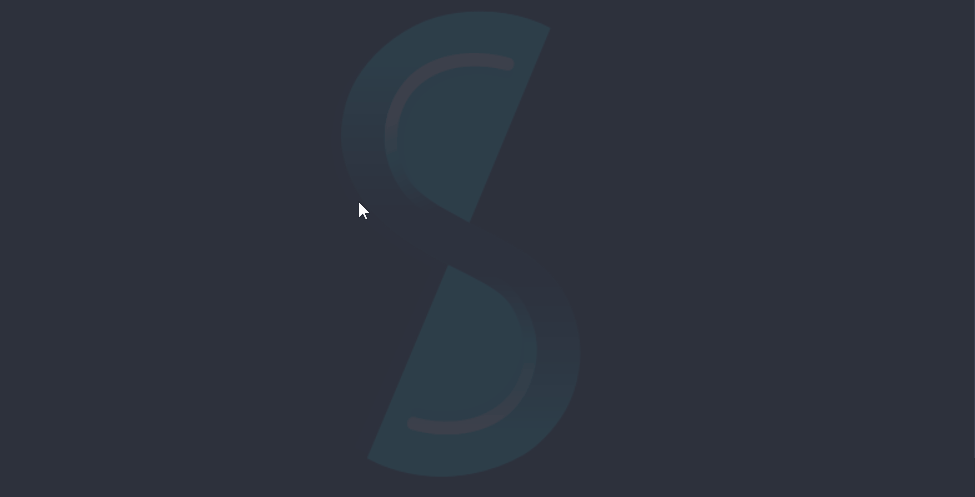
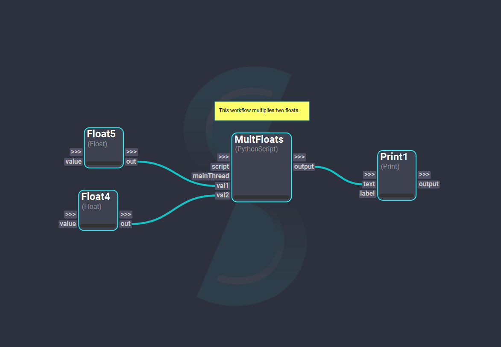
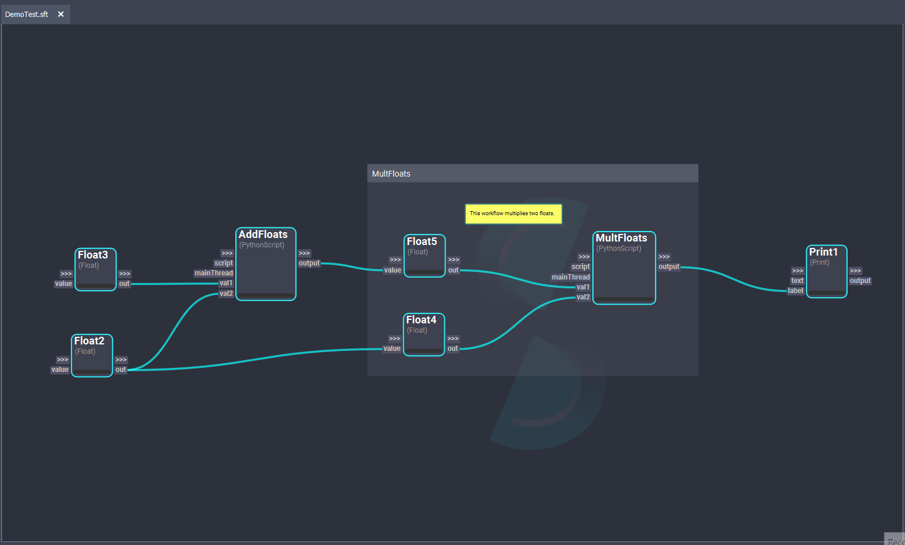

# Notes

Shift allows to add notes to the board. To add one, simply press `N` while the mouse is on the board. This will create a yellow text box where a note can be written.

Notes can be dragged around the board and edited by double-clicking on the text box. To resize the note, simply drag the note's corners. 
Additionally, the note color can be changed by right-clicking on the note, as well as the font color. This will open a color dialog where the user can select a new color.

<figure>
      
      <figcaption><b>Figure 1</b>: A note being added to the Shift board.</figcaption>
</figure>

# Groups

Shift groups are graphic objects that help organize other items throughout the board. With Shift groups, all nodes, notes, and other groups within its area can be boxed, labeled and moved together.
To create a node, simply do `Ctrl + G`. If there are items selected in the board, the group will be created enclosing those elements. 

<figure>
      
      <figcaption><b>Figure 2</b>: A group being added to the Shift board.</figcaption>
</figure>

Groups can be dragged around the board and selected by clicking on the interactive (non-transparent) area of the group. To resize the group, simply drag its corners. The name of the group can be changed by double-clicking on it.
Additionally, all items of the group can be selected by clicking on the "*Select All*" option in the group's context menu (`Right-Click`).

### Create Subworkflows

The "*Create Subworkflow*" option of the context menu allows to convert a group into a new workflow. When used, it automatically copies the group content into another board and generates the necessary connections, inputs, and outputs. Then it replaces the original group with a [`Workflow`](../../reference/nodes/workflow) node that links to the newly created workflow. This encapsulates the group's content in a new subworkflow, allowing to simplify complex workflows and better organize the Shift board. 

The name of the new workflow will be the group's name. 
The default location of the new workflow will be the same one as the location of the workflow the original group is. Before generating the workflow, this location can be changed if needed. If the workflow were the group is has not been ever saved, a location must be defined before create a subworkflow. 

<figure>
      
      <figcaption><b>Figure 3</b>: A workflow created out of a group. A new board is created and a Workflow node replaces the group.</figcaption>
</figure>