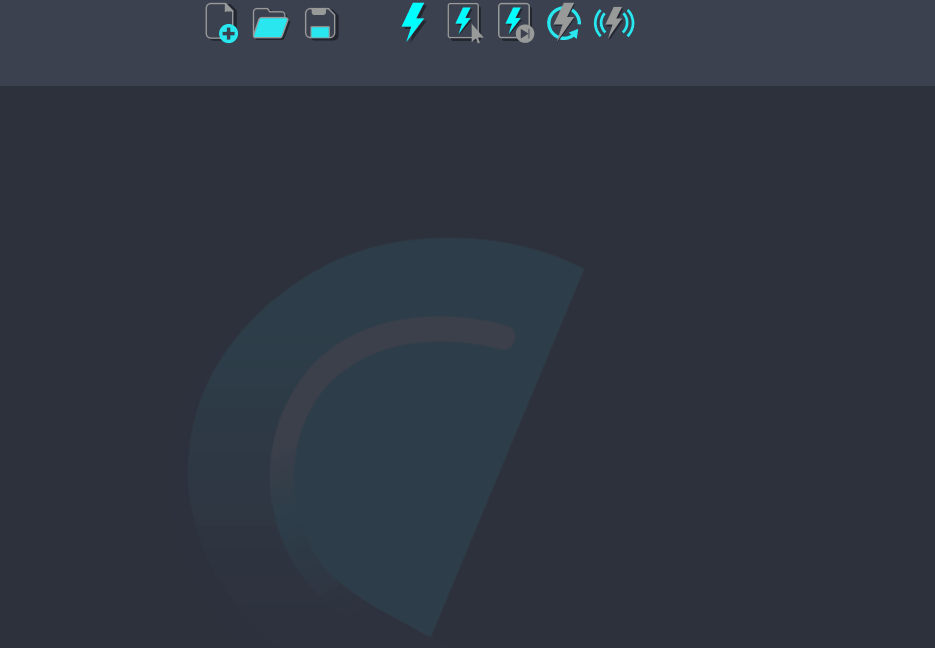

# Notes

Shift allows to add notes to the board. To add one, simply press `N` while the mouse is on the board. This will create a yellow text box where a note can be written.

Notes can be dragged around the board and edited by double-clicking on the text box. To resize the note, simply drag the note's corners. 
Additionally, the note color can be changed by right-clicking on the note, as well as the font color. This will open a color dialog where the user can select a new color.

<figure>
      
      <figcaption><b>Figure 1</b>: A note being added to the Shift board.</figcaption>
</figure>