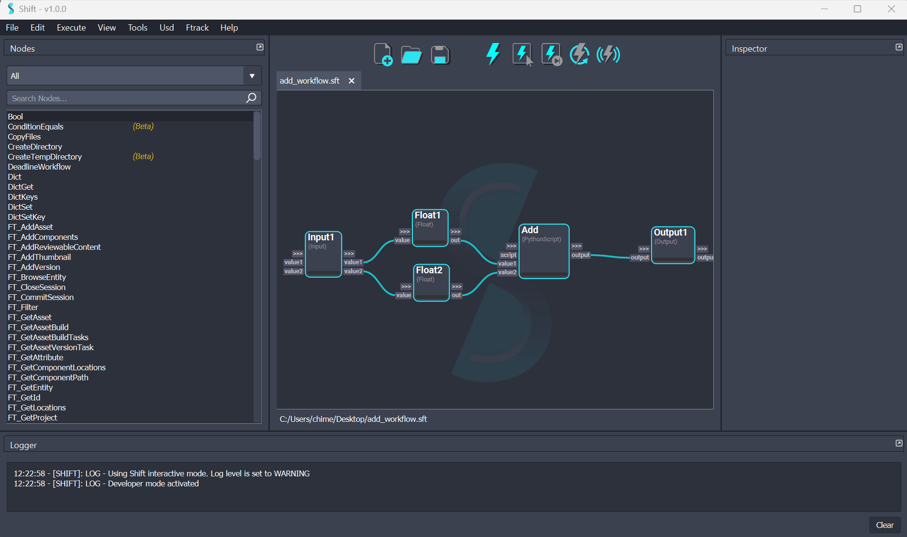
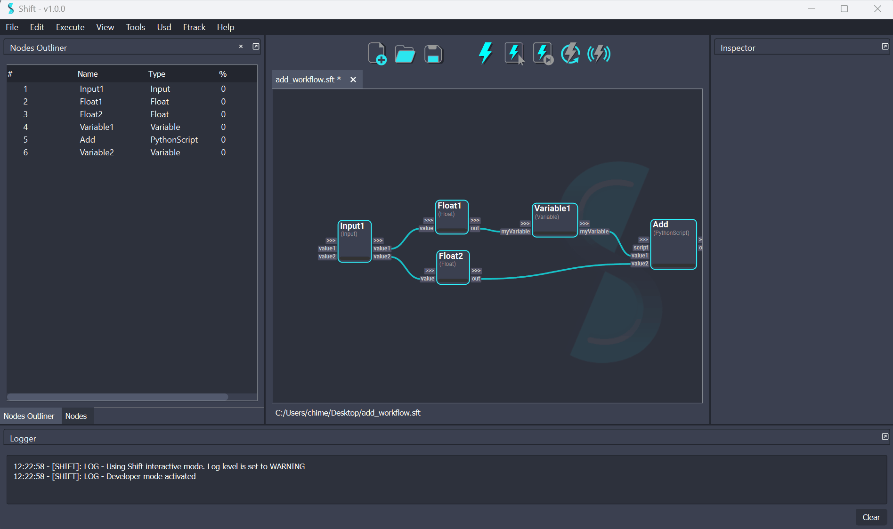

# Plugins

Shift supports the integration of custom plugins. Shift Plugins are Qt-based UIs that can interact with Shift to display additional information, perform actions or modify the behaviour of the application. Shift Plugins are located in dedicated entries in the top menu bar of the UI. The desired plugin can be opened by clicking on the corresponding entry. Once a plugin is opened, the Shift UI can be customized with the best suited layout.

## Shift Native Plugins

Shift ships with two plugins which can be found in the *Tools* section in the top menu bar.

### The Nodes Outliner

The *Nodes Outliner* helps the user to visualise the list of operators in the workflow and shows their current progress. This plugin also lists the nodes in order of execution. This might vary in case *Iterator* or *ConditionEquals* nodes are used as they affect the execution stack order.

<figure>
      
      <figcaption><b>Figure 1</b>: Nodes Outliner Plugin</figcaption>
</figure>

### The Variables Browser

The *Variables Browser* allows users to parse the workflow variables currently set and check their content. This is especially helpful in large workflows where it is easy to lose track of which nodes were previously executed. This plugin also allows to delete specific workflow variables set while working on a workflow. To do that `Right-click` on the variable entry to delete and select the *Delete* option. For more info on workflow variables please check out the section about [Variable Nodes](nodes/variable).

<figure>
      
      <figcaption><b>Figure 2</b>: Variables Browser Plugin</figcaption>

</figure>

### The Image Viewer

The *Image Viewer* allows users to visualize image data within Shift. When opened, the plugin will look for image data in the output plugs of the selected nodes that follow a special naming convention:

- A plug whose name starts with `images`: Will expect a Python list containing a sequence of images and display them with a slider for parsing the frames.
- A plug whose name starts with `image`: Will expect a single image object and display it.

The zoom can be changed using the mouse wheel. The plugin also allows for panning the image using the `Left-Click and Drag` or `Middle-Click and Drag` mouse actions.

<figure>
      
      <figcaption><b>Figure 3</b>: Image Viewer Plugin</figcaption>

</figure>

As shown in *Figure 3* above, the plugin will display the pixel coordinates and RGB values of the hovered pixel in a Tool Tip message.

> [!NOTE]
> The plugin uses the `numpy` Python library to process the image data, so any Python object that can be converted to a numpy array should display correctly (e.g. pillow objects).
