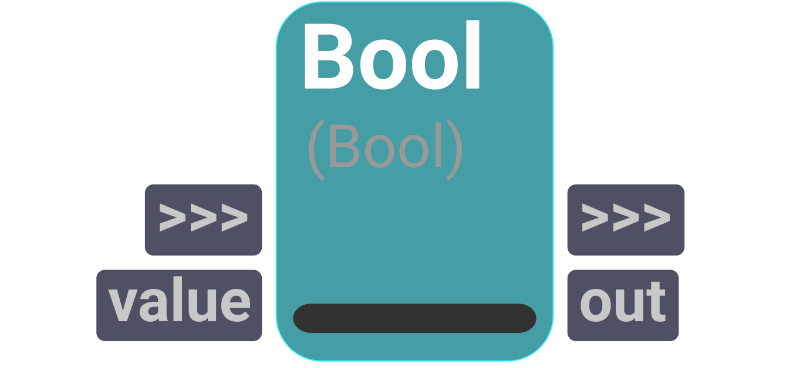
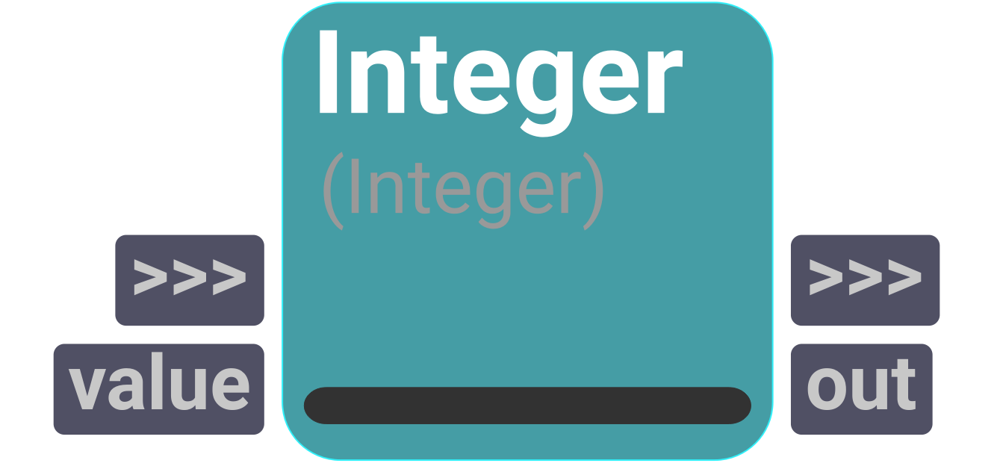
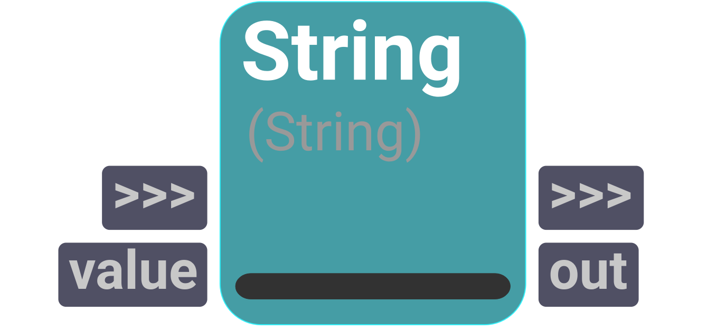

# constants
A catalog to work with standard Python type objects.

## Bool

<figure style="width: 30%">
	
	<figcaption>Node UI</figcaption>
</figure>

Operator used to define a boolean value.

    

#### Inputs
| Name | Type | Default
| --- | --- | --- |
| value | Bool | False

#### Outputs
| Name | Type | Default |
| --- | --- | --- |
| out | Bool | False

## Float

<figure style="width: 30%">
	
	<figcaption>Node UI</figcaption>
</figure>

Operator used to define a floating point number value.

    

#### Inputs
| Name | Type | Default
| --- | --- | --- |
| value | Float | 0.0

#### Outputs
| Name | Type | Default |
| --- | --- | --- |
| out | Float | 0.0

## Integer

<figure style="width: 30%">
	
	<figcaption>Node UI</figcaption>
</figure>

Operator used to define an integer number value.

    

#### Inputs
| Name | Type | Default
| --- | --- | --- |
| value | Int | 0

#### Outputs
| Name | Type | Default |
| --- | --- | --- |
| out | Int | 0

## String

<figure style="width: 30%">
	
	<figcaption>Node UI</figcaption>
</figure>

Operator used to define a string value.

    

#### Inputs
| Name | Type | Default
| --- | --- | --- |
| value | String | ""

#### Outputs
| Name | Type | Default |
| --- | --- | --- |
| out | String | ""

