# creativeSoftware
A catalog to work with Digital Content Creation software. It includes operators for scene management, geometry handling, node graph manipulation and more, across popular DCC tools like Maya, Houdini, Blender, and Nuke.

---
## AlembicExport

<figure style="width: 30%">
	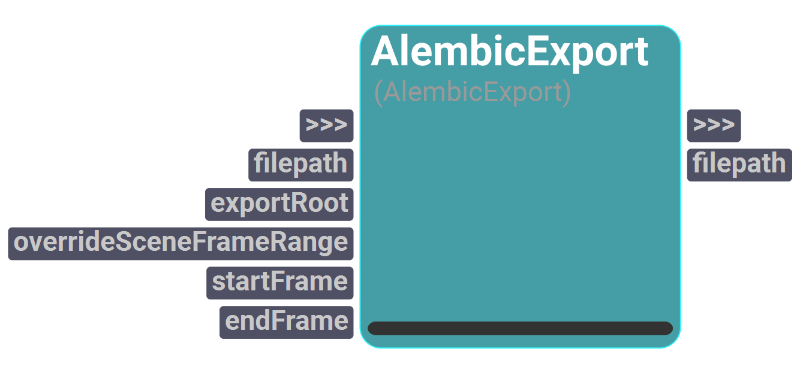
	<figcaption></figcaption>
</figure>

Exports data from the DCC scene to an Alembic file.
The node allows to define a start and end frame for animated geometries and transforms.
Outputs the filepath of the exported Alembic file.

Works for Maya and Houdini.

#### Inputs
| Name | Type | Default
| --- | --- | --- |
| filepath | FileOut | 
| exportRoot | String | ""
| overrideSceneFrameRange | Bool | False
| startFrame | Float | 0.0
| endFrame | Float | 0.0

#### Outputs
| Name | Type | Default |
| --- | --- | --- |
| filepath | String | ""

---
## AlembicImport

<figure style="width: 30%">
	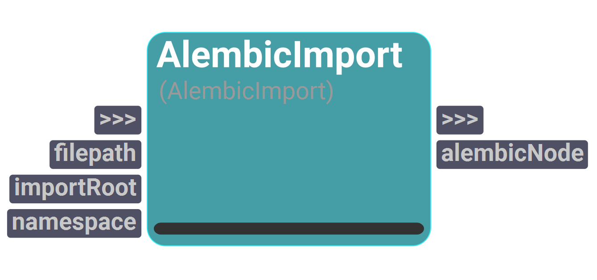
	<figcaption></figcaption>
</figure>

Imports an Alembic file from a filepath into the DCC.
The importRoot takes as input the name of a node that exists in the imported alembic data and
will merge it into a pre-existing node in the scene with the same name.

In Maya, the namespace plug will create the object under the specified namespace with non-clashing behaviour.

Outputs the path to the alembic node loaded.

Works for Maya and Houdini.

#### Inputs
| Name | Type | Default
| --- | --- | --- |
| filepath | FileIn | 
| importRoot | String | ""
| namespace | String | ""

#### Outputs
| Name | Type | Default |
| --- | --- | --- |
| alembicNode | String | ""

---
## ArnoldRender

<figure style="width: 30%">
	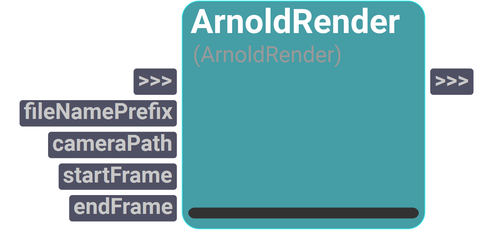
	<figcaption></figcaption>
</figure>

Performs an Arnold render in the DCC.

Works for Maya.

#### Inputs
| Name | Type | Default
| --- | --- | --- |
| fileNamePrefix | FileOut | 
| cameraPath | String | ""
| startFrame | Float | 1.0
| endFrame | Float | 120.0

---
## AttributeGet

<figure style="width: 30%">
	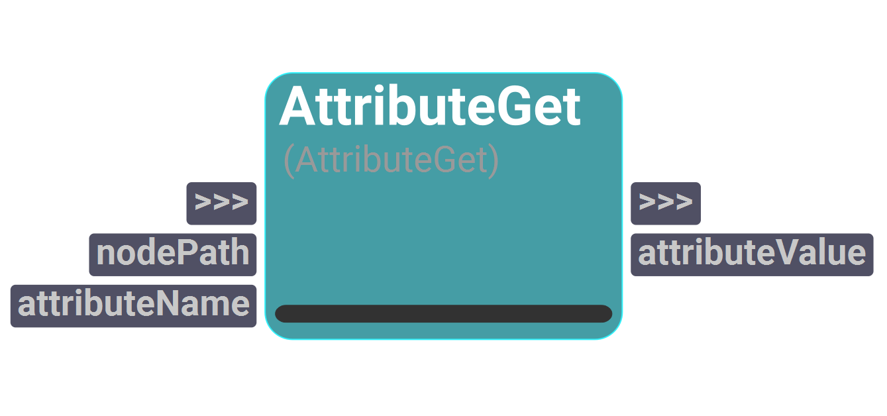
	<figcaption></figcaption>
</figure>

Gets a value from a node attribute.

Works for Maya, Houdini & Nuke.

#### Inputs
| Name | Type | Default
| --- | --- | --- |
| nodePath | String | ""
| attributeName | String | ""

#### Outputs
| Name | Type | Default |
| --- | --- | --- |
| attributeValue | Object | None

---
## AttributeSet

<figure style="width: 30%">
	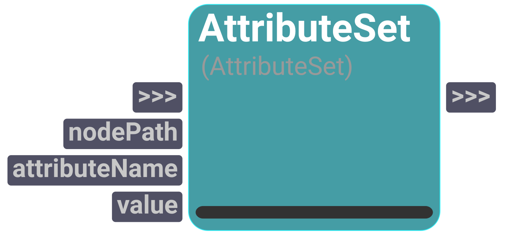
	<figcaption></figcaption>
</figure>

Sets a new value for a node attribute in the DCC.

Works for Maya, Houdini and Nuke.

#### Inputs
| Name | Type | Default
| --- | --- | --- |
| nodePath | String | ""
| attributeName | String | ""
| value | Object | None

---
## FBXAnimationImport

<figure style="width: 30%">
	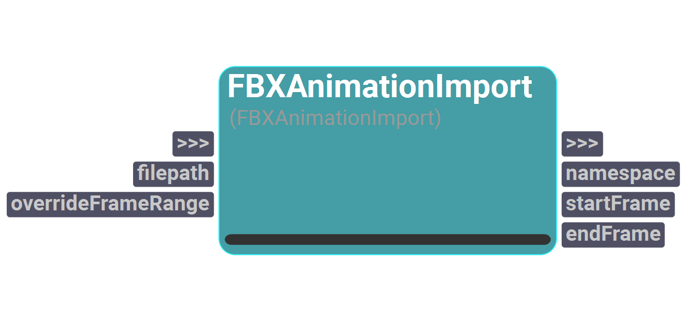
	<figcaption></figcaption>
</figure>

Imports the animation from the provided FBX file into the scene.
Returns the namespace of the animation, the start frame, and the end frame.

#### Inputs
| Name | Type | Default
| --- | --- | --- |
| filepath | FileIn | 
| overrideFrameRange | Bool | False

#### Outputs
| Name | Type | Default |
| --- | --- | --- |
| namespace | String | ""
| startFrame | Int | 0
| endFrame | Int | 0

---
## FBXExport

<figure style="width: 30%">
	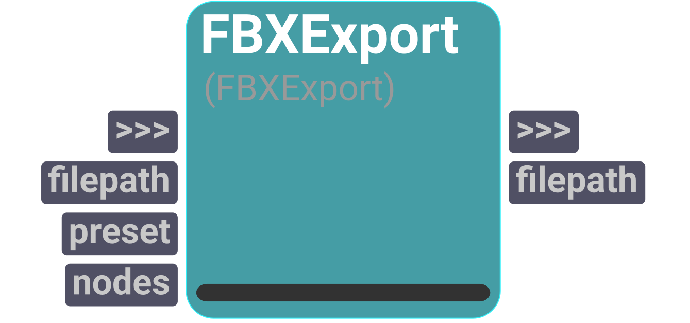
	<figcaption></figcaption>
</figure>

Exports the given nodes to an FBX file at the given path.
If the node list is empty all objects in the scene will be exported.
The preset file is optional.

Works for Maya.

#### Inputs
| Name | Type | Default
| --- | --- | --- |
| filepath | FileOut | 
| preset | FileIn | 
| nodes | List | []

#### Outputs
| Name | Type | Default |
| --- | --- | --- |
| filepath | String | ""

---
## FBXImport

<figure style="width: 30%">
	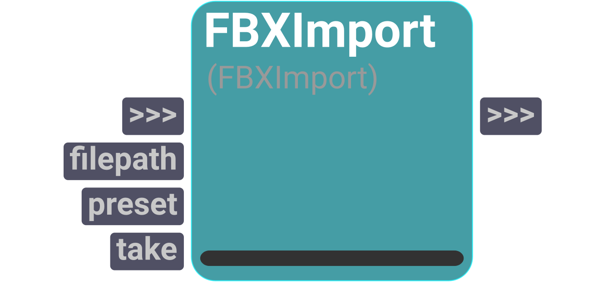
	<figcaption></figcaption>
</figure>

Imports the objects from the provided FBX file into the scene.
Optionally one can provide a preset file containing import settings.
Optionally one can provide a take number, and the corresponding animation will be imported.

Works for Maya.

#### Inputs
| Name | Type | Default
| --- | --- | --- |
| filepath | FileIn | 
| preset | FileIn | 
| take | Int | 0

---
## FileImport

<figure style="width: 30%">
	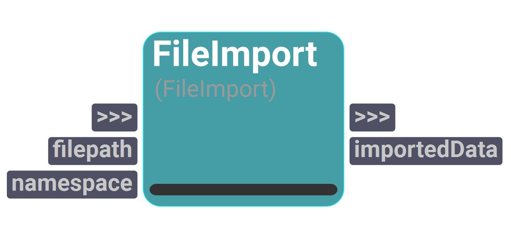
	<figcaption></figcaption>
</figure>

Imports a file from a filepath into the current scene.

Works for Maya.

#### Inputs
| Name | Type | Default
| --- | --- | --- |
| filepath | FileIn | 
| namespace | String | ""

#### Outputs
| Name | Type | Default |
| --- | --- | --- |
| importedData | List | []

---
## FitToView

<figure style="width: 30%">
	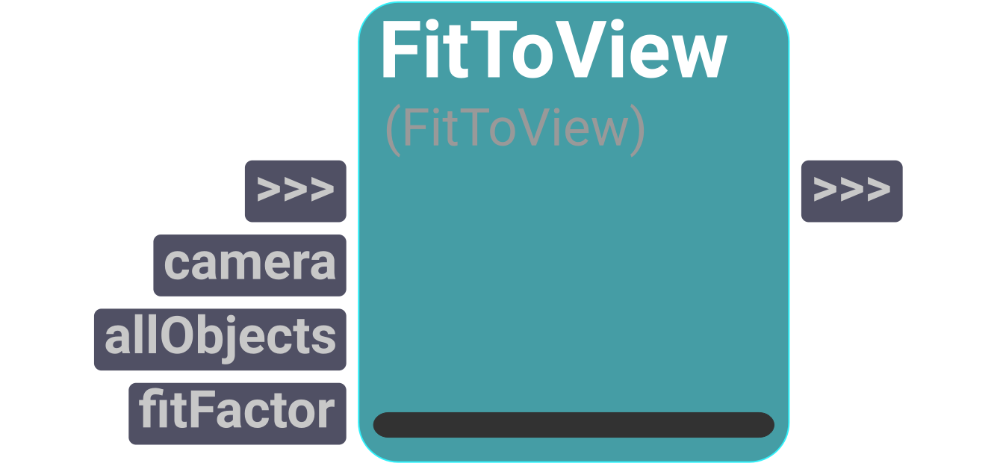
	<figcaption></figcaption>
</figure>

Fits the provided camera to frame items in the scene. 
If allObjects option is True it will fit all objects in the scene regardless of the active selection. Otherwise, it fits only selected objects.
Optionally a camera can be provided, if no camera is provided it uses the active view.
Optionally a fitFactor can be provided, by default its value is 0.0.

Works for Maya.

#### Inputs
| Name | Type | Default
| --- | --- | --- |
| camera | String | ""
| allObjects | Bool | True
| fitFactor | Float | 0.0

---
## NodeConnect

<figure style="width: 30%">
	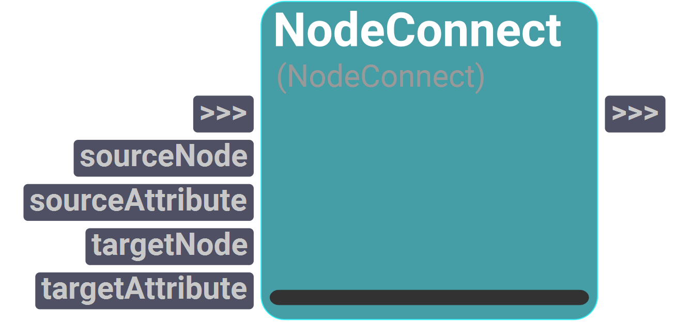
	<figcaption></figcaption>
</figure>

Connects two nodes (source and target), defining the attributes or properties to be connected.
In Nuke the source Node corresponds to the output node, and the target Node to the Node with the inputs.
In Nuke the sourceAttribute is not required, just the targetAttribute with the input number.

Works for Maya, Houdini, and Nuke.

#### Inputs
| Name | Type | Default
| --- | --- | --- |
| sourceNode | String | ""
| sourceAttribute | String | ""
| targetNode | String | ""
| targetAttribute | String | ""

---
## NodeCreate

<figure style="width: 30%">
	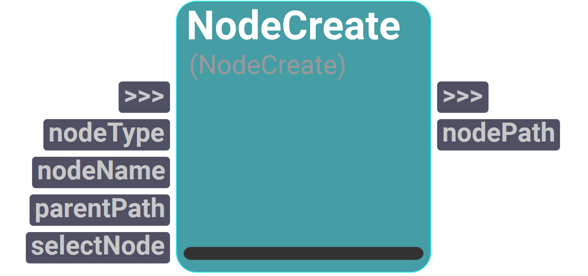
	<figcaption></figcaption>
</figure>

Creates a new node in the DCC with the provided type, name, and parent.

If selectNode option is True, the newly created node will be selected.
In Nuke you can use the nodeParent to create the node inside a Group.
Returns the fullpath of the newly created node.

Works for Maya, Houdini & Nuke.

#### Inputs
| Name | Type | Default
| --- | --- | --- |
| nodeType | String | ""
| nodeName | String | ""
| parentPath | String | ""
| selectNode | Bool | False

#### Outputs
| Name | Type | Default |
| --- | --- | --- |
| nodePath | String | ""

---
## NodeRename

<figure style="width: 30%">
	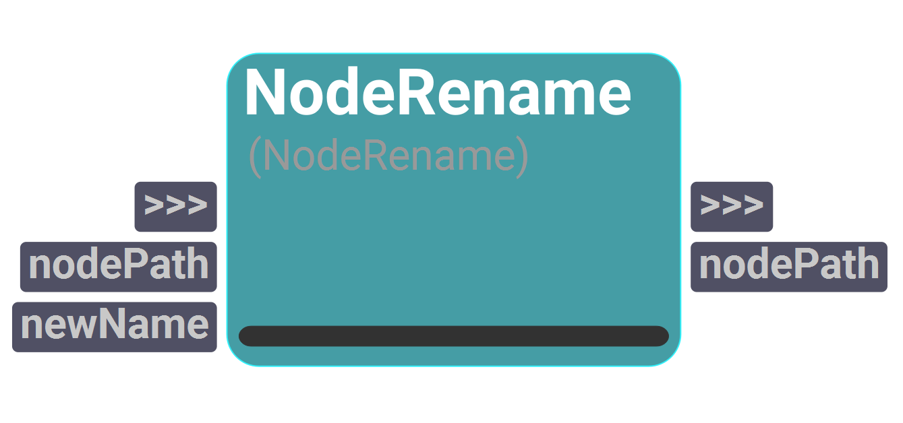
	<figcaption></figcaption>
</figure>

Renames a node in the DCC graph.
Outputs the new scenegraph path to the node.ç
In Houdini and Nuke any spaces are replaced by underscores to make sure the name is valid.

Works for Maya, Houdini, and Nuke.

#### Inputs
| Name | Type | Default
| --- | --- | --- |
| nodePath | String | ""
| newName | String | ""

#### Outputs
| Name | Type | Default |
| --- | --- | --- |
| nodePath | String | ""

---
## OBJImport

<figure style="width: 30%">
	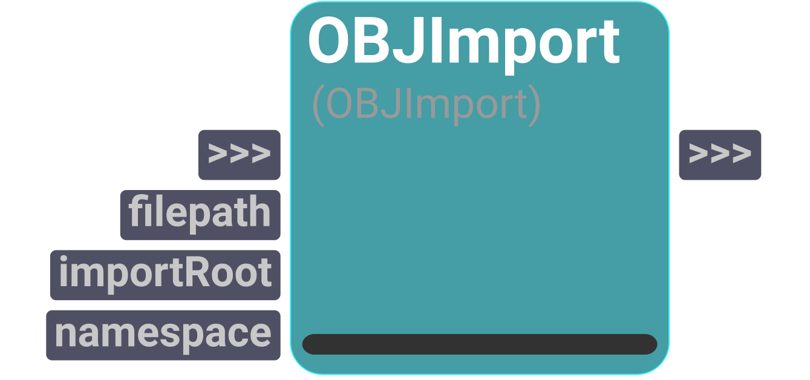
	<figcaption></figcaption>
</figure>

Imports geometric data from an OBJ file to the DCC.
The importRoot plug specifies the parent to which the new object will be appended.
The namespace plug will create the object under the specified namespace in Maya.

Works for Maya & Houdini.

#### Inputs
| Name | Type | Default
| --- | --- | --- |
| filepath | FileIn | 
| importRoot | String | ""
| namespace | String | ""

---
## ParentObjects

<figure style="width: 30%">
	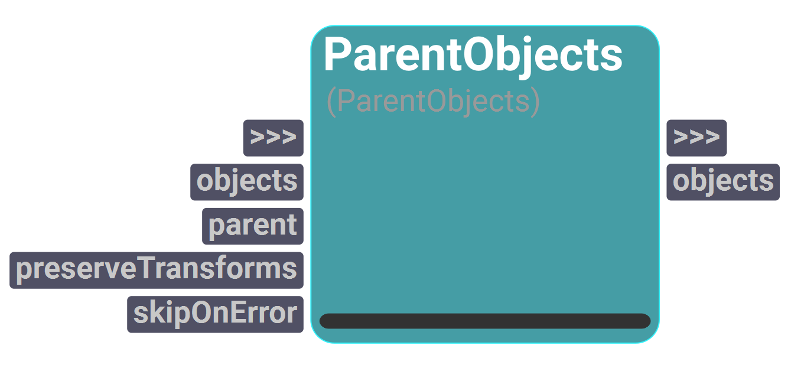
	<figcaption></figcaption>
</figure>

Parent the given list of objects to the object provided.
If preserveTransforms option is True, the object will preserve its existing transformations. If it is False the transformations will be relative to the parent node.
If skipOnError option is True the execution will continue to the next object in the list when an error occurs. If it is False it will stop and raise an error.

Works for Maya.

#### Inputs
| Name | Type | Default
| --- | --- | --- |
| objects | List | []
| parent | String | ""
| preserveTransforms | Bool | False
| skipOnError | Bool | False

#### Outputs
| Name | Type | Default |
| --- | --- | --- |
| objects | List | []

---
## ParentTransformGet

<figure style="width: 30%">
	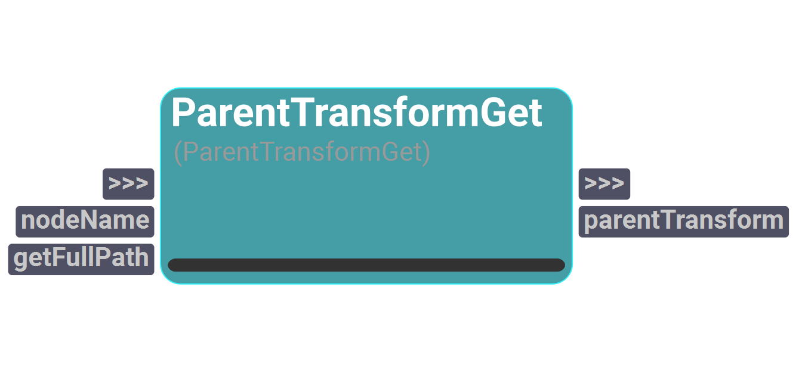
	<figcaption></figcaption>
</figure>

Gets the provided node's parent transform node. Returns the closest ancestor node that is a transform.

Works for Maya.

#### Inputs
| Name | Type | Default
| --- | --- | --- |
| nodeName | String | ""
| getFullPath | Bool | True

#### Outputs
| Name | Type | Default |
| --- | --- | --- |
| parentTransform | String | ""

---
## PluginLoad

<figure style="width: 30%">
	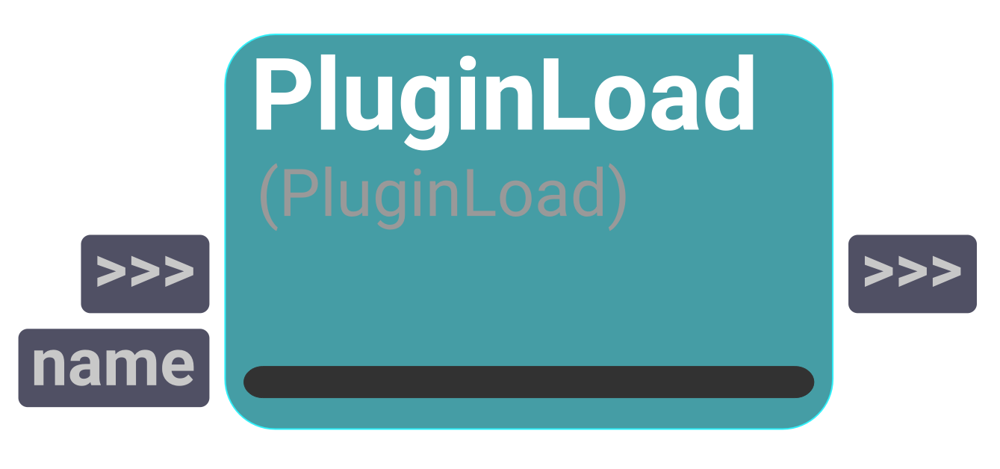
	<figcaption></figcaption>
</figure>

Loads the plugin with the given name.

Works for Maya.

#### Inputs
| Name | Type | Default
| --- | --- | --- |
| name | String | ""

---
## Read

<figure style="width: 30%">
	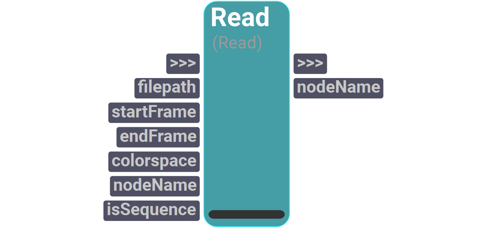
	<figcaption></figcaption>
</figure>

Reads a given file in a new Read node or a given one.
Sets the frame range with the given range. Automatically sets the format.
The colorspace plug is optional, to change the default value for colorspace in the Read if desired.
The nodeName parameter is optional: If it's empty, the default node name will be used. If it's provided and
the node already exists, the filepath will be loaded in the existing node. If it's provided but the node
does not exist, it will be created with that name.
The isSequence plug indicates if the filepath is an image sequence path.
To load a single image or a video, disable this plug.

Works for Nuke.

#### Inputs
| Name | Type | Default
| --- | --- | --- |
| filepath | FileIn | 
| startFrame | Int | 0
| endFrame | Int | 0
| colorspace | String | ""
| nodeName | String | ""
| isSequence | Bool | True

#### Outputs
| Name | Type | Default |
| --- | --- | --- |
| nodeName | String | ""

---
## ReferenceCreate

<figure style="width: 30%">
	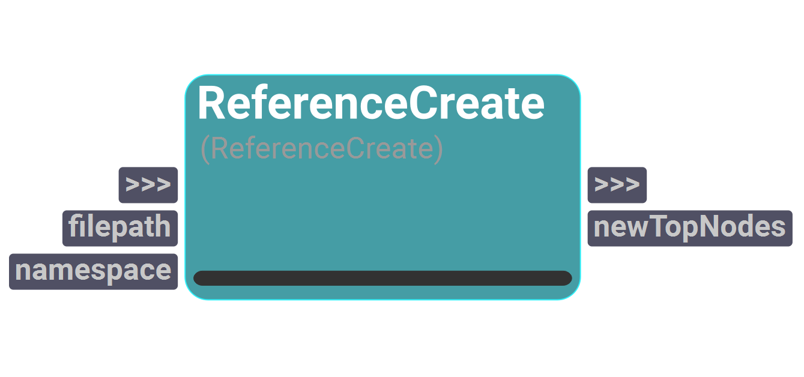
	<figcaption></figcaption>
</figure>

References a Maya-compatible file from a filepath into Maya.
Outputs the list of new top nodes in the scene.

Works for Maya.

#### Inputs
| Name | Type | Default
| --- | --- | --- |
| filepath | FileIn | 
| namespace | String | ""

#### Outputs
| Name | Type | Default |
| --- | --- | --- |
| newTopNodes | List | []

---
## RootTransformsGet

<figure style="width: 30%">
	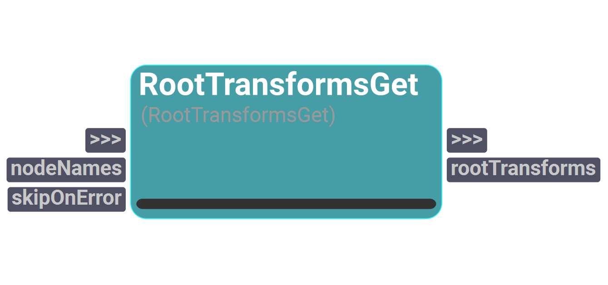
	<figcaption></figcaption>
</figure>

Gets the root transform nodes of the provided node list.
If skipOnError option is True, when an error occurs the execution will continue with the next node name in the list.

Works for Maya.

#### Inputs
| Name | Type | Default
| --- | --- | --- |
| nodeNames | List | []
| skipOnError | Bool | False

#### Outputs
| Name | Type | Default |
| --- | --- | --- |
| rootTransforms | List | []

---
## SceneFrameRangeGet

<figure style="width: 30%">
	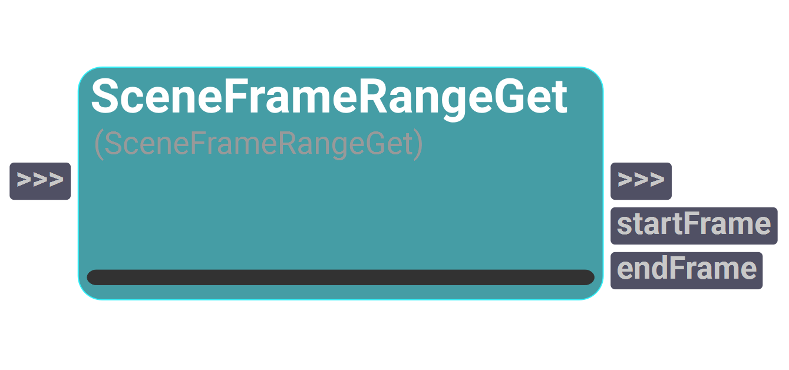
	<figcaption></figcaption>
</figure>

Returns the current open scene frame range values.

Works for Maya, Houdini & Nuke.

#### Outputs
| Name | Type | Default |
| --- | --- | --- |
| startFrame | Float | 0.0
| endFrame | Float | 0.0

---
## SceneFrameRangeSet

<figure style="width: 30%">
	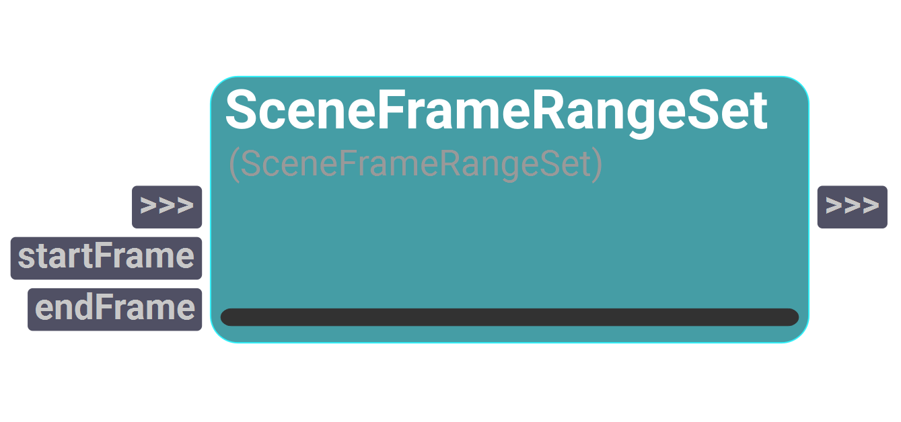
	<figcaption></figcaption>
</figure>

Sets the given frame range values in the currently open scene.

Works for Maya, Houdini & Nuke

#### Inputs
| Name | Type | Default
| --- | --- | --- |
| startFrame | Float | 0.0
| endFrame | Float | 0.0

---
## SceneNew

<figure style="width: 30%">
	
	<figcaption></figcaption>
</figure>

Creates a new scene in the DCC.

Works for Maya, Houdini, and Nuke.

---
## SceneOpen

<figure style="width: 30%">
	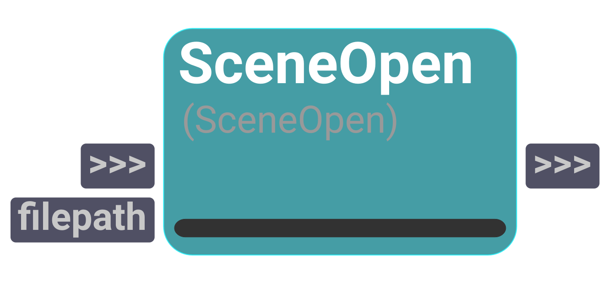
	<figcaption></figcaption>
</figure>

Opens a scene from a filepath.

Works for Maya, Houdini, Blender, and Nuke.

#### Inputs
| Name | Type | Default
| --- | --- | --- |
| filepath | FileIn | 

---
## SceneSave

<figure style="width: 30%">
	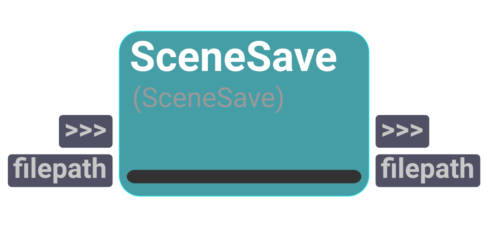
	<figcaption></figcaption>
</figure>

Saves the scene to a file.

Works for Maya, Houdini, Blender, and Nuke.

#### Inputs
| Name | Type | Default
| --- | --- | --- |
| filepath | FileOut | 

#### Outputs
| Name | Type | Default |
| --- | --- | --- |
| filepath | String | ""

---
## SelectionExport

<figure style="width: 30%">
	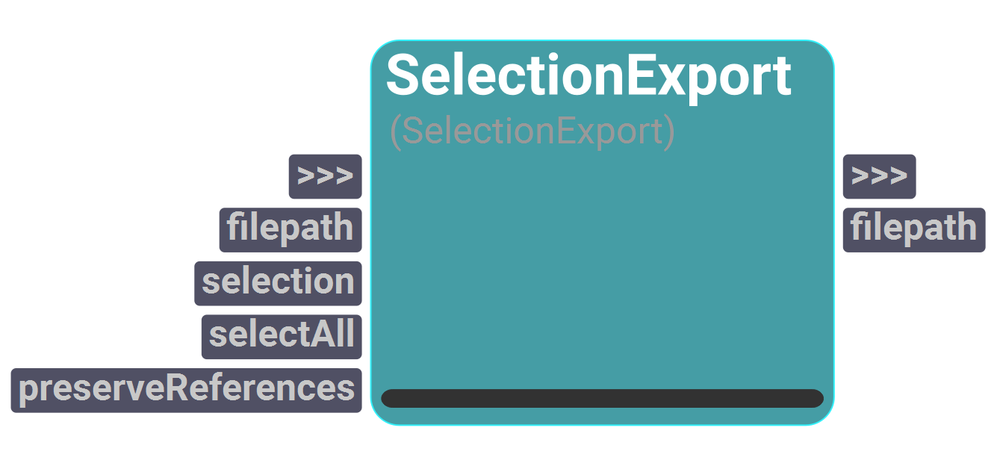
	<figcaption></figcaption>
</figure>

Exports the current selection to a file.
The selection plug allows to override the current selection in the DCC with the given list of objects to be exported.
If the selectAll is checked, it will export the whole scene (only for Maya).
If the preserveReferences is checked, it will keep the references (only for Maya).
The selection is always restored to the state previous to the execution.
Outputs the filepath of the exported file.

Works for Maya and Nuke.

#### Inputs
| Name | Type | Default
| --- | --- | --- |
| filepath | FileOut | 
| selection | List | []
| selectAll | Bool | False
| preserveReferences | Bool | False

#### Outputs
| Name | Type | Default |
| --- | --- | --- |
| filepath | String | ""

---
## SelectionGet

<figure style="width: 30%">
	
	<figcaption></figcaption>
</figure>

Retrieves the selected items in the DCC's scene.
Outputs a list of selected items.

Works for Maya.

#### Outputs
| Name | Type | Default |
| --- | --- | --- |
| selection | List | []

---
## SelectionSet

<figure style="width: 30%">
	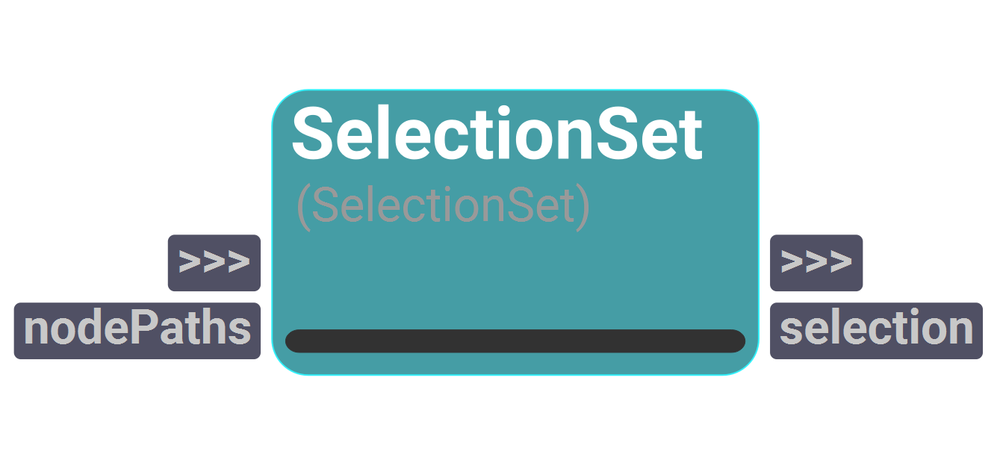
	<figcaption></figcaption>
</figure>

Sets the active selected items in the DCCs from a list of items' names.
Outputs the list of the current selected items.

Works for Maya and Nuke.

#### Inputs
| Name | Type | Default
| --- | --- | --- |
| nodePaths | List | []

#### Outputs
| Name | Type | Default |
| --- | --- | --- |
| selection | List | []

---
## TopGroupsGet

<figure style="width: 30%">
	
	<figcaption></figcaption>
</figure>

Retrieves all top group nodes in the DCC's scene graph.
Outputs a list of top group nodes.

Works for Maya.

#### Outputs
| Name | Type | Default |
| --- | --- | --- |
| groups | List | []

---
## USDProxyCreate

<figure style="width: 30%">
	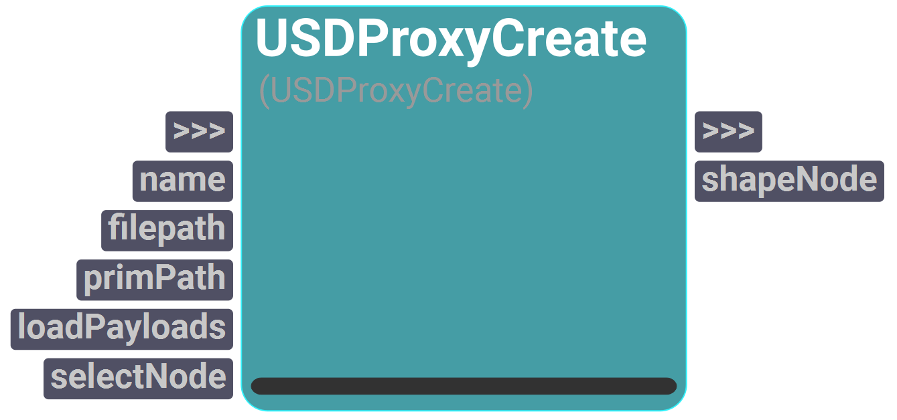
	<figcaption></figcaption>
</figure>

Create a USD proxy node which holds a USD stage that can be interacted with from the DCC.

Works for Maya.

#### Inputs
| Name | Type | Default
| --- | --- | --- |
| name | String | ""
| filepath | FileIn | 
| primPath | String | ""
| loadPayloads | Bool | True
| selectNode | Bool | False

#### Outputs
| Name | Type | Default |
| --- | --- | --- |
| shapeNode | String | ""

---
## USDProxyStageGet

<figure style="width: 30%">
	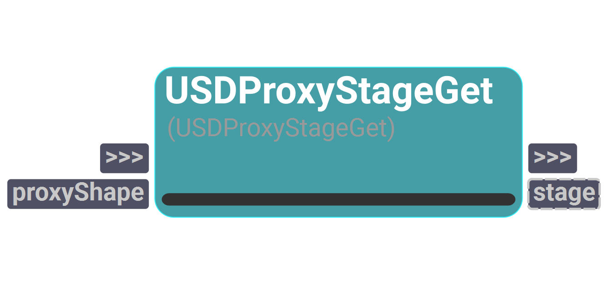
	<figcaption></figcaption>
</figure>

Gets the underlying UsdStage object that a USD proxy node is wrapping.

Works for Maya.

#### Inputs
| Name | Type | Default
| --- | --- | --- |
| proxyShape | String | ""

#### Outputs
| Name | Type | Default |
| --- | --- | --- |
| stage | Instance | None

---
## ViewportPreview

<figure style="width: 30%">
	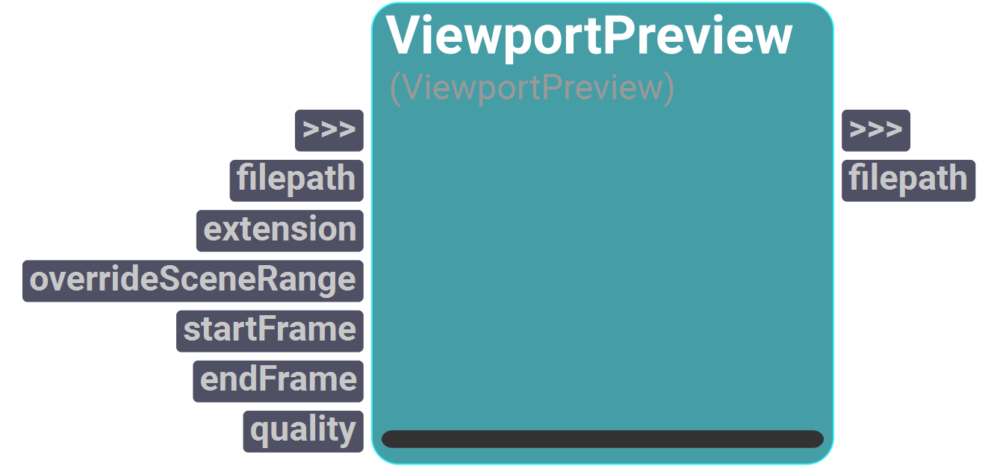
	<figcaption></figcaption>
</figure>

Performs a preview render with the DCC's inbuilt system.
Outputs the filepath of the rendered preview.

Works for Maya and Houdini.

#### Inputs
| Name | Type | Default | Options
| --- | --- | --- | --- |
| filepath | FileOut |  | 
| extension | Enum | png | png, jpg
| overrideSceneRange | Bool | False | 
| startFrame | Int | 1 | 
| endFrame | Int | 10 | 
| quality | Int | 4 | 

#### Outputs
| Name | Type | Default |
| --- | --- | --- |
| filepath | String | ""

