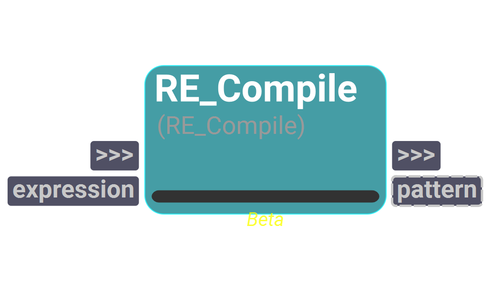
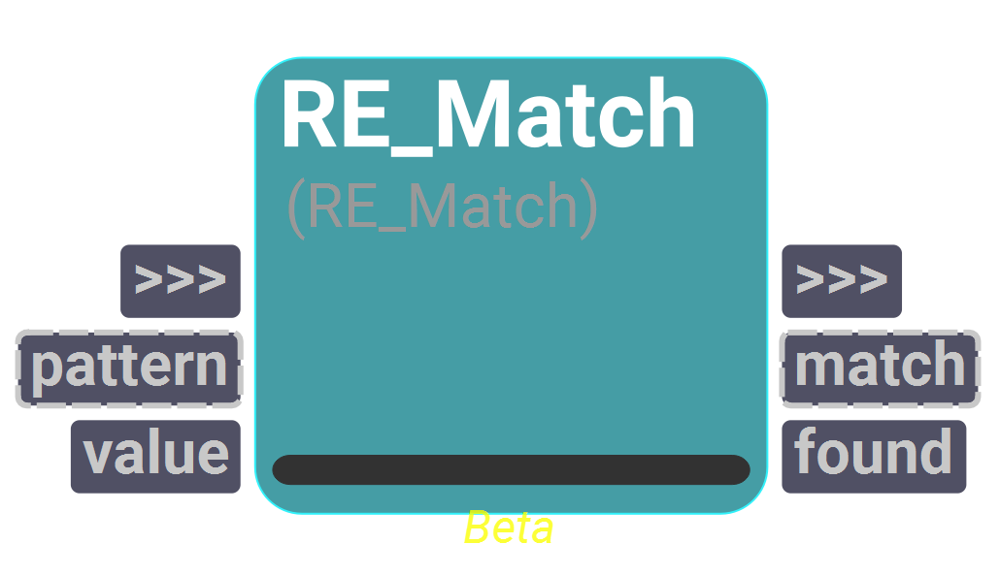
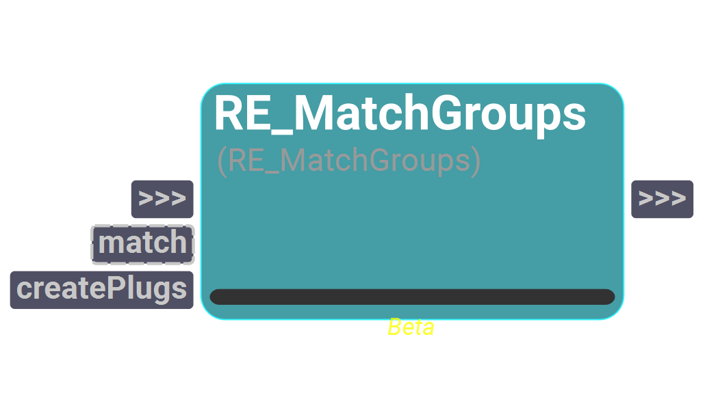
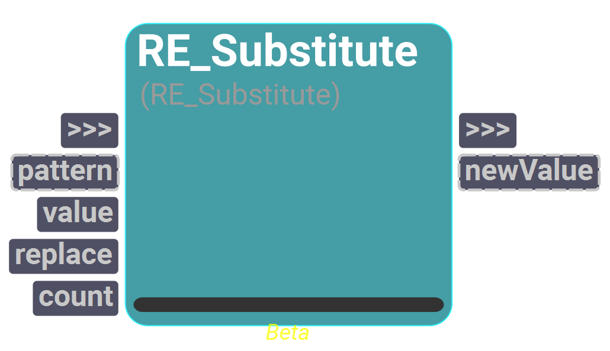

# regex
A catalog to work with regex functions.

## RE_Compile
<i>Beta operator</i>

<figure style="width: 30%">
	
	<figcaption></figcaption>
</figure>

Operator to compile a regex expression.

#### Inputs
| Name | Type | Default
| --- | --- | --- |
| expression | String | ""

#### Outputs
| Name | Type | Default |
| --- | --- | --- |
| pattern | Instance | None

## RE_Match
<i>Beta operator</i>

<figure style="width: 30%">
	
	<figcaption></figcaption>
</figure>

Operator to find a match given a regular expression pattern.
    The pattern input can be a compiled pattern or an expression in string format.
    The value input is the string in which the match has to be found.
    The match output plug stores the match object returned by Regex or None if the pattern is not found.
    The found output plug is a boolean signaling whether the search was successful or not

    

#### Inputs
| Name | Type | Default
| --- | --- | --- |
| pattern | Instance | None
| value | String | ""

#### Outputs
| Name | Type | Default |
| --- | --- | --- |
| match | Instance | None
| found | Bool | False

## RE_MatchGroups
<i>Beta operator</i>

<figure style="width: 30%">
	
	<figcaption></figcaption>
</figure>

Operator to get all the groups from a Match object.
    Set the createPlugs input to True to create one plug for each group found in the match object automatically.

    
<i>Allows creation of custom plugs.</i>

#### Inputs
| Name | Type | Default
| --- | --- | --- |
| match | Instance | None
| createPlugs | Bool | False

## RE_Search
<i>Beta operator</i>

<figure style="width: 30%">
	
	<figcaption></figcaption>
</figure>

Operator to perform a search using a regular expression pattern.
    The pattern input can be a compiled pattern or an expression in string format.
    The value input is the string in which the search have to be executed.
    The match output plug stores the match object returned by Regex or None if the pattern is not found.
    The found output plug is a boolean signaling whether the search was successful or not

    

#### Inputs
| Name | Type | Default
| --- | --- | --- |
| pattern | Instance | None
| value | String | ""

#### Outputs
| Name | Type | Default |
| --- | --- | --- |
| match | Instance | None
| found | Bool | False

## RE_Substitute
<i>Beta operator</i>

<figure style="width: 30%">
	
	<figcaption></figcaption>
</figure>

Operator to substitute pattern matches in the value string with a given replace string.
    The replace input is the value to replace for each match with the given pattern.
    The count plug controls the number of matches to substitute. The default value of 0 will substitute all matches.

    

#### Inputs
| Name | Type | Default
| --- | --- | --- |
| pattern | Instance | None
| value | String | ""
| replace | String | ""
| count | Int | 0

#### Outputs
| Name | Type | Default |
| --- | --- | --- |
| newValue | Instance | None

