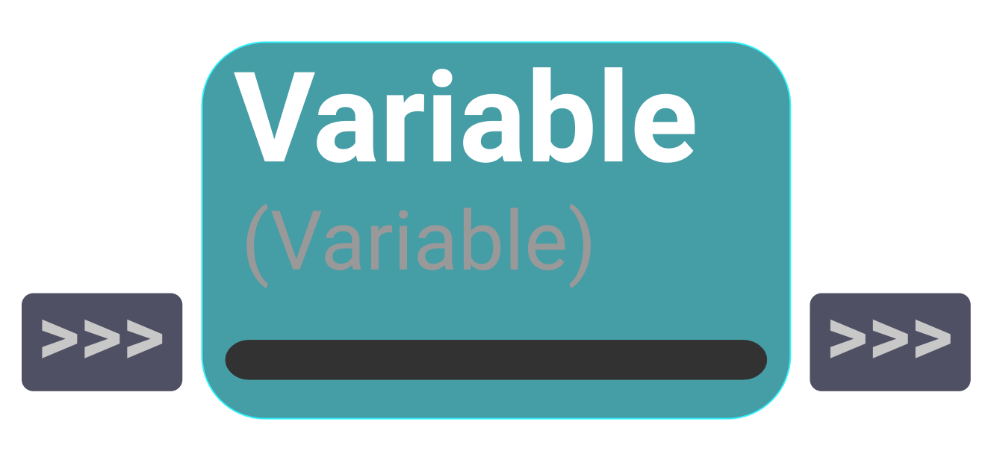
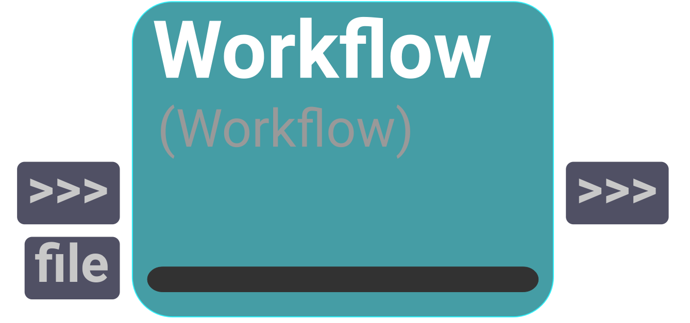

# workflow
A catalog to manage and nest Shift workflows. It includes operators to input and output data, store variables and execute sub-workflows.

---
## Input

<figure style="width: 30%">
	
	<figcaption></figcaption>
</figure>

Operator for external input. To define external data, this operator requires the user to create out plugs for it.
     

    @param code str: code name of the operator.
    @param parent shift.core.workflow.SWorkflow: the workflow owning the operator.

    
<i>Allows creation of custom plugs.</i>

---
## Output

<figure style="width: 30%">
	
	<figcaption></figcaption>
</figure>

Operator for external output. To define the data to send out,
    this operator requires the user to create in plugs for it.
     

    @param code str: code name of the operator.
    @param parent shift.core.workflow.SWorkflow: the workflow owning the operator.

    
<i>Allows creation of custom plugs.</i>

---
## Variable

<figure style="width: 30%">
	
	<figcaption></figcaption>
</figure>

Operator for to manage workflow variables.
    Input plugs will set variables values, while output plugs get variables values.
     
    @param code str: code name of the operator.
    @param parent shift.core.workflow.SWorkflow: the workflow owning the operator.
    
<i>Allows creation of custom plugs.</i>

---
## Workflow

<figure style="width: 30%">
	
	<figcaption></figcaption>
</figure>

The workflow operator defines and executes an external Shift workflow.
    The operator expands its plugs dynamically to enable access to its input and output data.
     
    
    @param code str: code name of the operator.
    @param parent shift.core.workflow.SWorkflow: the workflow owning the operator.

    

#### Inputs
| Name | Type | Default
| --- | --- | --- |
| file | FileIn | 

---
## WorkflowProcess

<figure style="width: 30%">
	
	<figcaption></figcaption>
</figure>

The workflow operator defines and executes an external shift workflow.
    The operator expands its plugs dynamically to enable access to its input and output data.
     

    @param code str: code name of the operator.
    @param parent shift.core.workflow.SWorkflow: the workflow owning the operator.

    

#### Inputs
| Name | Type | Default | Options
| --- | --- | --- | --- |
| file | FileIn |  | 
| dcc | Enum | Maya | Maya, Python

